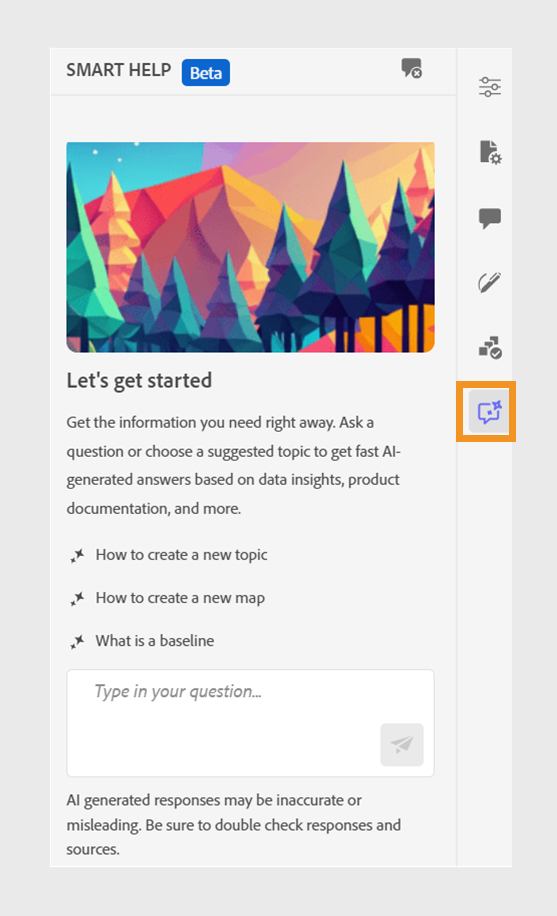

# 用于搜索内容的AI支持的智能帮助

Experience Manager Guides提供了基于GenAI的智能帮助，该对话式搜索功能可帮助您从[Adobe Experience Manager Guides文档](https://experienceleague.adobe.com/zh-hans/docs/experience-manager-guides/using/overview)中查找相关内容。
您可以提出问题并以信息性的方式获得答案。 您的查询答案取决于产品文档中的内容。 此搜索完全是对话式的。 您可以先提出问题，然后根据响应情况，您还可以提出进一步的问题。 响应中还包括指向源文档的链接，您可以参阅这些链接以了解详细信息。

例如，您可能需要在Experience Manager Guides中为文档创建一个主题。 您可以询问，*如何创建主题？*&#x200B;您收到了响应和相关文章的链接。 然后，如果您想了解如何为文档生成PDF输出，可以询问有关该文档的问题。 例如，*如何将主题发布到PDF？*&#x200B;或&#x200B;*如何生成主题的PDF输出？*

打开Web编辑器时，**智能帮助**&#x200B;面板将显示在右侧。

>[!NOTE]
>
> 您的管理员必须配置&#x200B;**智能帮助**&#x200B;功能。 有关更多详细信息，请查看Cloud Services的安装和配置指南中的[配置AI支持的智能帮助以搜索内容](/help/product-guide/cs-install-guide/conf-smart-help.md)部分。

{width="300" align="left"}

*查看&#x200B;**智能帮助**&#x200B;面板。*

执行以下步骤以使用对话式搜索来查找相应的内容并解决您的查询：

1. 选择&#x200B;**智能帮助** 以打开面板。

   >[!NOTE]
   >
   > 在[全局或文件夹级别配置文件](/help/product-guide/cs-install-guide/conf-folder-level.md#conf-ai-guides-assistant)中，您的管理员需要定义显示在面板中的默认问题。

1. 键入问题可在Experience Manager Guides文档中查找相关内容。 您可以在面板中选择默认问题，或在文本框中键入您的问题。

1. 选择&#x200B;**发送** 或按&#x200B;**Enter**&#x200B;查看对您问题的答复。

   根据您的问题，您可以查看内容、适用的图像以及指向文章的链接。

   {width="300" align="left"}

   *选择示例问题并查看内容与图像以作响应。*

1. 选择结尾的文章链接，并查看有关您问题的详细信息。

1. 选择&#x200B;**清除对话** 以从面板中删除对话历史记录。 然后，您可以开始新的对话并查找相关内容。

此智能功能可帮助您快速查找解决方案，让您能够专注于文档并高效完成任务。
