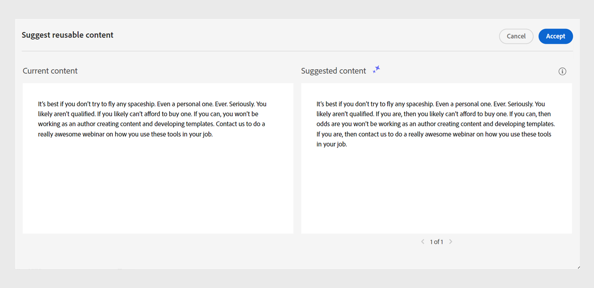

# 用于创作内容的AI支持的智能建议

Experience Manager Guides提供了智能建议，可帮助您创建一致且准确的内容。

在创作内容时，AI助手工具中的&#x200B;**建议可重用内容**&#x200B;功能可以使用AI进行搜索并显示语义上与您的内容类似的现有内容。 然后，您可以选择要在当前主题中包含的最佳匹配内容作为引用。

这可帮助您重用文档存储库中的现有内容并创建一致的内容。 例如，您正在创建的文档包含有关&#x200B;**Adobe Firefly**&#x200B;的信息，其中包括有关&#x200B;**Adobe**&#x200B;的段落。 在这种情况下，您可以快速查看和添加来自其他主题(如&#x200B;**Adobe Photoshop**)的内容引用，该主题包含相同的段落。
>[!NOTE]
>
> 在[全局或文件夹级别配置文件](/help/product-guide/cs-install-guide/conf-folder-level.md#conf-ai-smart-suggestions)中，管理员需要定义要索引的文件或文件夹以获取智能建议，需要输入的最小字符数以及可在列表中查看的最大建议数。

执行以下步骤，查看有关向主题添加相应内容引用的智能建议：

1. 选择主题中的内容以查看相关建议。 确保内容的字符长度超过管理员在文件夹配置文件中为显示内容建议而设置的长度。
1. 从AI助手面板中，选择&#x200B;**建议可重用内容** 。

1. 选择标记可查看当前标记的创作建议。  根据当前标记中的内容，显示从索引文件中查看和添加内容引用的建议。 您还可以选择多个标记。

1. 选择所有标记以查看基于完整文档中存在的内容的建议。  **建议可重用内容** 图标显示在找到合适匹配项的内容旁边。

   >[!NOTE]
   >
   > 您只能查看有关当前视区（屏幕上显示的内容）的建议。 要查看文档中任何其他内容的建议，请向上或向下滚动以在视区中显示该内容，然后选择&#x200B;**建议可重用内容** 。

1. 您可以在建议面板中查看智能建议。  Experience Manager Guides提供的建议内容在上下文上类似或具有相同含义。 例如，您可以搜索包含确切版本号的主题，如“发行版本2023.03.12”。 您还可以搜索“Adobe总部在加利福尼亚州的圣何塞”，并找到类似内容，如“圣何塞拥有像Adobe这样的许多软件公司的季度”。
1. 选择&#x200B;**内容信息** 以查看详细信息。

   {width="300" align="left"}

   *查看有关内容引用的详细信息。*

   1. 包含内容引用的主题的标题显示为超链接。
   1. 包含内容引用的文件的路径。
   1. 引用了内容的引用类型。
   1. 引用主题的DITA文件的名称显示为超链接。
1. 选择&#x200B;**预览** 以将当前内容与建议的内容进行比较。 这有助于您比较差异，并确定您是要为建议的内容添加内容引用并使它保持一致，还是要保留当前内容。

   

   *预览当前内容与建议内容之间的比较。*

1. 单击&#x200B;**接受**&#x200B;在&#x200B;**建议可重用内容**&#x200B;预览中添加建议的内容引用。
1. 您还可以在建议面板中选择&#x200B;**接受**&#x200B;或&#x200B;**消除**&#x200B;以获取相应的建议。

此智能功能非常方便，最大程度地减少了手动内容搜索的工作量，让您能够将更多精力集中在生成新内容上。 它还有助于更好地进行团队协作，并帮助保持由不同作者创建的内容的一致性。

>[!NOTE]
>
>智能建议不会保留当前会话之外的数据。 对于响应，智能建议仅依赖于基于内部数据库中驻留的内容创建的索引。 不使用外部AI工具，确保您的数据保留在系统中。
