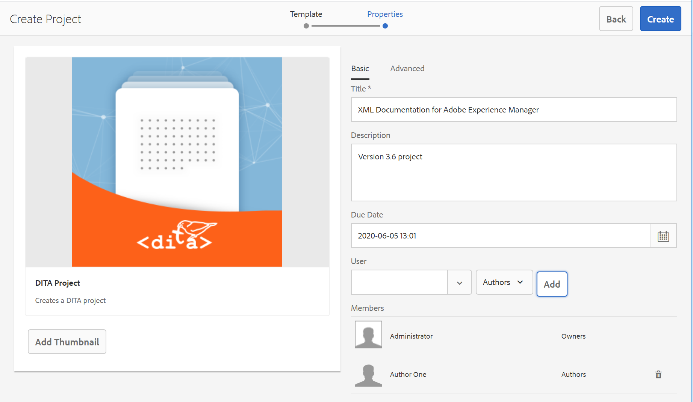

# 创建DITA项目 {#id1645HA00NM6}

AEM Guides提供了一个DITA项目模板，您可以使用它来创建和管理审阅任务。

您可以创建一个DITA项目，然后使用该项目启动审核。 通过项目，可定义截止日期并控制完成已创建项目的审核任务所需的任务和时间。

您可以将团队成员添加到项目中，然后可为这些成员分配各种角色 — 作者、审阅者和发布者。

创建DITA项目后，您可以从Web编辑器或Assets UI启动审核。 有关更多详细信息，请参阅[发送审核主题](review-send-topics-for-review.md#)。

同样，每当作者启动任何审阅工作流时，项目的选定成员都会收到电子邮件通知。 要配置电子邮件通知，请参阅安装和配置Adobe Experience Manager Guides as a Cloud Service中的&#x200B;*自定义电子邮件模板*。

执行以下步骤以创建DITA项目：

1. 打开项目控制台。

   您还可以使用以下URL访问“项目”控制台：

   ```http
   http://<server name>:<port>/projects.html
   ```

1. 单击&#x200B;**创建** \> **项目**&#x200B;以启动创建项目向导。

   {width="650" align="left"}

1. 在“创建项目”页面上，选择&#x200B;**DITA项目**&#x200B;模板，然后单击&#x200B;**下一步**。

1. 在“项目属性”页上，输入以下详细信息：

   **基本**&#x200B;选项卡中的信息：

   {width="650" align="left"}

   - 输入项目的&#x200B;**标题**、**描述**&#x200B;和&#x200B;**截止日期**。

   - 您可以选择项目的缩略图。

   - 默认情况下，您成为项目的所有者。 要向此项目添加更多用户，请执行以下操作：

   1. 从&#x200B;**用户**&#x200B;下拉列表中选择一个用户。

   1. 选择用户类型 — “作者”、“审阅者”或“发布者”。

      >[!NOTE]
      >
      >You will see other user types in this drop-down list, but for a DITA project you should only choose from Authors, Reviewers, or Publishers user type. Even if you add a user of a different type, that user will not be able to access any DITA-specific features available in AEM Guides.

   1. 单击&#x200B;**添加**。

      >[!NOTE]
      >
      >If you are using AEM Guides version 3.5 or earlier, you are shown an option to select a DITA map file to resolve key references for topic editing, preview and review workflows. In 3.6 and later versions, you can set the root map through the Web Editor. For more information, see the [User Preferences](web-editor-features.md#id2087G0P40SB) in the Web Editor. Another way of setting the root map is by configuring it at the global or folder-level profiles. For more details, see *Configure global or folder-level profiles* in the Installation and Configuration Guide.

   Information in the **Advanced** tab:

   - Enter a name for the project. This name is used to create the URL for this project.

1. 单击&#x200B;**创建**。

   The Project Created dialog appears.

1. Click **Open** to open your project page.


**父主题：**[&#x200B;审阅主题或映射](review.md)
