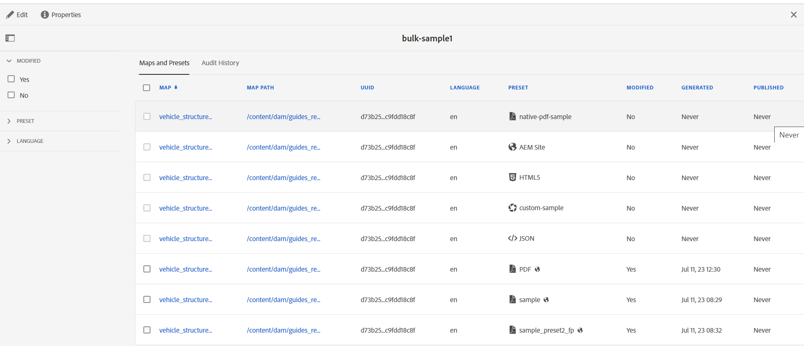

# 创建批量激活映射集合 {#id214GG0E90EV}

要创建批量激活映射集合，请执行以下步骤：

1. 从工具列表中选择&#x200B;**指南**。

1. 选择顶部的Adobe Experience Manager链接，然后选择&#x200B;**工具**。

1. 选择&#x200B;**批量发布仪表板**&#x200B;磁贴。

   首次显示空白收藏集页面。 如果您之前已创建批量激活收藏集，则它们将显示在此页面上。

1. 单击&#x200B;**创建**。

1. 输入批量Activation Map集合的标题，然后单击&#x200B;**创建**。

   创建批量激活图集合时会显示一条成功消息。

1. 单击成功消息上的&#x200B;**打开**。

1. 选择&#x200B;**编辑**，然后选择&#x200B;**添加映射**。

1. 查找并添加要添加到批量激活映射集合的DITA映射。

   默认情况下，会自动添加与映射关联的所有预设和区域设置。

1. 通过打开或关闭滑动按钮选择所需的输出。

   您可以跨可用区域设置选择多个输出预设。

1. 单击&#x200B;**完成**。

DITA映射文件将添加到批量激活映射集合中。

{width="800" align="left"}

## “映射和预设”选项卡

**映射和预设**&#x200B;选项卡在以下列中显示信息：

- **映射**：显示DITA映射文件的标题。
- **映射路径**：显示DITA映射文件的完整路径。

- **UUID**：显示与文件关联的唯一标识符。

- **语言**：显示DITA映射的语言代码。
- **预设**：显示在映射文件上配置的输出预设的标题。 它还会根据输出预设的类型显示图标。

  >[!NOTE]
  >
  > 小的图标表示文件夹配置文件级别预设。

- **已修改**：指示在上次发布后是否更新DITA映射。 根据此信息，您可以决定是否要激活此DITA映射的输出。
- **已生成**：显示上次生成的输出的日期和时间。
- **已发布**：显示上次发布（或激活）输出的日期和时间。 如果选择该链接，则显示&#x200B;**激活结果**&#x200B;页面，其中包含日志，其中包含有关激活内容的根路径的信息。

## “Audit History”（审核历史记录）选项卡

**审核历史记录**&#x200B;选项卡在以下列中提供了有关已激活映射输出的信息：
- **映射**：显示DITA映射文件的标题。
- **映射路径**：显示DITA映射文件的完整路径。
- **UUID** ：显示与文件关联的唯一标识符。
- **语言**：显示DITA映射的语言代码。
- **预设**：显示在映射文件上配置的输出预设的标题。 它还会根据输出预设的类型显示图标。
- **状态**：将激活状态显示为成功或不成功。
- **目标**：如果在Experience Manager Guides as a Cloud Service上生成输出，则可以以“发布”或“预览”形式查看输出的目标。

  >[!NOTE]
  >
  > 小的图标表示文件夹配置文件级别预设。

- **修改时间**：指示在上次发布后是否更新了DITA映射。 根据此信息，可以决定是否激活此DITA映射的输出。
- **已发布**：显示上次发布（或激活）输出的日期和时间。 如果选择该链接，则会显示“激活结果”页面，其中包含日志，其中包含有关激活内容的根路径的信息。
  {width="800" align="left"}

  *在&#x200B;**审核历史记录**&#x200B;选项卡中查看有关激活的映射输出的信息。*

  >[!NOTE]
  >
  > **审核历史记录**&#x200B;选项卡中的输出是根据&#x200B;**Published**&#x200B;列排序的。

## 左侧面板

左侧面板上提供了以下筛选选项：

- **已修改**：您可以选择“是”或“否”。 如果选择“是”，则仅显示修改的DITA映射。 修改后的映射是自上次发布以来生成的映射。
- **预设**：选择要过滤掉映射文件的预设。 此列显示在映射文件上配置的输出预设的标题。 例如，如果选择&#x200B;*AEM Site*&#x200B;预设，则仅显示上面配置了&#x200B;*AEM Site*&#x200B;输出预设的映射。
- **语言**：您可以选择任何可用的语言代码，并在“映射和预设”选项卡中仅显示选定的语言。

当您从&#x200B;**映射和预设**&#x200B;选项卡切换到&#x200B;**审核历史记录**&#x200B;选项卡时，筛选器会更新，反之亦然。

**父主题： &#x200B;** [批量激活已发布的内容](conf-bulk-activation.md)
