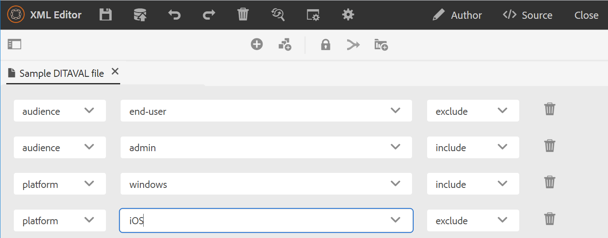
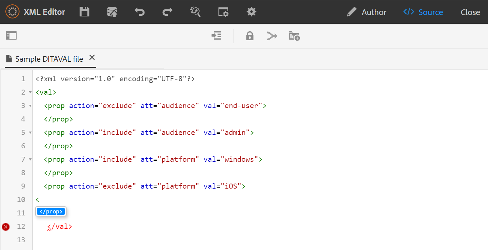

# DITAVAL编辑器 {#ditaval-editor}

DITAVAL文件用于生成条件输出。 在单个主题中，您可以使用元素属性添加条件以条件化内容。 然后，创建一个DITAVAL文件，在该文件中指定应选取以生成内容的条件，以及应从最终输出中排除哪些条件。

AEM Guides允许您使用DITAVAL编辑器轻松创建和编辑DITAVAL文件。 DITAVAL编辑器将检索系统中定义的属性\（或标记\），您可以使用它们来创建或编辑DITAVAL文件。 有关在AEM中创建和管理标记的更多详细信息，请参阅AEM文档中的[管理标记](https://experienceleague.adobe.com/docs/experience-manager-cloud-service/sites/authoring/features/tags.html?lang=en)部分。

## 创建DITAVAL文件

执行以下步骤以创建DITAVAL文件：

1. 在Assets UI中，导航到要创建DITAVAL文件的位置。

1. 单击&#x200B;**创建** \> **DITA主题**。

1. 在Blueprint页面上，选择DITAVAL文件模板并单击&#x200B;**下一步**。

1. 在“属性”页面上，为DITAVAL文件指定&#x200B;**标题**&#x200B;和&#x200B;**名称**。

   >[!NOTE]
   >
   > 根据文件的标题自动建议名称。 如果要手动指定文件名，请确保“名称”不包含任何空格、撇号或大括号，且以.ditaval结尾。

1. 单击&#x200B;**创建**。此时将显示“创建的主题”消息。

   您可以选择打开DITAVAL文件以便在DITAVAL编辑器中编辑，或者将主题文件保存到AEM存储库中。

## 编辑DITAVAL文件

执行以下步骤以编辑DITAVAL文件：

1. 在Assets UI中，导航到要编辑的DITAVAL文件。

1. 若要获得对文件的独占锁定，请选择该文件并单击&#x200B;**签出**。

1. 选择该文件并单击&#x200B;**编辑**&#x200B;以在AEM Guides DITAVAL编辑器中打开该文件。

   DITAVAL编辑器允许您执行以下任务：

   A：切换左侧面板
切换左侧面板视图。 如果您已通过DITA映射打开DITAVAL文件，则映射和存储库将显示在此面板中。 有关通过DITA映射打开文件的详细信息，请参阅[通过DITA映射编辑主题](map-editor-advanced-map-editor.md#id17ACJ0F0FHS)。

   B：保存
保存您在文件中进行的更改。 所有更改都保存在文件的当前版本中。

   C：添加属性
在DITAVAL文件中添加单个属性。

   

   第一个下拉列表列出了可以在DITAVAL文件中使用的允许DITA属性。 有五个受支持的属性 — `audience`、`platform`、`product`、`props`和`otherprops`。

   第二个下拉列表显示为所选属性配置的值。 然后，下一个下拉列表显示了您可以对选定属性配置的操作。 操作下拉列表中允许的值是 — `include`、`exclude`、`passthrough`和`flag`。 有关这些值的更多信息，请参阅OASIS DITA文档中的[prop](http://docs.oasis-open.org/dita/dita/v1.3/errata01/os/complete/part3-all-inclusive/langRef/ditaval/ditaval-prop.html#ditaval-prop)元素的定义

   D：添加所有属性
如果要通过单击添加系统中定义的所有条件属性或属性，请使用“添加全部属性”功能。

   >[!NOTE]
   >
   > 如果DITAVAL文件中已存在所有已定义的条件属性，则无法添加更多属性。 在这种情况下，您会收到一条错误消息。

   

1. 完成编辑DITAVAL文件后，单击&#x200B;**保存**。

   >[!NOTE]
   >
   > 如果关闭文件而不保存，更改将丢失。 如果不希望将更改提交到AEM存储库，请单击&#x200B;**关闭**，然后在&#x200B;**未保存的更改**&#x200B;对话框中单击&#x200B;**关闭而不保存**。

## DITAVAL编辑器视图

AEM Guides的DITAVAL编辑器支持以两种不同的模式或视图查看DITAVAL文件：

**作者**：   这是DITAVAL编辑器的典型“所见即所得”视图。 您可以使用简单的用户界面添加或删除属性，该界面在下拉列表中显示属性、属性值和操作。 在“创作”视图中，您可以选择通过一次单击插入单个属性和所有属性。

通过将指针悬停在文件名上，还可以找到当前正在处理的DITAVAL文件的版本。

**Source**：   Source视图显示构成DITAVAL文件的基础XML。 除了在此视图中编辑常规文本外，作者还可以使用智能目录添加或编辑属性。

要调用智能目录，请将光标放在任何属性定义的末尾并输入“&lt;”。 该编辑器将显示可以在该位置插入的所有有效XML元素的列表。

