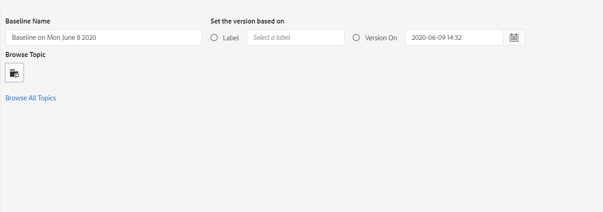
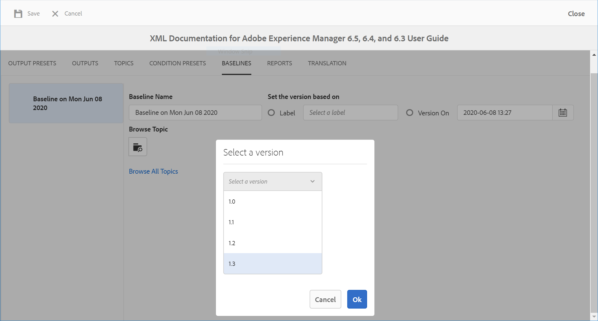
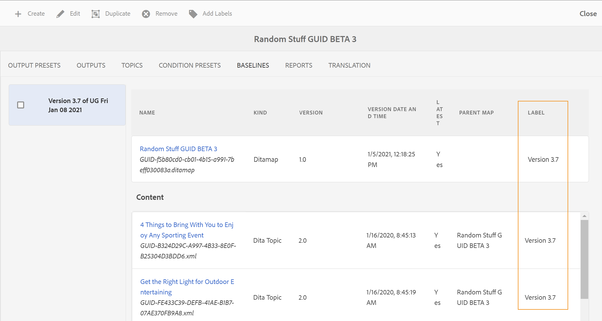

# 使用基线 {#id1825FI0J0PF}

基线功能允许您创建随后可用于发布或翻译的主题和资产的版本。 例如，如果您的DITA映射有`topicA`和`imageA`，则可以创建基线以使用`topicA`的第3版本，而使用`ImageA`的第4版本。 一旦基线就位，您只需单击一下即可发布或翻译不同版本的主题。

对于输出预设，选择基线是可选的，并且DITA映射可以有多个基线。 但是，DITA映射中的每个输出预设只能与单个基线相关联。 如果在发布时未指定基线，则使用最新版本的内容发布输出。

同样，选择要翻译内容的基线也是可选的。 但是，如果选择使用基线翻译内容，则基线的内容也将与翻译的副本一起保存。 然后，您可以使用翻译后的基线执行进一步的操作，如与外部发布者共享或存档它。 有关导出已翻译基线的详细信息，请参阅[导出已翻译基线](#id196SE600GHS)。

>[!TIP]
>
> 有关使用基线的最佳实践，请参阅最佳实践指南中的&#x200B;*基线*&#x200B;部分。

您的管理员可以在映射仪表板上配置基线选项卡。 有关更多详细信息，请参阅《安装和配置指南》中的&#x200B;*在DITA映射仪表板*&#x200B;上配置基线选项卡。

可以通过执行以下步骤来访问“基线”功能：

1. 在Assets UI中，导航到并单击DITA映射文件。
1. 转到&#x200B;**基线**&#x200B;选项卡。

在“基线”选项卡中，可以执行以下操作：

- [创建基线](#id195FI0I0MUQ)
- [查看基线的内容](#id195FI0I0TLN)
- [编辑、复制或删除基线](#id195FI0I0YJL)
- [向基线添加标签](#id184KD0T305Z)

## 创建基线 {#id195FI0I0MUQ}

您可以创建基线，该基线包含特定版本的主题和在特定日期和时间可用的引用内容，或者包含为某个版本的主题定义的标签。 可以单独指定基线中选定主题的版本，以便每次在发布或翻译工作流中应用基线时，所选主题及其相应版本都会包含在输出生成或翻译中。

执行以下步骤以创建基线：

1. 在“基线”页面上，单击&#x200B;**创建**。
1. 在&#x200B;**基线名称**&#x200B;中输入基线的名称。
   {width="800" align="left"}
1. 在&#x200B;**设置基于**&#x200B;的版本中，选择以下选项之一：

   - **标签**：选择此选项可根据应用于主题的标签选择主题。 输入标签以根据输入的字符串筛选列表。 从过滤出的列表中，您可以选择标签以选择具有指定标签的主题和其他资源。

   选择&#x200B;**标签**&#x200B;时，还可以选择使用未应用指定标签的最新版本主题。 如果不选择此选项，并且有任何主题或媒体文件没有指定的标签，则基线创建过程将失败。 有关添加标签的详细信息，请参阅[使用标签](web-editor-use-label.md#)。

   - **版本为** &lt;*时间戳*\>：在指定的日期和时间挑选主题的版本。 请注意，您在此处指定的时间与AEM服务器的时区相对应。 如果您的服务器在不同时区，则会按照服务器的时区而不是本地时区提取主题。

   选择标签或版本作为日期后，将相应地选择映射中所有引用的主题和媒体文件。 所选的主题不会显示在用户界面上，但会保存在后端。

   >[!NOTE]
   >
   >建议在创建基线时不要使用&#x200B;**浏览所有主题**&#x200B;链接。

1. 单击&#x200B;**保存**。

## 查看基线的内容 {#id195FI0I0TLN}

通过单击“基线”选项卡并从列表中选择所需的基线版本，可以查看现有基线的内容。 “基线”页面分为三个部分 — DITA映射文件、映射的内容或主题以及引用的内容。 如果您的映射包含子映射，则从子映射引用的主题也会显示在内容部分中。 “基线”页上的各列说明如下：

- **Name**: Lists the DITA map or topic&#39;s title or the name of the asset, such as the file name of an image.

- **Kind**: Lists the kind or type of asset in the map like DITA map, DITA topic, or image format.

- **Version**: Lists the version of the asset available in the Baseline.

- **Version Date and Time**: Lists the creation date and time of the asset for the selected version.

- **Latest**: Lists whether the latest version of the asset is used in the Baseline.

- **Parent Map**: If your map file contains sub-maps, then this column contains the name of the map in which a topic is referenced.

- **Label**: Lists the label\(s\) applied to the version of the topic.

- **Referenced By**: This column is available for the referenced content only. It indicates the parent topic of the referenced asset. In case an asset is referred by multiple topics, then the topics are separated by comas.

## Edit, duplicate, or remove Baselines {#id195FI0I0YJL}

**Edit Baselines**

Perform the following steps to edit an existing baseline:

1. Select the Baseline and click **Edit**.
1. Make the required changes in the baseline. You can change the name and version of the topic or referenced content.
1. If you want to use a different version for one or more topics, then you can do so by manually selecting those topics. Click **Browse Topic**, select the topic for which you want to use a different version. From the Select a Version drop-down list for the selected topic, select a version of the topic that you want to use in the baseline and click **OK**.

   {width="800" align="left"}

   The information about the topic and it&#39;s selected version is stored in the backend. You can repeat this step to change the selected version for multiple topics.

1. To load all topics and media files referred from the DITA  map, click the **Browse All Topics** link. The UUID of topics and media files is also shown below the topic title or the \(media\) file name.

   >[!NOTE]
   >
   > If you have a very large set of files in your DITA map, with nested maps and topics, then clicking Browse All Topics could take some time to load all files.

   The contents of your map are presented in the three sections: the map file, Content \(topic references\), and Referred Content \(nested topics, maps, and other assets\). Once you have all the referenced content available, you can individually select the version of the topic that you want to use in your baseline.

   The **Version** drop-down list shows the available versions of the topics or the referenced content. For the referenced content, you have the option to choose a version automatically.

   If you choose **Pick Automatically** for the referenced content, the system automatically picks the version of the referenced content corresponding to the version of the content in which it is referenced. For example, let&#39;s say a topic A has a reference to an image B. When version 1.5 of topic A was created, the version of image B was 1.2 in the repository. Now, when a baseline is created with version 1.5 of the topic A with image B set to **Pick Automatically**, the system will automatically pick version 1.2 of image B.

   If you create a baseline using the labels, **Pick Automatically** is applied to the version of all referenced content.

   If the referenced content or assets \(topic, sub-maps, images, or videos\) are not versioned \(such as, newly uploaded content\), then creating a baseline will create a version for such files. However, if your files are versioned, then no incremental version is created for those files. This behavior is controlled by the auto-create version setting, which is enabled by default. This is also required for translating content wherein the translation process expects all files to have a version.

   >[!NOTE]
   >
   > If you want to specify a different version for any particular resource, you can do so by choosing the desired version from the **Version** drop-down list.
1. 单击&#x200B;**保存**。

**Duplicate Baselines**

Select the Baseline and click **Duplicate** to create a copy of an existing Baseline. Specify a different name for the baseline and choose the version number for the topics and referenced content and click **Save**.

**Remove Baselines**

Select the Baselines version and click **Remove** to remove a Baseline.

## Add labels to a Baseline {#id184KD0T305Z}

Adding labels to every single topic can be time consuming. AEM Guides provides a single-click mechanism of adding labels to multiple topics and referenced content in a DITA map.

Perform the following steps to add a label to multiple topics and referenced content in a DITA map:

1. On the Baselines page, select a baseline containing the topics and referenced content on which you want to add a label.

   >[!NOTE]
   >
   > Ensure that your baseline does not have the latest version of any topic or asset. A label can only be added to a versioned topic or asset.

1. Click **Add Labels**.

   {width="800" align="left"}

1. 在&#x200B;**添加标签**&#x200B;对话框中，指定要与此基线关联的唯一标签。

   如果管理员配置了预定义标签，则会在下拉列表中显示这些标签。 您需要从列表中选择一个标签。

1. 如果要将标签应用于从子映射引用的主题，请选择&#x200B;**将标签应用于子映射和依赖项**&#x200B;选项。

   - 单击&#x200B;**添加**。
指定的标签将添加到DITA映射以及引用的主题和内容。

     {width="650" align="left"}

## 导出已翻译基线 {#id196SE600GHS}

可以使用基线来翻译内容。 例如，您可以为1.1版本创建一个准备翻译为法文的基线。 在“翻译”选项卡中，您需要使用“基线”来过滤内容，然后选择内容的1.1版本基线。 使用基线翻译内容使您能够更轻松地管理内容。

在翻译内容后，您可以导出翻译后的基线以进行存档，或与组织中的不同团队共享它。 在导出转换后的基线之前，必须考虑以下几点：

- 只有在基线中的内容被翻译之后，才能导出基线。 如果尝试导出未开始翻译或未完成的基线，您将收到错误。
- 您只能为已翻译的版本传输基线。 例如，如果已为内容版本1.1创建了基线并翻译了该基线，则可以导出此基线。 但是，如果您已经为1.2版创建了未翻译的基线，则无法导出此基线。
- 如果已导出基线，则可以在导出时选择&#x200B;*覆盖现有基线*&#x200B;选项来覆盖现有基线。

执行以下步骤以导出转换后的基线：

1. 打开包含转换后的基线的DITA映射。

1. 在&#x200B;**翻译**&#x200B;选项卡中，展开左边栏中可用的&#x200B;**基线**&#x200B;选项。

   {width="800" align="left"}

1. 选择&#x200B;**使用基线**&#x200B;选项，然后选择要导出的基线。

1. 单击&#x200B;**导出基线**。

   此时将显示“导出状态”。 如果过程成功，则会显示一条消息，指出基线导出所用的语言。 如果发生故障，将显示故障原因。

   如果尝试导出已导出的基线，则还会显示基线创建失败消息。

1. \（可选\）要导出已导出的基线，请选择&#x200B;**覆盖现有基线**，然后单击&#x200B;**导出基线**。

**父主题：**&#x200B;[&#x200B;输出生成](generate-output.md)
