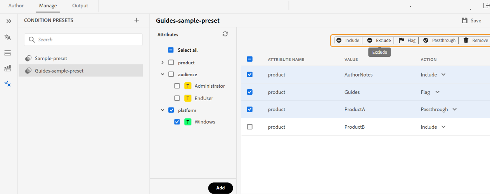

# 使用条件预设 {#id1825FL004PN}

您可以在DITA主题中定义属性，并使用条件预设指定在最终输出中属性会发生什么情况。 例如，您可以在内容中添加版本为1.0和版本为2.0的属性，并使用条件预设来包含版本1.0的版本1.0和排除版本2.0。同样，您可以将OS Windows和OS Linux等属性添加到内容中，然后根据操作系统在最终输出中包括或排除相关内容。

您可以通过两种方式创建条件预设：

* 从Web编辑器：允许您从Web编辑器创建和管理DITA映射的条件预设。
* 从映射仪表板：允许您从映射仪表板创建和管理DITA映射的条件预设。

## 来自Web编辑器的条件预设

通过Experience Manager Guides，您可以从Web编辑器管理条件预设，并在输出预设中使用它们来生成最终输出。
您可以从Web编辑器中的**条件预设**&#x200B;视图创建和查看条件预设、查看属性以及管理当前映射的操作。

### 创建条件预设

**条件预设**视图提供有关条件预设的详细信息，如其属性、值和操作。
可通过执行以下步骤来创建主题的条件预设：

1. 在&#x200B;**存储库**&#x200B;面板中，在映射视图中打开DITA映射文件。
1. 选择&#x200B;**管理**&#x200B;选项卡。
1. 选择左侧的&#x200B;**条件预设**。 将显示为DITA映射定义的条件预设列表。
1. 选择&#x200B;**条件预设**&#x200B;旁边的+图标以打开&#x200B;**新建条件预设**&#x200B;对话框。
1. 输入预设的唯一名称。

   >[!NOTE]
   >
   > 如果名称字段为空，或者输入无效字符或与现有条件预设相同的名称，则会查看错误。 可以使用连字符“ — ”或下划线“_”作为分隔符。

1. 选择&#x200B;**创建**。
新条件预设即添加到列表中。
1. 双击条件预设可查看属性和操作。
**属性**&#x200B;面板显示添加到映射中存在的任何引用的所有属性。 右侧面板仅显示您添加到条件预设的条件。
1. 执行以下任一操作以添加属性：
   * 选择一个或多个属性，以将它们下的所有值添加到条件预设。 例如，您可以选择`platform`属性以添加其所有值。
   * 选择一个或多个属性值以将其添加到条件预设。 例如，您可以选择平台属性的`Unix`和`Win`值
   * 选择任意属性和值对并将其拖动到中央面板。 例如，您可以选择Platform属性的`Unix`值并拖动它。
   * **全选**以将所有属性及其值添加到条件预设。
默认情况下，属性的操作为`Include`。

1. 选择&#x200B;**添加**。 您可以重复此步骤以添加更多属性。 您添加的属性从中央移至右侧面板。
1. 从顶部的操作栏中选择“移除”可移除右侧面板中的选定属性。
1. （可选）如果需要，您可以覆盖应用于属性的操作。
执行下列操作之一：
   * 对于任何属性，请从“操作”下拉列表中选择以下操作之一。
      * 包含
      * 不包括
      * 直通
      * 标志
   * 从右侧面板中选择多个属性行，然后从顶部的操作栏中选择一个操作。 例如，可以为所选属性选择“排除”操作。
1. 选择&#x200B;**保存**&#x200B;以保存条件预设。

   >[!NOTE]
   >
   > 如果您选择其他预设或关闭预设而不保存预设，则会查看警告。

创建条件预设后，该预设将显示在输出预设的&#x200B;**条件预设**&#x200B;下拉列表下。 详细了解如何[PublishPDF输出](/help/product-guide/web-editor/native-pdf-web-editor.md)。

### 重命名条件预设

执行以下步骤可重命名条件预设：

1. 将鼠标悬停在&#x200B;**条件预设**&#x200B;面板中的条件预设上。
1. 从“选项”菜单中选择&#x200B;**重命名**&#x200B;以打开&#x200B;**重命名条件预设**&#x200B;对话框。
1. 编辑条件预设的名称。
1. 单击&#x200B;**重命名**。

### 复制条件预设

执行以下步骤以复制条件预设：

1. 将鼠标悬停在&#x200B;**条件预设**&#x200B;面板中的条件预设上。
1. 从“选项”菜单中选择&#x200B;**复制**&#x200B;以打开&#x200B;**复制条件预设**&#x200B;对话框。
   >[!NOTE]
   >
   > 预设的默认名称为`<selected condition preset name>_1`。 您可以根据自己的要求更改名称。

1. 单击&#x200B;**复制**。

### 删除条件预设

执行以下步骤可删除条件预设：

1. 将鼠标悬停在&#x200B;**条件预设**&#x200B;面板中的条件预设上。
1. 从“选项”菜单中选择&#x200B;**删除**&#x200B;以打开&#x200B;**删除条件预设**&#x200B;对话框。
1. 单击&#x200B;**删除**。

## 地图功能板中的条件预设

### 创建条件预设

执行以下步骤可创建条件预设：

1. 在DITA映射控制台中选择&#x200B;**条件预设**&#x200B;选项卡。
1. 单击&#x200B;**创建**&#x200B;按钮。
1. 在&#x200B;**名称条件**&#x200B;中输入预设的名称。
1. 从&#x200B;**将默认操作设置为**&#x200B;下拉列表中选择以下默认操作之一：

   * 包含
   * 不包括
   * 直通
   * 标志
无论是否将属性添加到条件预设，该操作均设置为所有属性的默认操作。

   例如，您的文档中有15个条件属性，并且您在条件预设中包含了其中的4个。 如果选择&#x200B;**排除**&#x200B;作为默认操作，则会将其应用于所有15个属性。

1. 执行以下任一操作以添加属性：
   * 单击&#x200B;**将**&#x200B;添加到条件预设的一个属性。 您可以重复此步骤以添加更多属性。
   * 单击&#x200B;**全部添加**&#x200B;以将所有属性添加到条件预设。
1. \（可选\）如果需要，可以覆盖在步骤4中应用于属性的默认操作。 执行下列操作之一：
   * 选择多个属性，从&#x200B;**中选择一个操作将所选条件的操作设置为**，然后单击&#x200B;**应用**。
   * 从&#x200B;**操作**&#x200B;下拉列表中选择属性的操作。
1. 单击&#x200B;**保存**。

### 编辑条件预设

您可以在现有条件预设中进行更改，以更改应用于条件预设中属性的操作。 执行以下步骤来编辑条件预设：

1. 在DITA映射控制台中选择&#x200B;**条件预设**&#x200B;选项卡。
1. 单击&#x200B;**编辑**&#x200B;按钮。
1. 对条件预设中的所有属性进行所需的更改。
1. 单击&#x200B;**保存**。

### 创建条件预设的副本

您可以创建条件预设的副本，然后根据需要对其进行修改。 执行以下步骤可创建条件预设的副本：

1. 在DITA映射控制台中选择&#x200B;**条件预设**&#x200B;选项卡。
1. 单击&#x200B;**复制**&#x200B;按钮。

   >[!NOTE]
   >
   > 预设的默认名称为`<selected condition preset name>_Duplicate`

   您可以根据需要更改名称。

1. \（可选\）对条件预设中的所有属性进行所需的更改。
1. 单击&#x200B;**保存**。

### 删除条件预设

您可以从DITA映射控制台的&#x200B;**条件预设**&#x200B;选项卡中删除一个或多个条件预设。 执行以下步骤可删除条件预设：

1. 在DITA映射控制台中选择&#x200B;**条件预设**&#x200B;选项卡。
1. 选择要删除的条件预设。
1. 单击&#x200B;**删除**&#x200B;按钮。
1. 单击&#x200B;**删除**&#x200B;以确认操作。

**父主题：**[&#x200B;输出生成](generate-output.md)
