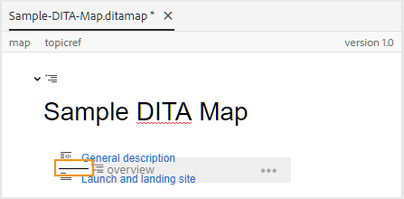
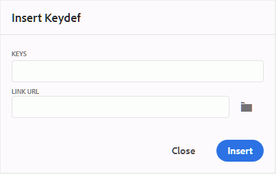
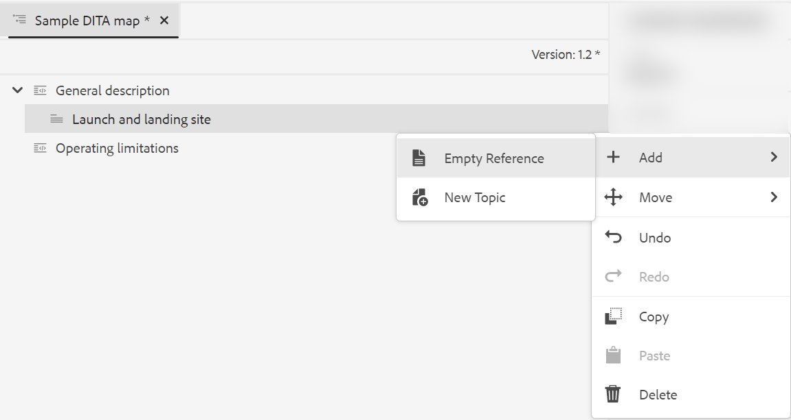
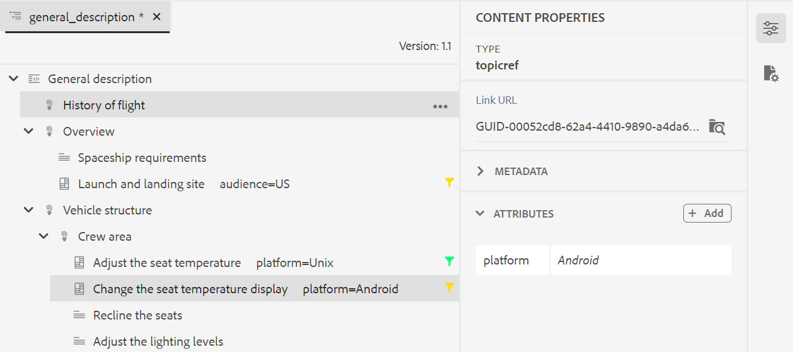
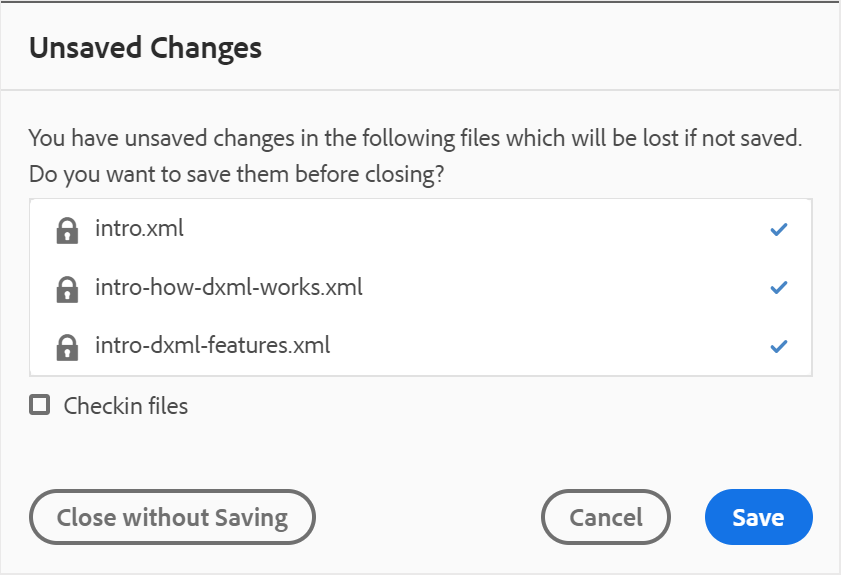

# 使用高级映射编辑器 {#id1942D0S0IHS}

高级映射编辑器提供直观的用户界面，它类似于Web编辑器。 在Web编辑器中打开映射文件时，您会获得一个选项，可使用“高级映射编辑器”界面编辑映射文件。 高级映射编辑器允许您添加主题引用、关键引用、内容结构等。

除了直接从Web编辑器编辑映射文件外，还可以在映射中打开主题文件以编辑Web编辑器。 本主题将向您介绍高级映射编辑器中的功能，以及如何在Web编辑器中打开和编辑DITA映射中的文件。

## 将主题添加到映射文件

执行以下步骤以使用高级映射编辑器构建映射文件：

1. 在Assets UI中，导航到要编辑的映射文件。

   >[!NOTE]
   >
   > 确保尚未启用资产选择模式。

1. 若要获取映射文件的独占锁定，请选择映射文件，然后单击&#x200B;**签出**。

   >[!NOTE]
   >
   > 一旦您对映射文件进行了独占锁定，其他用户将无法编辑该映射。 但是，他们能够处理映射文件中的主题。 如果管理员已将Web编辑器配置为在编辑之前签出文件，则在签出文件之前，您将无法编辑该文件。 同样，如果进行了配置，在关闭文件之前，系统会要求您签入任何已签出的文件

1. 选择映射文件后，单击&#x200B;**编辑主题**。

   {width="800" align="left"}

   或者，您也可以从映射文件的操作菜单中选择&#x200B;**编辑主题**&#x200B;选项：

   {width="800" align="left"}

   将打开映射文件，以便在Web编辑器的中进行编辑。

1. 单击&#x200B;**编辑**&#x200B;图标。

   {width="550" align="left"}

   将在高级映射编辑器界面中打开映射。 如果您已打开新的映射文件，则编辑器中只显示映射的标题。

   {width="800" align="left"}

   - **A** - \（*主工具栏*\）：这类似于Web编辑器的主工具栏。 有关详细信息，请参阅Web编辑器中的[主工具栏](web-editor-features.md#id2051EA0G05Z)。

   - **B** - \（*辅助工具栏*\）这是允许您处理映射文件的辅助工具栏。 有关通过辅助工具栏提供的功能的详细信息，请参阅高级映射编辑器工具栏中的[可用功能](#id205DEC0005Z)。

   - **C** - \（*映射视图*\）：允许您在布局、创作、Source和预览之间切换映射编辑器。 **布局**&#x200B;视图允许您在DITA映射中组织主题。 这将给出该映射的树或分层视图。 **作者**&#x200B;视图允许您在映射编辑器中编辑主题。 这还给出了映射文件的WYSIWYG视图。 **Source**&#x200B;视图允许您使用映射文件的基础XML。 预览为您提供了映射文件中所有主题和子映射的统一视图。 **关闭**&#x200B;链接关闭映射文件。

   - **D** - \（*左侧面板*\）：允许您访问左侧面板，该面板允许您访问收藏夹、存储库、映射、大纲和其他功能。 您可以通过单击展开侧栏图标\(\)来展开或折叠它。 有关左侧面板中可用功能的更多详细信息，请参阅Web编辑器中的[左侧面板](web-editor-features.md#id2051EA0M0HS)。

   - **E** - \（*中间区域*\）：映射内容编辑区域。

   - **F** - \（*右侧面板*\）：授予对“属性”面板的访问权限。 您可以查看选定主题或映射的内容属性和映射属性。 有关此面板中可用功能的更多详细信息，请参阅Web编辑器中的[右侧面板](web-editor-features.md#id2051EB003YK)。

1. 在左侧面板中，切换到&#x200B;**存储库视图**。

1. 在AEM存储库中，导航到包含要添加的主题或子映射的文件夹。

1. 在&#x200B;**存储库视图**&#x200B;中选择主题或映射文件，并将其拖放到\(middle\)映射内容编辑区域。

   该主题即添加到映射中。

   {width="800" align="left"}

1. 要添加后续主题或子映射，请将主题或子映射拖放到映射中的所需位置。

   构建映射文件时请考虑以下几点：

   - 文件被添加到地图编辑区域中水平条出现的位置。 在下面的屏幕截图中，将在&#x200B;*常规描述*&#x200B;和&#x200B;*启动项和登陆站点*&#x200B;主题之间添加&#x200B;*概述*&#x200B;主题。

     {width="350" align="left"}

   - 要替换主题，请将主题放在要替换主题的顶部、左侧或右侧。 主题左侧或右侧的垂直栏表示该主题将被放在其上的主题替换。

     {width="550" align="left"}

     但是，在替换主题之前，您会收到确认提示。 主题仅在您进行确认后才会被替换。

     {width="300" align="left"}

   - 如果将子映射添加到DITA映射，则该子映射在DITA映射中显示为链接。 要查看子映射的所有主题，请按Crtl并单击子映射链接。 子映射的内容将显示在新选项卡中。 同样，要从DITA映射中打开主题，请单击Crtl +单击主题链接，该链接将在新选项卡中打开。

   - 您可以使用快捷键CTRL+Z和CTRL+Y或它们在工具栏中的相应图标来撤消或重做映射中的任何更改。

   - 要更改主题的位置，请选择主题\（通过单击主题图标\），然后将其拖放到映射文件中的所需位置。 确保水平条在要放置主题的位置可见。 在下面的屏幕截图中，主题&#x200B;*启动项和登陆站点*&#x200B;将移动到&#x200B;*概述*&#x200B;主题之后。

     {width="350" align="left"}

   - 要检查映射文件的属性，请右键单击映射编辑区域中的任意位置，然后从上下文菜单中选择&#x200B;**属性**。 根据您的AEM版本，您可以看到元数据、计划\(de\)激活、引用、文档状态等属性。

1. 单击&#x200B;**保存**。

## 高级映射编辑器工具栏中的可用功能 {#id205DEC0005Z}

高级映射编辑器中的工具栏类似于主题Web编辑器。 切换左侧面板、保存映射、创建新版本的映射、撤消/重做上一个操作以及删除所选元素等基本操作在两个编辑器中都是通用的。 有关这些操作如何工作的详细信息，请参阅[了解Web编辑器功能](web-editor-features.md#)部分。

“布局”和“创作”视图的工具栏上还提供了以下特定于映射的操作：

## 布局视图 {#id205DEC0005Z_layout_view}

当您打开映射进行编辑时，它将打开映射编辑器的“布局”视图。“布局”视图以树视图显示映射层次结构，并允许您在映射中组织主题。

>[!NOTE]
>
> “布局”视图仅显示地图中存在的引用。 如果任何参照被断开，则参照左侧会显示一个小十字符号

您可以在“布局”视图中执行以下任务：

**插入主题引用** - 

显示主题搜索对话框。 导航到要插入的主题/映射文件，然后单击选择以将其添加到映射中。
{width="800" align="left"}

**插入主题组** - 

插入`topicgroup`元素。 有关分组主题的更多信息，请参阅OASIS DITA语言规范中的[主题组](https://docs.oasis-open.org/dita/v1.0/langspec/topicgroup.html)文档。

**插入键定义** - 

显示“插入Keydef”对话框。 使用此对话框可定义要在映射中使用的任何键定义。

{width="300" align="left"}

**此项前插入/此项后插入** -  / 

显示插入元素对话框。 选择要插入到映射中的元素。 根据操作，新元素会插入到映射中当前元素之前或之后。

**插入前置内容** - 

打开书签进行编辑时，将显示此图标。 您可以在书籍的开头插入组件，如目录、索引和表列表。

**插入后置内容** - 

打开书签进行编辑时，将显示此图标。 您可以为书籍的结尾插入组件，如索引、术语表和数字列表。

**将选定项目左/右移动** -  / 

单击左箭头将主题向层次结构中的左侧移动。 这实际上是将相应主题在层次结构中提升一级。 例如，在选定子主题时单击向左箭头，可使其成为其上主题的同级。 同样，如果单击向右箭头，则会将主题推到右侧，使其成为上方主题的子项。

**将选定项目上移/下移** - / 

单击向上或向下箭头图标，在层次结构中向上或向下移动主题。

>[!NOTE]
>
> 您还可以拖放引用以在地图中移动它们。

**锁定/解锁** -  / 

获取对映射文件的锁定并释放该锁定。 如果映射文件中有未保存的更改，则在释放锁定时，系统会提示您保存映射文件。 更改将保存在映射文件的当前版本中。

**合并** - 

有关从同一或不同文件的不同版本合并内容的更多详细信息，请参阅Web编辑器中的[合并](web-editor-features.md#id205DF04E0HS)。

**版本历史记录** - 

检查活动主题上的可用版本和标签，并从编辑器本身还原到任何版本。

**版本标签** - 

显示版本标签管理对话框。 从下拉列表中选择一个版本。 选择要应用于所选版本的标签，然后单击&#x200B;**添加标签**&#x200B;进行添加。

**查看选项** - 

显示一个下拉列表，其中提供了“显示行号”、“显示复选框”和“显示文件名”选项。

- **显示行号**

显示或隐藏每个主题的行号。 行号的显示取决于层次结构中的级别。

- **显示复选框**

显示或隐藏每个主题的复选框。 您可以使用该复选框选择主题，并使用“选项”菜单执行各种任务。 有关详细信息，请参阅[选项](#id228ID8006H8)菜单。

- **显示文件名**

显示主题标题的文件名。

>[!NOTE]
>
> 将指针悬停在主题标题上时，会显示文件路径。

**基于条件筛选条件查看主题**&#x200B;如果您对某个主题应用了任何条件，则该主题的右侧将显示筛选图标。 将指针悬停在过滤器图标上时，将显示应用的条件及其属性值。

布局视图中的&#x200B;**选项菜单**

除了在映射文件中组织主题外，您还可以使用“布局”视图中元素的“选项”菜单执行下列操作：

{width="650" align="left"}

- **添加**：您可以从映射编辑器中选择添加新主题或空引用：
   - **空引用**：此选项允许您在DITA映射中添加空引用。 您可以稍后双击插入的空引用并添加主题详细信息。 有关更多详细信息，请参阅[在Web编辑器中创建主题](web-editor-features.md#id228ICI0105U)。
   - **新建主题**：当您选择从菜单创建新主题时，您会看到“新建主题”对话框。 在创建新主题对话框中，提供所需的详细信息，然后单击创建。 有关更多详细信息，请参阅[在Web编辑器中创建主题](web-editor-features.md#id228ICI0105U)。
- **移动**：您可以选择在层次结构中向上/向下/向右/向左移动主题。您还可以将主题或映射从存储库面板拖放到在“映射编辑器”中打开的映射中。
- **撤消**：撤消布局视图中的上一个操作。
- **重做**：重做布局视图中的上一个操作。
- **复制**：从映射文件中复制所选引用。

  >[!NOTE]
  >
  > 可显示，然后选中复选框以复制多个引用。

- **粘贴**：将复制的引用粘贴到层次结构中的当前位置。
- **删除**：从映射文件中删除选定的引用。

  >[!NOTE]
  >
  > 可显示，然后选中复选框以删除多个引用。

## 地图编辑器中的右侧面板

右侧面板在地图编辑器的布局视图中显示内容属性和地图属性。

**内容属性**

“内容属性”面板包含有关地图中当前选定主题的类型、其链接URL及其属性的信息。 有关详细信息，请参阅Web编辑器中的[内容属性](web-editor-features.md#id228IDB00HMM)。

- **其他属性**&#x200B;如果管理员为属性创建了配置文件，则您将获得这些属性及其配置值。 使用“内容属性”面板，您可以选择这些属性，并将它们分配给主题中的相关内容。 您还可以在编辑器设置的&#x200B;**显示属性**&#x200B;选项卡下分配管理员配置的属性。 为元素定义的属性将显示在“布局”和“大纲”视图中。 这有助于快速查看映射中为其定义了特定属性的所有主题。 例如，所有将平台属性定义为“Android”的主题。

  {width="650" align="left"}

  有关更多详细信息，请参阅[左侧面板](web-editor-features.md#id2051EA0M0HS)部分的&#x200B;*编辑器设置*&#x200B;功能描述中的&#x200B;*显示属性*。

- **元数据**&#x200B;您可以使用元数据设置元数据信息。 您可以定义导航标题、链接文本、简短说明和关键字。

有关标准主题属性和元数据的更多信息，请参阅OASIS DITA语言规范中的[topicref](https://docs.oasis-open.org/dita/v1.2/os/spec/langref/topicref.html)文档。

**映射属性**

显示“映射属性”对话框，在其中可以设置映射的属性和元数据信息。

## 作者视图 {#id205DEC0005Z_author_view}

**作者**&#x200B;视图允许您在Web编辑器中编辑DITA映射。 这会显示映射编辑器的WYSIWYG视图，并且在“作者”视图中显示的某些图标与“布局”视图相同。 有关详细信息，请参阅[布局视图](#id205DEC0005Z_layout_view)。 此外，您还可以从“作者”视图中查看以下图标并执行相关任务：

**此项前插入/此项后插入** -  / 

显示插入元素对话框。 选择要插入到映射中的元素。 根据操作，新元素会插入到映射中当前元素之前或之后。

**插入元素** - 

显示插入元素对话框。 选择要插入的元素。 可以使用键盘滚动元素列表，然后按Enter插入所需的元素。 或者，可以直接单击元素以将其插入到映射中。

**插入关系表** - 

在映射中插入关系表。 由于使用关系表的概念与“基本映射编辑器”一节中说明的相同，有关详细信息，请参阅[在基本映射编辑器中使用关系表](map-editor-basic-map-editor.md#id1944B0I0COB)。

**插入可重复使用的内容** - 

显示重用内容对话框。 使用此对话框可插入要在映射中重复使用的内容。

**刷新导航标题属性** - 

将映射中引用文件的`title`元素与其`@navtitle`属性中指定的值同步。 可以在映射中添加不同类型的引用文件，例如主题、引用、任务、\(sub\)映射等。 这些文件中的大多数都支持`@navtitle`属性。 如果文件包含`@navtitle`属性，则映射中相同文件的`@navtitle`属性将更新。 如果`@navtitle`属性不存在，则`@navtitle`属性将添加到该引用文件，并且其`title`也会更新为显示`@navtitle`。

>[!NOTE]
>
> 您的管理员可以配置自动向添加到映射的每个引用文件添加`@navtitle`属性。 有关配置自动添加`@navtitle`属性的更多详细信息，请参阅安装和配置Adobe Experience Manager Guidesas a Cloud Service中的&#x200B;*默认情况下包含@navtitle属性*。

单击“刷新导航标题属性”图标以同步`title`元素和`@navtitle`属性的值。

**切换标记视图** - 

显示或隐藏XML标记。 标记用作指示元素边界的可视提示。 在此模式下，如果要插入主题/映射引用，请将所需文件拖放到标记之前或之后。 在“标记视图”模式下不会显示水平条。

**启用/禁用跟踪更改** - 

通过启用“跟踪更改”模式，您可以跟踪在映射文件中进行的所有更新。 启用跟踪更改后，文档将捕获所有插入和删除。 有关更多详细信息，请参阅[在Web编辑器中启用/禁用跟踪更改](web-editor-features.md#id205DF0203Y4)。

**创建审核任务** - 

可直接从Web编辑器创建当前主题的审阅任务或映射文件。 打开要为其创建审阅任务的文件，然后单击“创建审阅任务”以启动审阅创建流程。 按照[查看主题或映射](review.md#)中提供的说明了解更多详细信息。

## 通过DITA映射编辑主题 {#id17ACJ0F0FHS}

编辑单个主题不会为作者提供完整的上下文。 作者不会了解有关主题在DITA映射中的放置位置的信息。 如果没有这些上下文信息，作者创建内容会变得有点困难。

AEM Guides允许作者在Web编辑器中打开DITA映射，并查看主题在映射中的位置。 这有助于作者了解主题在地图中的确切放置位置并创建更相关的内容。 此外，如果有多位作者在一个项目上工作，则他们可以知道地图中所有的主题都可用，并可以根据需要重用内容。

要通过DITA映射编辑主题，请执行以下步骤：

1. 在Assets UI中，导航到包含要编辑的主题的DITA映射。
1. 单击DITA映射以在DITA映射控制台中将其打开。
1. 选择&#x200B;**主题**&#x200B;选项卡以查看DITA映射中可用的主题列表。

   >[!TIP]
   >
   > “主题”选项卡为您提供了一个选项，用于下载映射文件及其依赖项。 有关详细信息，请参阅[导出DITA映射文件](authoring-download-assets.md#id218UBA00IXA)。

1. 在主工具栏中，单击&#x200B;**编辑主题**。

   DITA映射将在Web编辑器中打开。

   >[!NOTE]
   >
   > 您还可以在Assets UI中选择DITA映射文件，然后单击主工具栏中的&#x200B;**编辑主题**&#x200B;以启动Web编辑器。

   {width="350" align="left"}

1. \（*可选*\）您还可以从映射中选择主题，并在编辑之前签出文件。 要签出文件\(s\)，请从左窗格中选择一个或多个文件，然后单击&#x200B;**签出**。 您还可以通过选择签出文件并单击“映射”视图中的&#x200B;**取消签出和解锁**&#x200B;图标来释放对任何文件的锁定。

   >[!IMPORTANT]
   >
   > 如果管理员配置了&#x200B;**禁用编辑而不签出**&#x200B;选项，则必须在编辑之前签出文件。 如果不签出文件，则文档将在编辑器中以只读模式打开。

   以下屏幕截图突出显示了“签出并锁定\(A\)”、“取消签出并解锁\(B\)”、“另存为新版本”和“解锁\(C\)”、“编辑\(D\)”、“预览\(E\)”、显示不同DITA文件类型\(F\)的不同图标以及\(G\)签出的文件。

   {width="550" align="left"}

1. 单击任意主题链接以在Web编辑器中打开它以进行编辑。

   可在编辑器中打开多个主题，每个主题都将在编辑器的新选项卡中打开。 即使DITA映射包含子映射，子映射中的主题也将在新选项卡中打开以进行编辑。 如果要查看子映射下的主题，可以单击并展开子映射。

   {width="800" align="left"}

   如果单击某个映射文件，则该映射将在Web浏览器的新选项卡中打开。

1. 编辑完主题后，可以执行以下操作：

   - 您可以单独保存它们。 如果单击&#x200B;**关闭而不保存主题**，您将看到一个对话框提示您保存未保存的主题：

     {width="550" align="left"}

     您可以选择保存所有选定的主题，也可以取消选择不想保存的主题。

   - 您可以使用&#x200B;**另存为新版本和解锁**&#x200B;按钮签入主题。 在保存主题的一个版本时，将创建一个新版本，同时也会释放锁定。

     建议在签入文件之前保存更改。  在保存更改时，将验证XML文件。

   - 您还可以使用&#x200B;**另存为新版本和解锁**&#x200B;按钮选择并签入多个主题。 在保存主题版本时，将为每个主题创建一个新版本，并且还会释放锁定。 您还可以从&#x200B;**另存为新版本和解锁**&#x200B;对话框中查看签入主题的进度。 签入文件时将显示成功消息。

   - 如果管理员启用了关闭时签入文件的选项，则每当已签出的文件被关闭时，系统都会提示您保存文件。 启用此选项后，在关闭包含已更改文件的编辑器时，将显示需要保存的已签出文件列表。 签出的文件显示有锁图标：

     {width="550" align="left"}

      - 单击&#x200B;**关闭而不保存**&#x200B;按钮可关闭文件而不保存任何更改。

      - 单击&#x200B;**保存**&#x200B;按钮可保存更改，但不会签入文件。

      - 选择&#x200B;**Checking Files**&#x200B;选项，然后单击&#x200B;**Save**&#x200B;按钮将签入文件\（创建另一个版本\）并保存文件。

## 预览地图

除了能够查看地图中每个主题文件的位置之外，还希望在一个连续流中查看地图内容。 “预览映射”功能允许您通过单击查看映射文件的整个内容。 您不必生成映射文件的输出即可查看整个映射在发布后的外观。 您只需访问映射的预览即可，所有主题和子映射将以书籍的形式呈现。

您可以从以下位置访问地图的预览：

- **Assets UI**：在Assets UI中，导航到映射位置，选择映射文件，然后在工具栏中选择&#x200B;**预览映射**。 映射的预览将显示在新选项卡中。 您可以在预览模式下查看所有主题的内容。 在此视图中，不能编辑任何主题。

  >[!NOTE]
  >
  > 如果&#x200B;*预览图*&#x200B;选项在主工具栏中不可见，则它可能已移动到&#x200B;**更多**&#x200B;工具栏菜单下。

- **高级映射编辑器**：在高级映射编辑器中，单击“预览”图标查看当前映射的预览。

  {width="350" align="left"}

  您可以在预览模式下执行以下附加任务：

   - 右键单击主题，然后选择&#x200B;**编辑**&#x200B;以打开该主题并在新选项卡中进行编辑。

     >[!NOTE]
     >
     > 如果您没有编辑权限，则该主题将以只读模式打开。

   - 通过单击映射树中的主题标题\（在左侧面板中\）跳转到所需主题。

   - 地图预览中的当前主题也会在地图树中突出显示。

**父主题：**[&#x200B;使用映射编辑器](map-editor.md)
