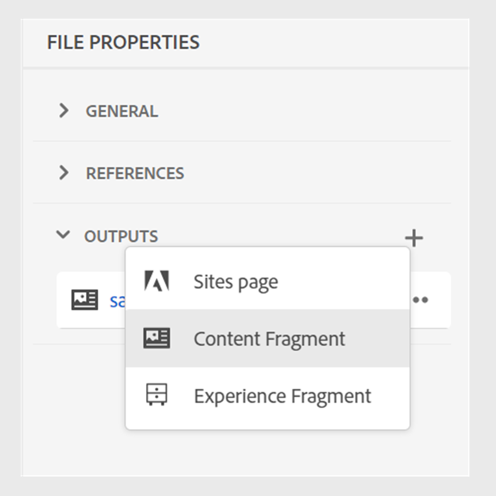
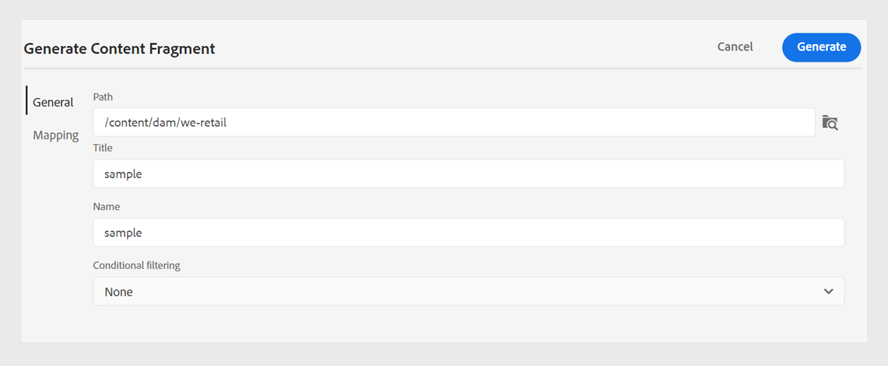
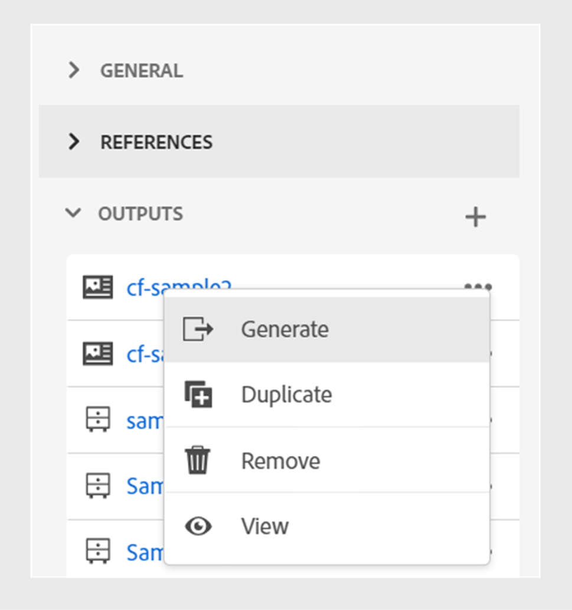

# 发布内容片段

Content Fragments are discrete pieces of content in Adobe Experience Manager. They are structured content based on a content model. Content Fragments are pure content without design or layout information. They can be authored and managed independently of the channels that Adobe Experience Manager supports. Content Fragments are modular, where content is broken down into smaller components.

Experience Manager Guides allows you to publish a topic or its elements to a content fragment.

>[!NOTE]
>
>You can choose only those elements in a topic that have an id attribute  defined.

To create a Content Fragment, perform the following steps:

1. Create a [Content Fragment model](https://experienceleague.adobe.com/docs/experience-manager-65/assets/content-fragments/content-fragments-models.html?lang=zh-Hans) in Adobe Experience Manager Assets.
1. Create a folder where you want to save the Content Fragments that you create based on the Content Fragment model. For example, &quot;stock-content-fragments&quot;.
1. Edit the folder&#39;s properties (for example, &quot;stock-content-fragments&quot;) and add the path of the folder, which contains the Content Fragment model in the cloud configuration.
For example, add `/conf/we-retail` in the cloud configuration. This configuration connects all the Content Fragment models with the folder.\
   {width="650" align="left"}
   *Add the cloud configuration in the folder properties to connect it with the fragment models.*

1. To generate a Content Fragment, select **New Output**  from the **Outputs** section in the **File Properties** of a topic.
1. Select **Content Fragment**.\
    {width="300" align="left"}

   *Add a new Content Fragment from the File Properties of a topic*.

1. In the **Generate Content Fragment** dialog box, fill in the following details under the **General** and **Mapping** tabs.

   **常规**选项卡
   
   *添加路径、名称、标题和条件筛选以将主题或其元素发布为内容片段。*

   * **路径**：浏览并选择要发布内容片段的文件夹的路径。 如果选择现有的内容片段，则会覆盖映射字段的内容。
   * **标题**：键入内容片段的标题。 默认情况下，标题中填充了主题的标题。 您可以对其进行编辑。 此标题用于生成内容片段的名称。
   * **名称**：键入内容片段的名称。 默认情况下，该名称将填充主题标题，空格将替换为“_”。 例如，*sample_content_fragment*。 您可以对其进行编辑。  此名称用于生成内容片段的URL。

   * 您可以选择不同的条件来创建内容片段变体。 选择以下选项之一：
     >[!NOTE]
     > 
     > 仅当在主题中定义了条件属性时，才会启用条件。

      * **无**：如果不想对已发布的输出应用任何条件，请选择此选项。
      * **使用DITAVAL**：选择要在生成的输出中包含或排除特定内容的DITAVAL文件。 可使用浏览对话框或键入文件路径来选择DITAVAL文件。
      * **使用属性**：您可以在DITA主题中定义条件属性。 然后选择条件属性以发布相关内容。

   **映射**&#x200B;选项卡

   

   *选择内容片段模型并添加映射详细信息，以将主题或其元素发布为内容片段。*

   * **模型**：选择要用于创建内容片段的内容片段模型。 将从已在Experience Manager Guides服务器上配置的文件夹中选取模型。
   * **映射**：您可以查看应用了ID属性的主题元素。 将主题元素拖动到内容片段模型中存在的字段。
如果存在内容片段，右侧会填充已发布的内容片段内容。 如有必要，可以用主题内容覆盖这些内容。 您还可以选择**撤消**&#x200B;以还原映射更改。

     >[!NOTE]
     >
     > 如果您使用的是4.4或更低版本，请从下拉列表中选择一个映射。 它会从&#x200B;*contentFragmentMapping.json*&#x200B;文件中选取映射。  您的管理员可以在&#x200B;*contentFragmentMapping.json*&#x200B;文件中添加映射。 请参阅安装和配置指南以了解有关如何[创建主题和内容片段之间的映射](/help/product-guide/cs-install-guide/conf-content-fragment-mapping-cs.md)的详细信息。

1. 单击&#x200B;**生成**&#x200B;以发布内容片段。

1. 您可以在&#x200B;**文件属性**&#x200B;的&#x200B;**输出**&#x200B;部分下查看主题的内容片段。

   {width="300" align="left"}

   *查看某个主题存在的内容片段并重新发布它们。*

发布内容片段后，还可以在任何Adobe Experience Manager站点中使用它们。

## 内容片段的“选项”菜单

您还可以从&#x200B;**选项**&#x200B;菜单为内容片段执行以下操作：

* **生成**：重新发布内容片段以使用DITA主题中的最新内容对其进行更新。 重新生成输出时，您可以更改内容片段的路径、名称、标题、模型和映射。 也可以在再生输出时选取不同的条件。

* **重复**：重复内容片段。 您可以更改路径、名称、标题、模型和映射。 在复制内容片段以创建内容片段变体时，您还可以选择不同的条件。

* **移除**：从输出列表中移除内容片段。 出现确认提示。 Once you confirm, the Content Fragment is removed from the **Outputs** list.

  >[!NOTE]
  >
  > No content is deleted from the Content Fragment by this action.

* **View**: View the Content Fragment editor. 您还可以进行更改并保存它们。

## Improved Non-UUID to UUID content migration

The new UUID content migration script has been significantly optimized, making the content migration from Non-UUID to UUID 30 times faster than the earlier script. It includes features such as resuming from checkpoints, live insights, estimated completion time, and detailed reporting, ensuring a harmonious migration process. Notably, the migration process preserves asset metadata without any changes. The script has been tested and verified on a large dataset of 3 million assets, confirming its efficiency and reliability for large-scale migrations.

Learn more about [Non-UUID to UUID content migration](/help/product-guide/install-guide/migrate-non-uuid-4-3.md).
