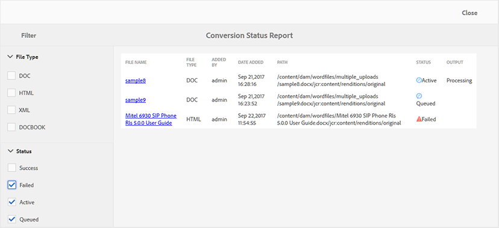

# 转化状态报表 {#id205BBA00WZZ}

AEM Guides提供强大的转换功能，可将各种格式的文档转换为DITA。 转换状态报表提供了AEM Guides执行的所有转换任务的统一视图。

执行以下步骤以查看“转换状态报表”：

1. 单击顶部的Adobe Experience Manager链接，然后选择&#x200B;**工具**。

1. 从工具列表中选择&#x200B;**指南**。

1. 单击“**转化状态报表**”拼贴。

   对于系统上执行的所有转换任务，将显示转换状态报告。

   {width="800" align="left"}

1. 报告页面分为两个部分：

   - **筛选器：**

     您可以根据“文件类型”和“转换状态”筛选报表数据。 在“文件类型”中，您可以选择查看Word文档、结构化HTML、XML和DocBook类型文档的报表数据。 在状态中，您可以选择查看已成功执行、失败、活动或已排队任务的报表数据。

     以下屏幕截图显示了状态为“失败”、“活动”和“已排队”的转化任务的报表数据。

     {width="800" align="left"}

   - **报表数据：**

     报表数据包含以下列：

      - **文件名**：执行转换过程的源文件的名称。 单击“文件名”链接将转到源文档位置。

      - **文件类型**：源文档的类型，可以是Word、结构化HTML、XML和DocBook。

      - **添加者**：执行转换任务的用户的名称。

      - **添加日期**：执行任务的日期。 单击添加日期链接可下载日志文件。

      - **路径**：源文档的完整路径。

      - **状态**：转换任务的状态 — 成功、失败、活动或排队。

      - **输出**：已成功转换文档的路径。 单击“输出”链接可转到保存输出的位置。

**父主题：**&#x200B;[&#x200B;报告](reports-intro.md)
