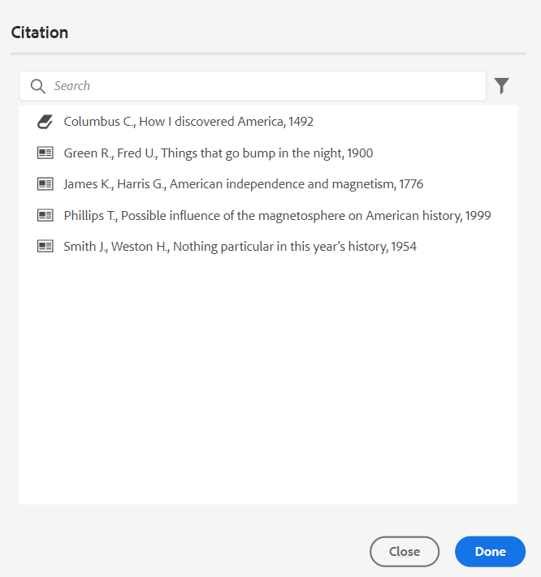
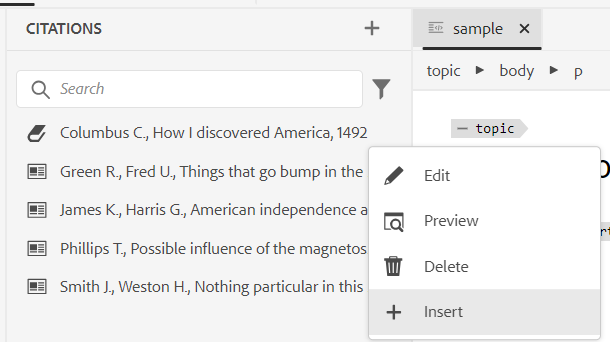

# Add and manage citations in your content

Citations are references to the source of information added to your content. Using citations, you can credit the authors of the source information and help readers to follow up on the source information. Adding citations makes your content more reliable and prevents plagiarism. They also allow you to display well-researched content.

In AEM Guides, you can add and import citations and apply them to your content. You can add these citations from any source of books, websites, and journals.

AEM Guides helps you to edit, preview, and sort your citations. After adding your citations into the content, you can generate the output using Native PDF. You can also add the bibliography or references page in the Native PDF output.

AEM Guides supports multiple styles of citations, such as Modern Language Association (MLA), American Psychological Association (APA), Chicago, Institute for Electrical and Electronics Engineers (IEEE), and American Heart Association (AHA). The recommendation is to use them clearly and consistently.

>[!NOTE]
>
>Currently AEM Guides only supports Native PDF for citations.

## Add citations

To add citations, follow these steps:

1. Select the **Citations**  icon in the left panel.
The **Citations** panel opens.

   {width="300" align="left"}

1. In the **Citations** panel, select . From the dropdown you can choose to add a new citation or to import  a citation.

1. Select **New Citation** to add a new citation.
The **Add Citation** dialog box opens.

    {width="300" align="left"}

1. 填写&#x200B;**添加引文**&#x200B;对话框中的字段。

   >[!NOTE]
   >
   >您还可以添加ISBN、DOI或PubMed ID。 AEM Guides会自动填充其他字段。

   | 书籍 | 网站 | 日志 |
   | --- | ---|---|
   | **Source**  从下拉列表中，选择引用作为书籍的来源。 | **Source** &#x200B;从下拉列表中，选择引用源作为网站。 | **Source**  从下拉列表中，选择引用源作为日志。 |
   | **搜索依据**  从下拉列表中选择&#x200B;**ISBN**&#x200B;或&#x200B;**DOI**&#x200B;以搜索链接到引文的数字ID。   DOI：数字对象标识符  ISBN：唯一数字帐簿标识符 | **搜索依据**  从下拉列表中选择&#x200B;**DOI**&#x200B;以搜索链接到引文的数字ID。 | **搜索依据**  从下拉列表中选择&#x200B;**DOI**&#x200B;或PubMed ID以搜索链接到该引文的数字ID。     |
   | **作者**  添加引文作者的名字和姓氏。 选择以添加更多名称。 | **作者**  添加引文作者的名字和姓氏。 选择以添加更多名称。 | **作者**  添加引文作者的名字和姓氏。 选择以添加更多名称。 |
   | **标题**  添加书籍的标题。 | **标题**  添加网页的标题。 | **标题**  添加文章的标题。 |
   | **编辑者**  添加书籍的编辑者。 | **网站名称**  添加网站的名称。 | **日志标题**  添加文章所在工作的标题。 |
   | **版本**  添加书籍的版本。 | **URL**  添加网站的Web链接以浏览内容。 | **年**  添加文章发布的年份。 |
   | **城市**  添加出版物的城市。 | **访问日期** &#x200B;添加访问网站内容的日期。 | **卷**  添加系列中的工作卷。 |
   | **发布者**  添加书籍发布者的名称。 | **发布日期**  添加发布网站内容的日期。 | **数字**  添加系列中卷的编号。 |
   | **年**  添加书籍发布的年份。 | **更新日期**  添加更新网站内容的日期。 | **页面**  添加找到的文章的页码或页面范围。 |
   | **版本**  添加书籍的版本。 | **唯一ID**  为引文添加唯一ID。 唯一ID是该引文的唯一标识符。 | **URL**  将Web链接添加到日志。 |
   | **系列**  添加书籍的系列。 |  | **唯一ID**  为引文添加唯一ID。唯一ID是该引文的唯一标识符。 |
   | **URL**  添加Web链接到帐簿。 |  |  |
   | **唯一ID**  为引文添加唯一ID。 唯一ID是该引文的唯一标识符。 |  |  |

1. 选择&#x200B;**完成**。

   新的引文将添加到“引文”面板。

>[!NOTE]
>
> 必须为引文字段添加唯一ID。  添加引文后，便无法更改唯一ID。

## 导入引文

要导入引文，请执行以下步骤：

1. 在左侧面板中，选择&#x200B;**引用** 。

   将打开&#x200B;**引用**&#x200B;面板。

1. 在&#x200B;**引用**&#x200B;面板中，选择，然后从下拉列表中选择&#x200B;**导入**。
1. 从系统中浏览.bib文件并将其导入。

   >[!TIP]
   >
   > .bib文件扩展名是BibTeX文献数据库文件。 它是一个特殊格式化的文本文件，列出了有关特定信息源的引用。

   成功导入文件后，您可以在引用面板中查看引用。

   >[!NOTE]
   > <ol><li> AEM Guides仅导入不重复且尚不存在的引用。
   > &gt; <li> AEM Guides可以从书籍、日记或网站导入引文。 目前不支持来自其他来源的引用。

## 管理引文

引用在左侧面板中按字母顺序排序。 根据要在主题中使用的源搜索引文。

### 过滤器

选择搜索栏旁边的&#x200B;**筛选器** 图标，然后从下拉列表中选择源选项以筛选引用列表。 它允许进行单选和多选。

* **所有源**：它显示完整的引用列表，包括所有源。

* **书籍**：它显示源自书籍的引用列表。

* **网站**：它显示源自网站的引用列表。

* **日志**：它显示来自日志的引用列表。

### 搜索

在引文中搜索您的内容。

1. 在左侧面板中，选择“引文”。
将打开&#x200B;**引用**&#x200B;面板。

1. 使用搜索栏从长列表中搜索相应的引用。

### 更改引用样式 {#change-citation-style}

系统管理员可以从&#x200B;**编辑器设置**&#x200B;的&#x200B;**常规设置**&#x200B;选项卡中的&#x200B;**引用**&#x200B;下拉菜单中更改引用的样式。
这些样式决定引文在预览窗格或本机PDF输出中的显示方式。

下拉菜单中提供了以下选项：

| MLA | APA | 芝加哥 | IEEE | AHA |
|---|---|---|---|---|
| 现代语言关联样式  | 美国心理协会风格 | 《芝加哥风格手册》 | 电气和电子工程师风格研究所 | 美国心脏协会风格 |
| 示例：  Crawford， Claire等 *黑暗记忆的情感内容*。Edited by Memory， vol 16， 2010， Amsterdam。 | 示例：   Crawford， C.， J.， &amp;， C. (2010). *黑暗记忆的情感内容* （505-16版）。 10.1080/ 09658210902067289 | 示例：   Crawford、Claire等 *黑暗记忆的情感内容*。 505-16, 2010. | 示例：   C. Crawford， J. 和C. ，*黑暗记忆的情感内容*。 阿姆斯特丹，2010年。 | 示例：   C. Crawford， J. 和C. ，*黑暗记忆的情感内容*。 阿姆斯特丹，2010年。 |

## 编辑引文

要编辑该引文，请执行以下步骤：

1. 将鼠标悬停在列表中引文的名称上。 选择 **选项**&#x200B;图标。

1. 选择&#x200B;**编辑**。

将打开&#x200B;**编辑引文**&#x200B;对话框。

1. 进行所需的更改。 选择&#x200B;**完成**。
将编辑选定的引文。

>[!NOTE]
>
>添加引文后，便无法更改唯一ID。

## 预览引用

要预览引用，请执行以下步骤：

将鼠标悬停在列表中引文的名称上。 选择      **选项**&#x200B;图标。

1. 选择&#x200B;**预览**。
您可以在预览窗格中预览引文的内容和格式。

   >[!NOTE]
   >
   >预览基于管理员在&#x200B;**编辑器设置**&#x200B;中选择的引文样式。

1. 单击屏幕上的任意位置以关闭预览框。

   {width="550" align="left"}

>[!NOTE]
>
> 您还可以从Assets UI或Web编辑器的“预览”选项卡预览在主题中插入的引文。

## 插入引文

执行以下步骤将引用插入到主题：
1. 在存储库面板中选择主题，然后双击以在编辑窗口中将其打开。
1. 将光标放在要添加引文的主题位置。

您可以从主工具栏或左侧面板将引用插入到主题。

### 从主工具栏

1. 在主工具栏中选择&#x200B;**引用** 图标。
1. 在&#x200B;**引文**&#x200B;对话框中，选择引文。 您还可以选择多个引文。
   {width="300" align="left"}
1. 您可以在&#x200B;**引文**&#x200B;对话框的搜索面板中键入前几个字母来筛选引文。

1. 单击&#x200B;**完成**。
所选引文将添加到主题中的光标位置。

### 从左侧面板

>[!NOTE]
> 
>若要从左侧面板查看&#x200B;**引用**&#x200B;图标，系统管理员必须在&#x200B;**编辑器设置**&#x200B;的&#x200B;**面板**&#x200B;选项卡中选择&#x200B;**引用**&#x200B;选项。

1. 在左侧面板中选择&#x200B;**引用** 图标。
1. 将引文从&#x200B;**引文**&#x200B;面板拖放到主题中的适当位置。

   您还可以从 **选项**&#x200B;中选择&#x200B;**插入**&#x200B;以插入引用。

   
1. 要选择多个引文，请右键单击主题中的引文，然后从快捷菜单中选择&#x200B;**修改引文**。
1. 从&#x200B;**引文**&#x200B;对话框中选择要插入的引文。
1. 选择&#x200B;**完成**&#x200B;以将其添加到主题。

在主题中插入引文后，可以在Web编辑器中预览它们。 您还可以使用本机PDF发布包含引文的内容。

## 删除引文

您可以从“引文”面板或插入的主题中删除引文。

### 从“引用”面板中删除引用

要从“引文”面板中删除引文，请执行以下步骤：

1. 将鼠标悬停在列表中引文的名称上。
1. 选择 **选项**&#x200B;图标。
1. 选择   **删除** 。
确认对话框打开。
1. 选择&#x200B;**是**。
所选引文将从引文面板中删除。

### 从主题中删除引用

To delete a citation that is already used in the topic, follow these steps:

In the topic, place your cursor at the end of the citation.

1. Right-click a citation in the topic and select **Modify Citation** from the shortcut menu. The Citation dialog opens.
   

1. You can choose the citations you want to insert into the document.

   >[!NOTE]
   >
   >The citations that are already used in the topic are replaced with the ciations that you select from the dialog.

1. 选择&#x200B;**完成**。

## Generate output of content with citations

Once you have inserted citations in the topic, you can publish content with citations using Native PDF.

In the Native PDF output, the citations appear within the content where you have inserted them. You can also create a Bibliography page. When you click any citation, you are redirected to the bibliography page.

Create a **Citations** page layout in the PDF templates, and include it in your document. All the citations used in the book get listed on one page that appears in the PDF output. To learn more about creating a page layout, view [Create a page layout](/help/product-guide/native-pdf/components-pdf-template.md#create-page-layout).

To change the view and feel of the citation page, view [Customize PDF templates](/help/product-guide/native-pdf/pdf-template.md).

### Apply content style to a citation

Apply formatting to the citation when added to the topic.

1. Select **Stylesheets** in the **Templates** panel of a Native PDF output preset.   It opens the **STYLES** panel that contains all the styling options.

1. In the Search panel, search for `<cite>`.

To learn more about styles, view [Work with the common content styles](/help/product-guide/native-pdf/stylesheet.md).
