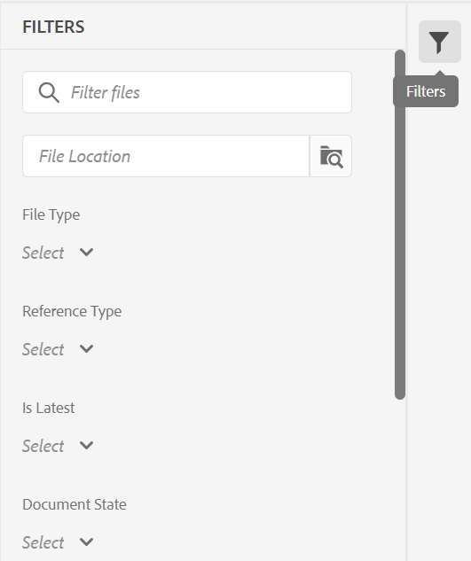

# 从Web编辑器创建和管理基线 {#id223MB0ZF043}

>[!TIP]
>
> It is recommended to use this Baseline feature from the Web Editor if you have upgraded to AEM Guides as a Cloud Service March release or later.

AEM Guides provides the Baseline feature integrated inside the Web Editor that allows the users to create baselines and use them to publish or translate topics of different versions. They can also publish multiple output presets of the same DITA map in parallel.

## 创建基线

You can create a baseline from the Web Editor by performing the following steps:

1. 在“存储库”面板中，在“映射视图”中打开DITA映射文件。
1. Click the **Manage** tab. The **Baseline** panel displays the baselines of the DITA map.

   {width="800" align="left"}

1. On the **Baseline** panel, select the + icon at the top-right to start creating a baseline.
1. Enter a name for the baseline in **Name**.
1. In **Configuration**, you can either choose **Manual update** option or **Automatic update** option:

   **Manual update**: You can manually create a static baseline with a specific version of the topics and referenced content available on a specific date and time, or with a label defined for a version of topics:

   - In **Select the version based on,** select one of the following options:

      1. **Date** &lt;time stamp\>: Picks the topics&#39; version as on the specified date and time.
      1. **标签**：选择此选项可根据应用于主题的标签选择主题。 If the topics have labels specified for them, the labels are listed in the dropdown. You can choose a label from the list. You can also add a label in the text box.

         For the direct references in static baselines, the labels are pulled from the latest saved version of the map. For example, if you have created labels `Label Release 1.0` and `Label Release 1.1` for versions 1.0 and 1.1 of Topic A, and then add Topic A to the map saved as version 1.0. 在这种情况下，您可以在下拉列表中查看静态基线标签的标签`Label Release 1.0`和`Label Release 1.1`。

         当您选择&#x200B;**标签，**&#x200B;时，您可以选择直接引用和间接引用。
         - 对于DITA映射中的直接引用，可以选择使用未应用指定标签的最新版本主题。

           >[!NOTE]
           >
           > 如果输入的标签不存在，并选择选项&#x200B;**不创建基线**，则基线创建将失败，并在“基线”面板中的基线名称附近显示错误消息。

         - 对于DITA映射中的间接引用，提供了附加选项，可用于未在其上应用指定标签的最新版本主题。 您还可以选择&#x200B;**自动挑选引用的内容**，系统会自动挑选与引用内容版本对应的引用内容版本。

         选择标签或版本作为日期后，将相应地选择映射中所有引用的主题和媒体文件。 所选的主题不会显示在用户界面上，但会保存在后端。

   **自动更新**：为基线创建选择此选项，以根据应用于主题的主题标签自动选择主题。

   使用自动更新配置创建的基线会动态更新。 如果您生成基线、下载基线或使用基线创建翻译项目，则系统会根据更新的标签动态选取文件。 例如，如果您使用了主题的1.2版和标签版本1.0作为基线，而更新的版本1.5和标签版本1.0，则将动态更新基线，并使用版本1.5。

   {width="300" align="left"}

   - **标签**：如果主题指定了标签，则使用&#x200B;**标签**&#x200B;下拉菜单从[列出的标签](#labels-list)中进行选择。
首先选定的标签优先于后续的标签。

     >[!NOTE]
     >
     >在提取标签时，会出现加载器，并且下拉列表被禁用。

     对于动态基线，将从地图的最新保存版本和当前工作副本中提取标签。 例如，如果您已创建标签   主题A版本1.0和1.1的`Label Release A.1.0 `和`Label Release A.1.1`以及主题B版本1.0和1.1的标签`Label Release B.1.0`和`Label Release B.1.1`。 然后，可以添加主题A来映射1.0版中的A，添加主题B来映射1.0*版中的A（工作副本）。 在这种情况下，您可以在动态基线标签下拉列表中查看`Label Release A.1.0 `、`Label Release A.1.1`、`Label Release B.1.0`和`Label Release B.1.1`。

1. **间接引用**：对于DITA映射中的间接引用，提供了以下选项：

   - **自动挑选**：您可以选择自动挑选&#x200B;**引用的内容**，系统会自动挑选与引用内容版本对应的引用内容版本。

   - **使用所选标签**：您可以为某个版本的主题创建具有所选标签的基线。
   - **使用最新版本或工作副本**：使用未应用指定标签的主题的最新版本，或者如果尚未创建任何版本，则使用主题的工作副本创建基线。
1. 单击&#x200B;**应用**。

此时将创建基线。 The baseline creation happens asynchronously, so you can continue working on other files in the Web Editor. Once the baseline is created, a pop-up message is displayed confirming that the baseline has been created, and you also receive an Inbox notification for the same.

## Manage baselines

You can manage your existing baselines using the various features on the Baseline dashboard.

- You can search for an existing baseline using the text box in the Baseline panel. Use the **Apply Filter** icon to show all baselines or list the baselines with the creation status as Successful, In-Progress, or Failed.
- Use the **Refresh** icon in the Baseline panel to recheck for all baselines and display a fresh list of baselines for the DITA map that&#39;s opened in the Map View.
- You can view or edit the contents of an existing static baseline by double-clicking the baseline from the list in the **Baseline** panel. The baseline editing window in the center displays the DITA map file, map&#39;s contents or topics, and the referenced content.

  >[!NOTE]
  >
  >Edit operation for static baselines is only recommended for small number of reference changes. Edit operation is not recommended to change the version of the main DITA map as it must recalculate all the references. This may cause a baseline update failure for large DITA maps. For the larger DITA maps, you can create a new baseline or edit the properties of the baseline.
  >
  >Edit operation in case of dynamic baseline allows you to edit the properties of the baseline as the references for dynamic baselines are generated at runtime using the labels.

  {width="800" align="left"}

  You can also perform the following operations on the baseline from the Options menu:

### Duplicate a baseline

You can duplicate a baseline and modify it according to your requirements.
{width="300" align="left"}
*Duplicate a baseline based on a label or create an exact copy.*

1. Select **Duplicate** from the Options menu of a baseline. The **Duplicate baseline** dialog box opens.
>[!NOTE]
>
>The default name of the baseline is `<selected baseline name>`_suffix (like sample-baseline_1). You can change the name according to your requirements.

   In **Select the version based on**, you can either choose the **Exact copy** option or the **Label** option:

   - **精确副本**： Experience Manager Guides选择所有主题的相同版本，并创建重复基线的精确副本。
   - **标签**：您可以使用下拉菜单选择[列出的标签](#labels-list)之一。 Experience Manager Guides会选取为其定义了选定标签的主题的这些版本，对于其余主题，它会从复制的基线中选取版本。 例如，从下拉列表中选择标签`Release 1.0`，然后它会选取您已为其定义此标签的主题的这些版本。 对于所有其他主题，它会从复制的基线中选取版本。
1. 单击&#x200B;**复制**。

- **重命名**，或&#x200B;**删除**&#x200B;现有基线。
- 从静态基线的&#x200B;**管理标签**&#x200B;选项添加、删除或更改现有标签。 如果您的管理员配置了预定义标签，则会在添加标签下拉列表中显示这些标签。 有关添加标签的详细信息，请参阅[使用标签](web-editor-use-label.md#)。

  >[!NOTE]
  >
  > 添加或删除标签的过程是异步进行的，因此您可以在Web编辑器中继续处理其他文件。 添加或删除标签后，将显示一条弹出消息，确认已添加或删除标签，并且您还会收到该标签的收件箱通知。

- **编辑您在创建基线时设置的现有静态基线的属性**。
- 使用&#x200B;**导出基线**&#x200B;选项导出Microsoft Excel文件中基线的快照。

### 标签列表 {#labels-list}

下拉列表中列出的标签基于以下条件：
- 标签应添加到DITA映射（在其上创建基线）中主题的某个版本中。
- 并且只考虑DITA映射的第一级引用（主题或子映射）来选取标签。

## 基线过滤器

使用&#x200B;**基线筛选器**&#x200B;面板中的筛选器图标，可以对在基线编辑窗口中打开的基线应用筛选器：

{width="300" align="left"}

- 根据文件名或文件位置筛选文件。
- 根据不同列（如“文件类型”、“引用类型”等）的值筛选文件。
- 选择要显示在基线编辑窗口中的列。

>[!NOTE]
>
> 可以单击列标题并根据基线编辑窗口中的列对文件进行排序。

**保存或重置基线**

编辑基线后，可以单击顶部的&#x200B;**保存**&#x200B;按钮以保存对基线的更改。 如果不想保存更改并重置基线，可单击&#x200B;**重置**&#x200B;按钮。 单击“**重置**”按钮时，会显示一条警告，指出未保存的更改将丢失。

**父主题：**&#x200B;[&#x200B;使用Web编辑器](web-editor.md)
