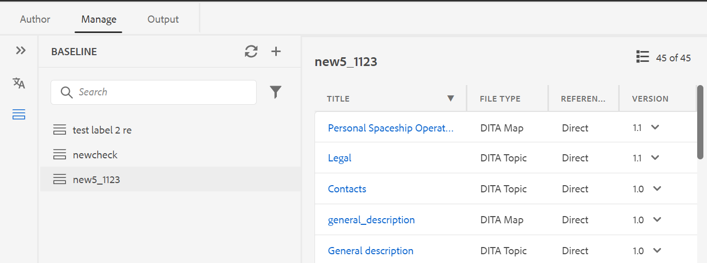

# 从Web编辑器创建和管理基线 {#id223MB0ZF043}

>[!TIP]
>
> 如果您已升级到AEM Guides as a Cloud Service 3月版或更高版本，则建议从Web编辑器使用此基线功能。

AEM Guides提供了集成在Web编辑器中的基线功能，允许用户创建基线，并使用它们发布或翻译不同版本的主题。 它们还可以并行发布同一DITA映射的多个输出预设。

## 创建基线

可以通过执行以下步骤从Web编辑器创建基线：

1. 在“存储库”面板中，在“映射视图”中打开DITA映射文件。
1. 单击&#x200B;**管理**&#x200B;选项卡。 **基线**&#x200B;面板显示DITA映射的基线。

   {width="800" align="left"}

1. 在&#x200B;**基线**&#x200B;面板上，选择右上角的+图标以开始创建基线。
1. 在&#x200B;**名称**&#x200B;中输入基线的名称。
1. 在&#x200B;**配置**&#x200B;中，您可以选择&#x200B;**手动更新**&#x200B;选项或&#x200B;**自动更新**&#x200B;选项：

   **手动更新**：您可以手动创建静态基线，该基线具有特定版本的主题和引用内容，在特定日期和时间可用，或者具有为某个版本的主题定义的标签：

   - 在&#x200B;**选择基于的版本中，**&#x200B;选择以下选项之一：

      1. **日期** &lt;时间戳\>：在指定的日期和时间选取主题版本。
      1. **标签**：选择此选项可根据应用于主题的标签选择主题。 如果主题具有为其指定的标签，则标签将在下拉列表中列出。 您可以从列表中选择标签。 您还可以在文本框中添加标签。

         对于静态基线中的直接引用，将从地图的最新保存版本中提取标签。 例如，如果您为主题A 1.0和1.1版本创建了标签`Label Release 1.0`和`Label Release 1.1`，然后将主题A添加到另存为版本1.0的映射中。在这种情况下，您可以在下拉列表中查看静态基线标签的标签`Label Release 1.0`和`Label Release 1.1`。

         当您选择&#x200B;**标签，**&#x200B;时，您可以选择直接引用和间接引用。
         - 对于DITA映射中的直接引用，可以选择使用未应用指定标签的最新版本主题。

           >[!NOTE]
           >
           > 如果输入的标签不存在，并选择选项&#x200B;**不创建基线**，则基线创建将失败，并在“基线”面板中的基线名称附近显示错误消息。

         - 对于DITA映射中的间接引用，提供了附加选项，可用于未在其上应用指定标签的最新版本主题。 您还可以选择&#x200B;**自动挑选引用的内容**，系统会自动挑选与引用内容版本对应的引用内容版本。

         选择标签或版本作为日期后，将相应地选择映射中所有引用的主题和媒体文件。 所选的主题不会显示在用户界面上，但会保存在后端。

   **自动更新**：为基线创建选择此选项，以根据应用于主题的主题标签自动选择主题。

   使用自动更新配置创建的基线会动态更新。 如果您生成基线、下载基线或使用基线创建翻译项目，则系统会根据更新的标签动态选取文件。 例如，如果您使用了主题的1.2版和标签版本1.0作为基线，而更新的版本1.5和标签版本1.0，则将动态更新基线，并使用版本1.5。

   {width="300" align="left"}

   - **标签**：如果主题指定了标签，则使用&#x200B;**标签**&#x200B;下拉菜单从[列出的标签](#labels-list)中进行选择。
首先选定的标签优先于后续的标签。

     >[!NOTE]
     >
     >在提取标签时，会出现加载器，并且下拉列表被禁用。

     对于动态基线，将从地图的最新保存版本和当前工作副本中提取标签。 例如，如果您已创建标签   主题A版本1.0和1.1的`Label Release A.1.0 `和`Label Release A.1.1`以及主题B版本1.0和1.1的标签`Label Release B.1.0`和`Label Release B.1.1`。 然后，可以添加主题A来映射1.0版中的A，添加主题B来映射1.0*版中的A（工作副本）。 在这种情况下，您可以在动态基线标签下拉列表中查看`Label Release A.1.0 `、`Label Release A.1.1`、`Label Release B.1.0`和`Label Release B.1.1`。

1. **间接引用**：对于DITA映射中的间接引用，提供了以下选项：

   - **自动挑选**：您可以选择自动挑选&#x200B;**引用的内容**，系统会自动挑选与引用内容版本对应的引用内容版本。

   - **使用所选标签**：您可以为某个版本的主题创建具有所选标签的基线。
   - **使用最新版本或工作副本**：使用未应用指定标签的主题的最新版本，或者如果尚未创建任何版本，则使用主题的工作副本创建基线。
1. 单击&#x200B;**应用**。

此时将创建基线。 基线创建是异步进行的，因此您可以在Web编辑器中继续处理其他文件。 创建基线后，将显示一条弹出消息，确认已创建该基线，并且您还会收到该基线的收件箱通知。

## 管理基线

您可以使用“基线”操控板上的各种功能来管理现有基线。

- 可以使用“基线”面板中的文本框搜索现有基线。 使用&#x200B;**应用筛选器**&#x200B;图标显示所有基线，或列出创建状态为“成功”、“进行中”或“失败”的基线。
- 使用“基线”面板中的&#x200B;**刷新**&#x200B;图标可重新检查所有基线，并显示在“映射视图”中打开的DITA映射的最新基线列表。
- 通过双击&#x200B;**基线**&#x200B;面板中的列表中的基线，可以查看或编辑现有静态基线的内容。 位于中心的基线编辑窗口将显示DITA映射文件、映射的内容或主题以及引用的内容。

  >[!NOTE]
  >
  >仅建议对少量的引用更改执行静态基线的编辑操作。 不建议执行编辑操作来更改主DITA映射的版本，因为它必须重新计算所有引用。 这可能会导致大型DITA映射的基线更新失败。 对于较大的DITA映射，可以创建新基线或编辑基线的属性。
  >
  >在动态基线的情况下进行编辑操作允许您编辑基线的属性，因为动态基线的引用是在运行时使用标签生成的。

  基线{width="800" align="left"}的选项

  也可以从“选项”菜单对基线执行以下操作：

### 复制基线

您可以复制基线，然后根据您的要求对其进行修改。
{width="300" align="left"}
*根据标签复制基线或创建精确副本。*

1. 从基线的“选项”菜单中选择&#x200B;**复制**。 将打开&#x200B;**复制基线**&#x200B;对话框。
>[!NOTE]
>
>基线的默认名称为`<selected baseline name>`_suffix （如sample-baseline_1）。 您可以根据自己的要求更改名称。

   在&#x200B;**选择基于**&#x200B;的版本中，您可以选择&#x200B;**完全复制**&#x200B;选项或&#x200B;**标签**&#x200B;选项：

   - **精确副本**： Experience Manager Guides选择所有主题的相同版本，并创建重复基线的精确副本。
   - **标签**：您可以使用下拉菜单选择[列出的标签](#labels-list)之一。 Experience Manager Guides会选取为其定义了选定标签的主题的这些版本，对于其余主题，它会从复制的基线中选取版本。 例如，从下拉列表中选择标签`Release 1.0`，然后它会选取您已为其定义此标签的主题的这些版本。 对于所有其他主题，它会从复制的基线中选取版本。
1. 单击&#x200B;**复制**。

- **重命名**，或&#x200B;**删除**&#x200B;现有基线。
- 从静态基线的&#x200B;**管理标签**&#x200B;选项添加、删除或更改现有标签。 如果您的管理员配置了预定义标签，则会在添加标签下拉列表中显示这些标签。 有关添加标签的详细信息，请参阅[使用标签](web-editor-use-label.md#)。

  >[!NOTE]
  >
  > 添加或删除标签的过程是异步进行的，因此您可以在Web编辑器中继续处理其他文件。 添加或删除标签后，将显示一条弹出消息，确认已添加或删除标签，并且您还会收到该标签的收件箱通知。

- **编辑您在创建基线时设置的现有静态基线的属性**。
- 使用&#x200B;**导出基线**&#x200B;选项导出Microsoft Excel文件中基线的快照。

### 标签列表 {#labels-list}

下拉列表中列出的标签基于以下条件：
- 标签应添加到DITA映射（在其上创建基线）中主题的某个版本中。
- 并且只考虑DITA映射的第一级引用（主题或子映射）来选取标签。

## 基线过滤器

使用&#x200B;**基线筛选器**&#x200B;面板中的筛选器图标，可以对在基线编辑窗口中打开的基线应用筛选器：

{width="300" align="left"}

- 根据文件名或文件位置筛选文件。
- 根据不同列（如“文件类型”、“引用类型”等）的值筛选文件。
- 选择要显示在基线编辑窗口中的列。

>[!NOTE]
>
> 可以单击列标题并根据基线编辑窗口中的列对文件进行排序。

**保存或重置基线**

编辑基线后，可以单击顶部的&#x200B;**保存**&#x200B;按钮以保存对基线的更改。 如果不想保存更改并重置基线，可单击&#x200B;**重置**&#x200B;按钮。 单击“**重置**”按钮时，会显示一条警告，指出未保存的更改将丢失。

**父主题：**&#x200B;[&#x200B;使用Web编辑器](web-editor.md)
