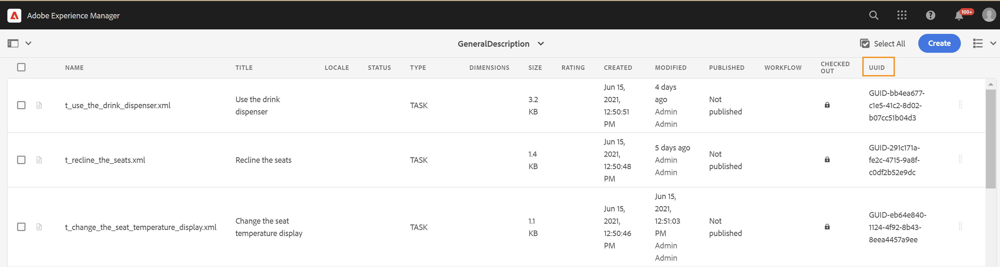

# 启动Web编辑器 {#id2056B0140HS}

您可以从以下位置启动Web编辑器：

- [AEM导航页面](#id2056BG00RZJ)
- [AEM ASSETS UI](#id2056BG0307U)
- [DITA映射控制台](#id2056BG090BF)

以下部分介绍了如何从不同位置访问和启动Web编辑器的详细信息。

## AEM导航页面 {#id2056BG00RZJ}

登录AEM时，您会看到“导航”页面：

{width="800" align="left"}

单击&#x200B;**Guides**&#x200B;链接将直接转到Web编辑器。

{width="800" align="left"}

由于您启动了Web编辑器而未选择任何文件，因此将显示一个空白的Web编辑器屏幕。 您可以从AEM存储库或“收藏夹”收藏集中打开文件进行编辑。

- 单击&#x200B;**指南**&#x200B;图标()以返回AEM导航页面。

- “**关闭**”按钮根据您的设置将您转到目标：

  

  
 云服务 

  如果您使用的是Cloud Services，请单击&#x200B;**关闭**&#x200B;按钮以返回AEM导航页面。
  

  

  
 内部部署软件

  如果您使用的是AEM Guides On-premise Software（4.2.1及更高版本），请单击右侧的&#x200B;**关闭**&#x200B;按钮，以返回到Assets UI中的当前文件路径。

  

## AEM ASSETS UI {#id2056BG0307U}

可以从中启动Web编辑器的另一个位置来自AEM Assets UI。 您可以选择一个或多个主题并直接在Web编辑器中打开它们。 要在Web编辑器中打开主题，请执行以下步骤：

1. 在Assets UI中，导航到要编辑的主题。

   >[!NOTE]
   >
   > 您还可以看到主题的UUID。

   。

   {width="800" align="left"}

   >[!IMPORTANT]
   >
   > 确保您对包含要编辑的主题的文件夹具有读写权限。

1. To get an exclusive lock on the topic, select the topic and click **Check Out**.

   >[!IMPORTANT]
   >
   > If your administrator has configured the **Disable Edit Without Checkout** option, then you must check out the file before editing. If you do not check out the file, you will not be able to see the edit option.

1. Close the asset selection mode and click the topic that you want to edit.

   The topic&#39;s preview is displayed.

   You can open the Web Editor from the List view, Card view, and the Preview mode.

   >[!IMPORTANT]
   >
   > If you want to open multiple topics for editing, select the desired topics from the Asset UI and click Edit. Ensure that your browser does not have pop-up blocker enabled, else only the first topic in the selected list is opened for editing.

   {width="800" align="left"}

   If you do not want to preview a topic and want to open it directly in the Web Editor, then click the Edit icon in the quick action menu from the card view:

   {width="800" align="left"}

1. Click **Edit** to open the topic in the Web Editor.

   {width="800" align="left"}

## DITA映射控制台 {#id2056BG090BF}

To open the Web Editor from DITA map console, follow these steps:

1. In the Assets UI, navigate to and click the DITA map file that contains the topic you want to edit.

   The DITA map console is displayed.

1. Click **Topics**.

   A list of topics in the map file is displayed. The UUID of topics is displayed below the topic title.

1. Select the topic file that you want to edit.

1. Click **Edit Topic**.

   {width="800" align="left"}

1. The topic is opened in the Web Editor.

   >[!IMPORTANT]
   >
   > If your administrator has configured the **Disable Edit Without Checkout** option, then you must check out the file before editing. If you do not check out the file, then the document opens in the editor in read-only mode.

**父主题：**&#x200B;[&#x200B;使用Web编辑器](web-editor.md)
