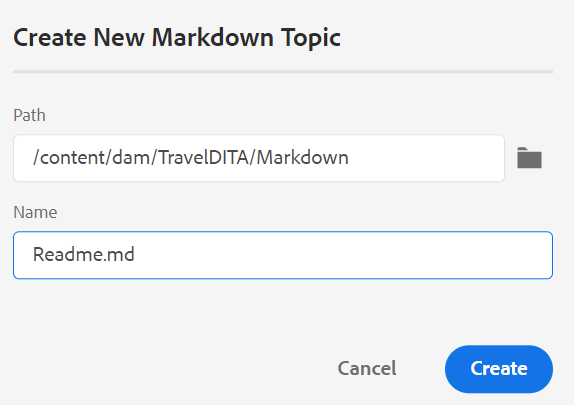

# 从Web编辑器创作Markdown文档 {#id223MIE0B079}

Markdown是一种轻量级的标记语言，可帮助您将格式元素添加到纯文本文档。 AEM Guides提供了从Web编辑器创建、创作和预览Markdown \(.md\)主题的功能。 您还可以上传现有Markdown文档并在Web编辑器中编辑它们。

## 创建Markdown主题

执行以下步骤，从Web编辑器创建Markdown主题：

1. 在“存储库视图”中选择文件夹。
1. 通过以下方式之一创建&#x200B;**Markdown主题**：
   1. 单击存储库面板右上角的&#x200B;**创建DITA文件**&#x200B;图标，然后从下拉列表中选择&#x200B;**Markdown主题**。

   {width="550" align="left"}

   1. 从所选文件夹的“选项”菜单中选择“**创建**”，然后从下拉菜单中选择“**标记主题**”。

   {width="550" align="left"}

1. 在&#x200B;**新建Markdown主题**&#x200B;对话框中，输入Markdown主题的名称和路径。

{width="350" align="left"}

1. 单击&#x200B;**创建**。

Markdown主题将在选定的路径中创建，并会打开以进行编辑。

## 创作和预览Markdown主题

执行以下步骤以从Web编辑器创作Markdown主题：

1. 在“存储库视图”中选择现有的Markdown主题\(.md\)。
1. 双击该主题以在编辑窗口中将其打开。

   该主题将在Source模式下打开。

1. 更新Markdown主题中的内容。
1. 单击右上方的&#x200B;**预览**&#x200B;以预览主题。

   >[!NOTE]
   >
   > “预览”模式显示用户在浏览器中查看主题时主题的显示方式。

1. 使用主工具栏中的&#x200B;**另存为新版本**&#x200B;以保存您在主题中所做的更改并创建主题的新版本。 您还可以使用主工具栏中的&#x200B;**全部保存**&#x200B;来保存所有打开的主题中的更改。

1. 单击右上方的&#x200B;**关闭**&#x200B;以关闭Markdown主题。

>[!NOTE]
>
> 如果尚未保存更改，则会显示一个弹出窗口，并提示您先保存主题，然后再关闭主题。

**父主题：**[&#x200B;使用Web编辑器](web-editor.md)
