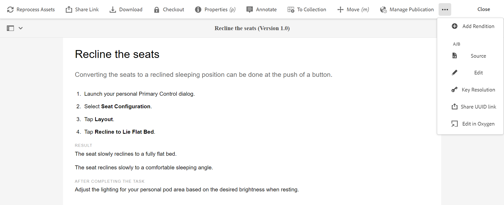
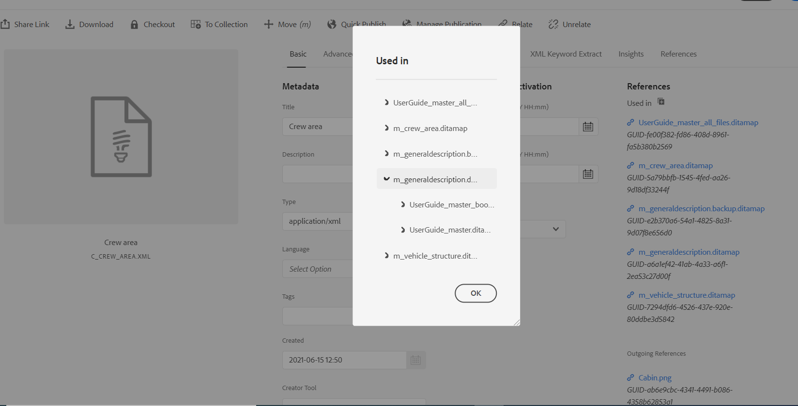
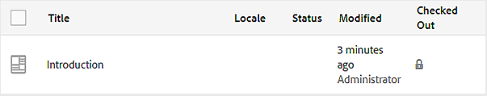
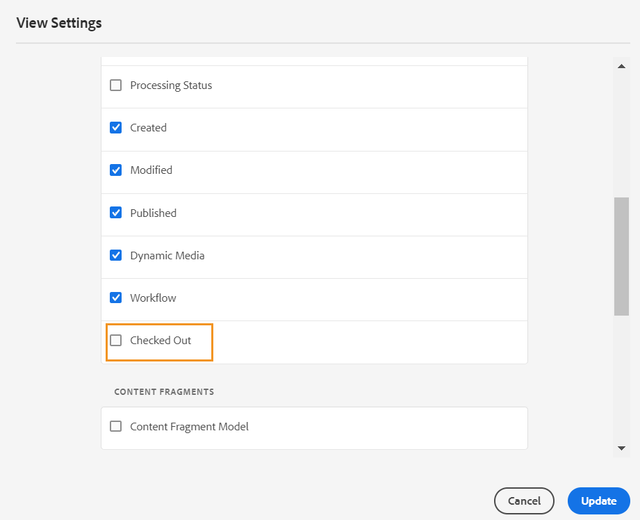
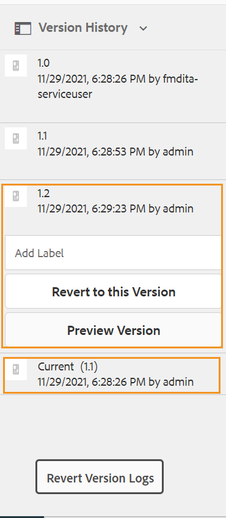

# 预览主题 {#id1696II000QR}

创建主题后，AEM Guides会生成该主题的预览。 “预览”模式提供了多种可用于处理文档的功能。

执行以下步骤以预览主题：

1. 在Assets UI中，导航到要查看的主题。
1. 单击要查看的主题。

   该主题的预览会显示在Assets UI中。

   >[!NOTE]
   >
   > 您可以在主题的文件选项卡的右上角看到活动主题或DITA映射的版本。

   >[!IMPORTANT]
   >
   > 根据AEM服务器的设置，以下功能在预览工具栏中的位置可能有所不同。 某些功能可能位于主工具栏中，而其他功能可能位于“更多”菜单下。

## 预览模式下可用的功能

{width="800" align="left"}

您可以在预览模式下从工具栏执行以下操作：

**属性**

查看所选主题的属性。 根据您的AEM版本，您可以看到元数据、计划\(de\)激活、引用、文档状态等属性。

>[!NOTE]
>
> 主题的标题属性是从DITA主题或映射的`title`标记中自动填充的。 如果您使用属性窗口对标题进行了任何更改，则更改将丢失。 如果要更新标题属性，应使用Web编辑器进行更新。

“属性”页面包含有关引用的有用信息，例如正在使用地图或主题的位置，或文档中包含哪些引用。 “属性”页列出了文档的两种引用类型 — **用于**&#x200B;和&#x200B;**传出引用**。

**Used In**&#x200B;引用列出了引用或使用当前文件的文档。 **传出引用**&#x200B;列出了当前文档中引用的文档。

**在**&#x200B;中使用的引用部分中的\(+\)图标允许您进一步向上导航以查找正在使用或引用该主题的位置。

{width="800" align="left"}

单击文档旁边的图标会显示该文档被进一步引用的映射或主题文件。

**条件筛选\(A/B\)**

如果您的主题包含条件内容，那么您将在工具栏上看到A/B图标。 单击此图标将打开一个弹出窗口，允许您根据主题中的可用条件筛选内容。

>[!NOTE]
>
> 在Web编辑器中，使用浅色背景颜色突出显示条件内容。

{width="300" align="left"}

**编辑**

- 打开主题以在Web编辑器中编辑。 如果管理员启用了&#x200B;**禁用编辑而不签出**&#x200B;选项，则&#x200B;**编辑**&#x200B;选项将不可用。 启用该选项后，只有在签出主题文件后才会看到&#x200B;**编辑**&#x200B;选项。

**密钥分辨率**

- 如果要将密钥空间文件用于主题，请单击“密钥分辨率”图标。 然后，您可以从“关键分辨率”弹出菜单中选择一个关键空间。

**来源**

- 打开文件的XML源代码。 在“预览”模式下打开映射、主题或DITAVAL文件，然后单击Source图标，可以查看该文件的基础XML代码。 XML Source弹出窗口显示XML源代码。 您可以从文件中选择特定代码，或按`Ctrl`+`a`选择整个内容。

  >[!NOTE]
  >
  > 要获取DITA映射文件的源代码视图，请在Assets UI中选择该文件，然后单击Source。

  {width="800" align="left"}

**共享UUID链接**

- AEM Guides允许您从以下位置共享DITA映射、主题和图像文件基于UUID的链接：

   - ASSETS UI
   - DITA映射的控制台
   - 主题或图像的预览

新选项&#x200B;**共享UUID链接**&#x200B;将显示在上述区域的工具栏中。 以下屏幕截图显示了主题预览模式中的&#x200B;**共享UUID链接**&#x200B;选项：

{width="800" align="left"}

在资产UI中，当您选择文件时，此选项可见。 在“预览”模式下，此选项默认位于主工具栏中。 在DITA映射控制台中，此选项在输出预设部分中可见。

复制URL后，可以与其他用户共享该URL，以便他们直接访问文件。 即使将文件移动到存储库中的其他位置，此链接仍然有效。 仅当从存储库中删除文件时，链接才会失败。

如果从DITA映射控制台或文件的预览模式共享链接，则用户将进入文件的同一视图。 但是，当您从Assets UI共享映射文件的链接时，用户将被带入映射的控制台。 同样，对于主题或图像文件，会显示文件的预览。

>[!IMPORTANT]
>
> 该链接不能用作其他主题中的引用链接，它仅提供对存储库中文件的直接访问。 此外，只要文件在存储库中可用，该链接仍然有效。 即使将文件移动到存储库中的其他位置，链接仍保持有效。 仅当从存储库中删除文件时，链接才会失败。

**签出/签入**

- 切换检出和检入功能。 签出文件时，当前用户将获得对该文件的独占写入权限。 可以在Web编辑器中打开签出的文件进行编辑。 进行所需的更改后，单击签入图标以将文件保存在DAM中。

检出主题时，文件的状态在卡片视图和列表视图中显示为“已检出”。

在卡片视图中签出的文件：

{width="300" align="left"}

在列表视图中签出的文件：

{width="550" align="left"}

如果“已签出”列不可见，请在&#x200B;**列表视图**&#x200B;下选择&#x200B;**视图设置**，然后在&#x200B;**配置列**&#x200B;对话框中选择&#x200B;**已签出**&#x200B;状态。

{width="800" align="left"}

>[!TIP]
>
> 有关使用文件签出和签入的最佳实践，请参阅最佳实践指南中的内容版本控制部分。

**基于Web的版本差异**

- 如果您的主题发生了一些更改，您可以轻松地找到在该主题的不同版本中所做的更改。 要了解不同版本主题中的更改，请执行以下操作：

  >[!IMPORTANT]
  >
  > 以下过程中描述的方法仅适用于DITA文件。 对于非DITA文件，使用“时间轴”视图创建版本或恢复文件的现有版本。

   1. 在预览模式下打开主题。

   1. 在左边栏中，单击&#x200B;**版本历史记录**&#x200B;并选择版本。

      {width="800" align="left"}

   1. 从列出的版本中，选择要用作基本版本的版本，然后单击&#x200B;**预览版本**。 所选版本的预览将显示在“版本预览”窗口中。

   1. 从&#x200B;**显示差异**&#x200B;列表中，选择要与基本版本进行比较的版本。

      {width="800" align="left"}

      更改的内容在主题预览中突出显示。 以绿色高亮显示的内容表示新添加的内容，而以红色显示的内容表示已删除的内容。

      {width="800" align="left"}

### 分支、还原和后续版本控制 {#id193PG0Y051X}

- 在典型的创作环境中，您需要创建一个主题的新分支来适应特定版本。 与任何其他版本管理系统一样，AEM Guides允许您从主题的现有版本创建分支，或还原到主题的旧版本。 使用AEM Guides提供的版本管理功能，您可以执行以下任务：

   - 从现有版本的主题创建分支
   - 在新分支中创建后续版本
   - 还原到主题的特定版本

  下图显示了典型的分支和后续版本化系统：

  {width="550" align="center"}

  对于任何新主题，第一个版本编号为1.0。 此后，该主题的每个新版本都以增量数字（例如1.1、1.2等）保存。 创建主题的分支后，将创建一个新分支，该分支的版本号来自创建分支的位置，并在版本末尾添加。0。 如图所示，新分支是从主题的1.1版本创建的。 新分支的版本为1.1.0。 此后，每次在此分支中保存该主题的新版本时，它都会获得一个增量版本号，例如1.1.1、1.1.2等。

  与分支类似，您还可以将工作版本或当前版本还原为存储库中存在的任何版本。 要还原到某个版本，只需选择所需的主题版本，然后在&#x200B;**版本历史记录**&#x200B;面板中单击&#x200B;**还原到此版本**。

  Perform the following steps to create a branch, revert to a version, and maintain subsequent versions of a topic:

  >[!IMPORTANT]
  >
  > The method described in the following procedure is only applicable for DITA files. For non-DITA files, use the Timeline view to create versions or restore an existing version of a file.

   1. Access the topic in Assets UI.

      >[!NOTE]
      >
      > You can also open the topic in Preview mode and proceed with Step 3.

   1. Select the topic for which you want to create a branch.

   1. In the left rail, click **Version History**.

      >[!NOTE]
      >
      > A list of versions available for the selected topic is displayed. Each version contains the timestamp, user name, version comment, and [label](web-editor-use-label.md#) information.

   1. Select a version from where you want to create a branch. In the following screenshot, version 1.2 is selected for creating a branch.

      {width="300" align="left"}

      >[!NOTE]
      >
      > The current version of a topic contains *\(Current\)* mentioned next to the version number.

   1. Click **Revert to This Version**.

      A message appears asking you to confirm the creation of a new branch.

   1. *\(Optional\)* In the message prompt, you get an option to select the **Save The Current Working Copy As A New Version**. The following two actions are possible based on the selection of this option:

      - If you select this option, then a branch is created from version 1.1. And, a new version of the topic is also created from the current working copy of the topic and saved as the next version – 1.4.

        {width="300" align="left"}

        Version 1.2 becomes your current working copy of the topic. Any version saved after this is created under the new branch of 1.1. For example, the subsequent version of a new topic in this branch will be saved as 1.2.0.

        {width="300" align="left"}

      - If you do not select this option, then no new version from the current working copy of the topic is created. A new branch is created from version 1.2 of the topic. Any subsequent version of the topic is saved under the 1.2 branch as 1.2.0, 1.2.1, and so on.

        {width="300" align="left"}

   1. 单击&#x200B;**确定**。

  A new branch is created from the selected version of the topic. 上述过程也适用于恢复到主题的特定版本。 从技术上讲，恢复到特定版本意味着从选定版本创建新分支，并将该版本作为主题的当前工作副本。 您还可以在“版本还原历史记录”报告中查看已还原文件的历史记录。 有关此报告的更多详细信息，请参阅[还原文件版本历史记录报告](reports-reverted-file-version-history.md#)。

**父主题：**[&#x200B;创建和预览主题](create-preview-topics.md)
