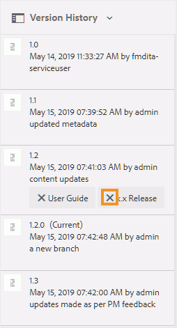

# 使用标签 {#id164JBG0M0T1}

AEM Guides允许您将标签添加到文件的不同版本。 您可以使用这些标签指定要包含在要发布的基线中的版本。 有关使用标签创建基线的详细信息，请参阅[使用基线](generate-output-use-baseline-for-publishing.md#)。

例如，如果要在&#x200B;*版本2.0*&#x200B;中使用同一主题的&#x200B;*版本1.0*&#x200B;和&#x200B;*版本1.1*&#x200B;中的&#x200B;*版本1.0*，则可以在&#x200B;*版本1.0*&#x200B;上添加&#x200B;*版本1.0*&#x200B;标签，在&#x200B;*版本1.1*&#x200B;上添加&#x200B;*版本2.0*&#x200B;标签。

添加标签后，即可创建基线，并指定要使用该基线发布时包含的主题版本。 要查看基线中应包含或排除的版本，可以使用“版本历史记录”选项。

## 添加标签

执行以下步骤可向主题添加标签：

1. 在Assets UI中，选择一个主题
1. 单击左边栏选择器图标并选择&#x200B;**版本历史记录**。
1. 在“版本历史记录”中，单击要添加标签的版本。

1. 输入所选版本的标签，然后按Enter键。 例如，*2.6版本*。

   >[!NOTE]
   >
   > 不能将同一标签添加到主题的不同版本。 但是，您可以向主题的同一版本添加多个标签。

   标签将显示在所选主题的“版本历史记录”中。 以下屏幕截图显示了已添加到高亮显示的主题版本中的标签&#x200B;*x.x版本*&#x200B;和&#x200B;*用户指南*。

   {width="300" align="left"}

>[!NOTE]
>
> 使用基线，可以向多个主题添加标签。 有关使用基线添加标签的详细信息，请参阅[将标签添加到基线](generate-output-use-baseline-for-publishing.md#id184KD0T305Z)。

## 删除标签

执行以下步骤可删除标签：

1. 在Assets UI中，选择添加了标签的主题。
1. 单击左边栏选择器图标并选择&#x200B;**版本历史记录**。

   在版本历史记录中，您将看到主题的所有版本以及附加到这些版本的标签。 下图显示了不同版本主题的一个示例，其中有一个版本添加了标签。

   {width="300" align="left"}

1. 单击“删除”按钮\(**X**\)可删除标签。

   {width="300" align="left"}

**父主题：**[&#x200B;使用Web编辑器](web-editor.md)
