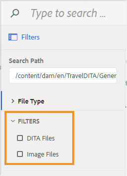

# 为文件浏览对话框配置筛选器 {#id20CIL7009GN}

在Web编辑器中工作时，需要使用文件浏览对话框插入图像、引用或键引用等元素。 默认的文件浏览对话框不提供任何文件过滤选项。 您可以添加自己的过滤器，以便轻松快速地访问所需的文件。

执行以下步骤，将自定义文件过滤选项添加到文件浏览对话框：

1. 要下载UI配置文件，请以管理员身份登录到Adobe Experience Manager。

1. 单击顶部的Adobe Experience Manager链接，然后选择&#x200B;**工具**。
1. 从工具列表中选择&#x200B;**指南**，然后单击&#x200B;**文件夹配置文件**。
1. 单击&#x200B;**全局配置文件**&#x200B;拼贴。
1. 选择&#x200B;**XML编辑器配置**&#x200B;选项卡，然后单击顶部的&#x200B;**编辑**&#x200B;图标
1. 单击&#x200B;**下载**&#x200B;图标可在本地系统上下载ui\_config.json文件。 然后，您可以对文件进行更改，然后上传相同的更改。
1. 在`ui_config.json`文件中，添加要添加筛选器的定义。

   以下代码段显示了如何添加两个过滤选项 — DITA文件和图像文件。

   ```
   "browseFilters": [
                       {
                       "title": "DITA Files",
                       "property": "jcr:content/metadata/dita_class",
                       "operation": "exists"
                       },
                       {
                       "title": "Image Files",
                       "property": "jcr:content/metadata/dc:format",
                       "value": [
                       "image/jpeg",
                       "image/gif",
                       "image/png"
                       ]
                       }
                       ]
   ```

   在上述代码片段中，第一个过滤器用于DITA文件。 过滤器定义采用以下参数：

   标题
：过滤器的显示名称。 此标题将作为筛选选项显示在文件浏览对话框中。

   属性
：与文件元数据匹配的属性。 例如，要仅允许属性中包含`dita_class`元数据的文件，属性筛选器将采用“`jcr:content/metadata/dita_class`”作为其值。

   操作
：指定“`exists`”以匹配属性参数中指定的值是否存在。

   第二个滤镜用于图像文件。 除了`value`参数之外，这些参数与第一个筛选器相似。 `value`参数采用图像类型的数组作为其值。 在value参数中指定的所有文件类型都将被搜索并显示在文件浏览对话框中，所有其他文件类型将被忽略。

1. 保存&#x200B;*ui\_config.json*&#x200B;文件并上传该文件。 然后重新加载Web编辑器。

   启动文件浏览对话框时，将显示在ui\_config.json文件中配置的过滤器选项。

   


**父主题：**&#x200B;[&#x200B;自定义Web编辑器](conf-web-editor.md)
