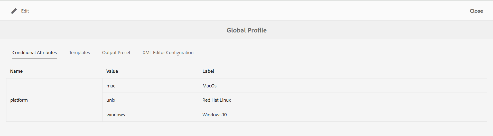

# 配置全局或文件夹级别的配置文件 {#id181AH2003PF}

在企业中，不同的组或产品可能使用不同的创作模板、输出模板、条件属性配置文件\（或主题方案\）和Web编辑器配置。 仅在企业\（或全局\）级别配置这些组件会让作者难以获得体验，因为他们会看到与其无关的模板或配置文件。

AEM Guides允许您在企业\(global\)级别和文件夹级别配置创作\（topic或map\）模板、输出模板、条件属性和Web编辑器配置。 这样，您就可以分离企业中不同部门或产品的配置。

此外，您还可以将特定于文件夹的配置委派给部门或产品管理员，以分散管理。

使用“参考线”设置中的“文件夹配置文件”图块，您可以在以下选项卡下配置设置：

{width="800" align="left"}

- **常规**：“常规”选项卡仅在配置文件夹级别\（或项目/产品\）设置时可用。 您可以配置设置，例如将应用这些设置的文件夹路径以及具有创建或更新配置的管理权限的用户。

- **条件属性**：使用此选项卡可在全局或文件夹级别配置条件属性。 条件属性是属性名称和值的组合，您还可以为其定义标签。 您可以使用标准DITA属性或您自己的自定义属性。 您在全局级别定义的条件属性将提供给项目中的所有用户。 如果定义了文件夹级别的条件属性，则这些属性将与全局定义的条件属性合并。

- **模板**：使用此选项卡可配置您的作者将用于创建或发布DITA内容的模板。 以下主题模板是现成可用的：

   - 术语表

   - 引用

   - 主题

   - 概念

   - 任务

   - 疑难解答

   - 空白

   - DITAVAL

  >[!NOTE]
  >
  > 您可以使用任何现有模板作为创建新模板的基础。 空白DITA模板不包含与其它模板类似的任何结构或元素。 您可以使用任何OOTB DITA模板作为基础，对其进行修改并使用其他名称保存它。 完成所需的更改后，将更新的模板添加到全局或文件夹级别的创作模板配置，然后该模板便可用于创作。

  除了主题模板之外，您还可以定义将提供给作者的映射模板。 以下映射模板是现成可用的：

   - 地图

   - 书图

- **输出预设**：与模板类似，有五个预配置的输出预设：

   - AEM站点

   - PDF

   - HTML5

   - ePub

   - 自定义

  发布者可以使用这些现成的输出预设来发布内容。 这些预设可由全局或文件夹级别配置文件的管理员配置。 配置后，发布预设将可供发布者用于新创建的DITA映射。 您还可以将发布预设应用于现有DITA映射，有关更多详细信息，请参阅[应用预设更改](#id18AGD0K0OHS)。

- **XML编辑器配置**：使用此选项卡自定义Web编辑器的外观和各种功能。 以下可配置设置可用于Web编辑器：

   - XML编辑器UI配置
   - XML编辑器页面布局
   - XML编辑器配置
   - CSS模板布局
   - XML编辑器代码片段
   - XML内容版本标签
   - Rootmap \（仅在文件夹级别\）

您可以同时配置全局配置文件和文件夹级别的配置文件。 在文件夹级别的配置文件中，您可以定义将应用设置的文件夹。 这些设置包括条件属性、模板、输出预设和XML编辑器设置。 条件预设、模板和XML编辑器配置随后将提供给在配置的文件夹中工作的作者。 同样，发布者将有权访问在配置的文件夹中定义的配置的输出预设。

文件夹级别的配置文件将覆盖在全局配置文件中配置的设置。 换言之，如果文件夹具有文件夹级别的配置文件，则将显示在其相应的文件夹配置文件中配置的模板、输出模板和XML编辑器设置。 它不会显示全局配置文件中配置的设置。 但是，这不适用于条件属性。 对于条件属性，条件属性在全局和文件夹级别合并。

以下部分将指导您完成配置全局配置文件和文件夹级别配置文件的过程。

## 配置全局配置文件

执行以下步骤来配置全局配置文件：

1. 以管理员身份登录Adobe Experience Manager。

1. 单击顶部的Adobe Experience Manager链接，然后选择&#x200B;**工具**。

1. 从工具列表中选择&#x200B;**参考线**，然后单击&#x200B;**文件夹配置文件**&#x200B;拼贴。

   首次只显示“文件夹配置文件”页面和“全局配置文件”拼贴。

   {width="800" align="left"}

1. 单击&#x200B;**全局配置文件**&#x200B;拼贴。

1. 要配置&#x200B;**条件属性**，请参阅[为全局或文件夹级别的配置文件配置条件属性](#id1889D0I305Z)。

1. 要配置&#x200B;**模板**，请参阅[配置创作模板](#id1889D0IL0Y4)。

1. 要配置&#x200B;**输出预设**，请参阅[配置输出预设](#id18AGD0IH0Y4)。

1. 要配置XML编辑器配置，请参阅[配置和自定义XML编辑器](#id2065G300O5Z)。

1. 完成所有必需的更新后，保存并关闭&#x200B;**全局配置文件**。


## 创建和配置文件夹级别的配置文件

执行以下步骤可配置文件夹级别的配置文件：

1. 以管理员身份登录Adobe Experience Manager。

1. 单击顶部的Adobe Experience Manager链接，然后选择&#x200B;**工具**。

1. 从工具列表中选择&#x200B;**参考线**，然后单击&#x200B;**文件夹配置文件**&#x200B;拼贴。

   首次显示“文件夹配置文件”页面，其中仅显示默认的“全局配置文件”拼贴。

1. 单击&#x200B;**创建**。

   {width="300" align="left"}

1. 在&#x200B;**创建文件夹配置文件**&#x200B;对话框中输入以下详细信息：
   - 文件夹配置文件的名称。
   - 将应用配置文件的文件夹的路径。

     >[!NOTE]
     >
     > 您不能在一个文件夹中应用多个文件夹配置文件。 请确保您在此处选择的文件夹没有应用任何其他配置文件。 如果父子文件夹具有自己的特定配置文件，则子文件夹将使用来自其自身配置文件的配置。 父文件夹中的配置不会覆盖子文件夹的配置。

1. 单击&#x200B;**创建**。

   在“文件夹配置文件”页面中创建一个名为文件夹配置文件的新图块

1. 单击要编辑的文件夹配置文件拼贴。

   此时将显示一个常规选项卡，其中包含文件夹配置文件的名称和配置的文件夹信息。

1. 单击&#x200B;**编辑**&#x200B;可添加多个文件夹以及具有修改文件夹配置文件的管理访问权限的用户。

   >[!NOTE]
   >
   > 您在此处添加的用户将具有管理权限，可以更新为此文件夹配置文件配置的条件属性、模板和输出预设。

1. 要添加文件夹，请单击“文件夹路径”中的“浏览”图标，导航到某个文件夹并将其选定，然后单击“添加”将该文件夹添加到此配置文件中。

   >[!NOTE]
   >
   > 请确保您在此处选择的文件夹没有与其关联的任何其他文件夹级配置文件。

1. 要添加用户，请从&#x200B;**管理员用户**&#x200B;下拉列表中选择一个用户，然后单击&#x200B;**添加**。

   >[!NOTE]
   >
   > 您可以从下拉列表中向文件夹配置文件添加多个用户。 您也可以通过单击用户ID旁边的删除图标，从列表中删除现有管理员用户。

1. 将所有必需的文件夹和用户添加到文件夹配置文件后，单击&#x200B;**保存**。


现在，您可以配置条件属性、模板、输出预设和XML编辑器。

>[!IMPORTANT]
>
> 创建文件夹配置文件时，默认不包含任何模板。 您必须在文件夹配置文件中添加所需的模板，以便作者能够使用这些模板。

## 为全局或文件夹级别的配置文件配置条件属性 {#id1889D0I305Z}

执行以下步骤以在全局或文件夹级别配置标准DITA支持的条件属性：

1. 以管理员或具有文件夹级别配置文件管理权限的用户身份登录Adobe Experience Manager。

1. 单击顶部的Adobe Experience Manager链接，然后选择&#x200B;**工具**。

1. 从工具列表中选择&#x200B;**参考线**，然后单击&#x200B;**文件夹配置文件**&#x200B;拼贴。

1. 单击要配置的配置文件拼贴。

   >[!NOTE]
   >
   > 您可以选择在全局配置文件或文件夹级别的配置文件中配置条件属性。

1. 在配置文件页面上，单击&#x200B;**条件属性**&#x200B;选项卡。

1. 单击&#x200B;**编辑**。

1. 单击&#x200B;**添加**。

1. 为条件属性输入&#x200B;**Name**、**Value**&#x200B;和&#x200B;**Label**。

   您可以保存仅具有属性名称的配置文件。 但是，仅当属性具有指定的值时，才能使用属性。 如果为属性指定 — 值和标签，则Web编辑器将显示条件属性的标签。 此外，在创建条件预设时还会向发布管理员显示标签。

   以下屏幕快照显示了`platform`属性的定义以及可能的值和标签。

   

1. 如果要为同一属性添加更多值，请单击&#x200B;**+**&#x200B;图标并输入其他值和标签。

1. 如果要添加更多属性，请单击&#x200B;**添加**。

1. 单击&#x200B;**保存**。


如果使用自定义属性，则它必须是DTD支持的有效DITA属性。 如果要使用任何属性（不是标准DITA属性），则执行以下附加步骤：

1. 将自定义属性添加到DTD文件中。 例如，如果DTD文件是commonElements.mod，则需要在DTD目录中查找此文件。 系统DTD文件的缺省路径为：

   /libs/fmdita/dita\_resources/DITA-1.3/dtd/base/dtd/commonElements.mod

   >[!IMPORTANT]
   >
   > 专用的DTD文件应是自定义代码部署的一部分。 /apps下的DTD是产品部署的一部分，因此将被任何新版本的安装覆盖。 建议在项目文件夹的/var/dxml/dita\_resources下添加专用的DTD，并在DITA配置文件中包含DTD/目录路径。有关详细信息，请参阅[集成DITA专用化](dita-ot-specialization.md#id211MB0E00XA)。

1. 使用包管理器下载/libs/fmdita/config/condAttrList.xml文件：

1. 在Cloud Manager Git存储库中的以下位置创建condAttrList.xml文件的副本：

   `/apps/fmdfmdita/config/condAttrList.xml`

1. 保存文件。

1. 将自定义属性添加到全局或文件夹级别的配置文件。


## 配置模板 {#id1889D0IL0Y4}

AEM Guides提供了7个现成的主题模板、2个DITA映射模板和3个PDF模板。 您可以选择只向作者和发布者提供几个模板。 如果您使用自定义模板，则可以配置该模板并使其可用于创作和发布。 使用文件夹配置文件配置中的&#x200B;**模板**&#x200B;选项卡从全局或文件夹级别的配置文件中添加或删除主题、映射或PDF模板。

即使在全局或文件夹级别配置主题、映射或PDF模板之前，您还可以定义存储自定义模板的位置。 要配置自定义位置以存储模板，请参阅[配置自定义DITA模板文件夹路径](conf-template-tags-custom-dita-topic-template.md#id191LCF0095Z)。

执行以下步骤，将主题、映射或PDF模板添加到文件夹配置文件：

1. 以管理员或具有文件夹级别配置文件管理权限的用户身份登录Adobe Experience Manager。

1. 单击顶部的Adobe Experience Manager链接，然后选择&#x200B;**工具**。

1. 从工具列表中选择&#x200B;**参考线**，然后单击&#x200B;**文件夹配置文件**&#x200B;拼贴。

1. 单击要配置的配置文件拼贴。

   >[!NOTE]
   >
   > 您可以选择在全局配置文件或文件夹级别的配置文件中配置模板。

1. 在配置文件页面上，单击&#x200B;**模板**&#x200B;选项卡。
1. 单击&#x200B;**编辑**。

   您可以通过从默认位置搜索或浏览来获取添加Topic、Map和PDF模板的选项。

   >[!NOTE]
   >
   > 默认情况下，所有模板都存储在/content/dam/dita-templates文件夹中。 `dita-templates`文件夹包含用于存储主题、映射和PDF模板的`topics`、`maps`和`PDF`子文件夹。 您可以将自定义模板\(.dita、.xml或.ditamapfiles\)添加到默认模板文件夹中。 将模板添加到默认文件夹后，便可以将它们添加到全局或文件夹配置文件中。 有关使用Web编辑器创建自定义模板的详细信息，请参阅[创建自定义创作模板](#id1917D0EG0HJ)。

   {width="800" align="left"}

1. 将所需主题、映射和PDF模板添加到您的配置文件。

   要添加模板，请执行以下操作之一：

   - 选择&#x200B;**搜索或类型**，然后输入或从下拉列表中选择模板的名称。 下拉列表包含所有默认模板以及您创建的任何新模板。

     {width="800" align="left"}

   - 单击&#x200B;**浏览**&#x200B;并从DAM中选择模板。

1. 单击&#x200B;**添加**。

   选定的模板即添加到模板列表中。

   {width="800" align="left"}

   >[!NOTE]
   >
   > 可以通过将模板拖放到列表中的所需位置来更改模板的顺序。 模板的位置控制它们在主题或映射创建工作流的Blueprint页面中的显示顺序。

1. 要设置翻译规则，请浏览SRX位置以查找包含SRX文件的文件夹。 SRX \（分段规则交换\）格式是在不同用户和不同翻译环境之间交换分段规则的标准。 您可以创建一个文件夹并将自定义SRX文件添加到其中。

   创建包含SRX文件的文件夹后，您可以在文件夹配置文件中的&#x200B;**翻译SRX位置**&#x200B;配置中添加文件夹路径。

   AEM Guides根据翻译项目的源语言选择SRX规则。 它会查找某种语言的自定义SRX文件，如果您未定义自定义SRX文件，则它会根据现成的翻译规则选取规则。

1. 单击&#x200B;**保存**。


如果您在文件夹级别的配置文件上配置了模板，则配置的模板将与配置的文件夹关联。 在配置的文件夹下创建的所有项目将只能访问在文件夹级别的配置文件下配置的那些模板。

## 创建自定义创作模板 {#id1917D0EG0HJ}

AEM Guides提供了一种创建创作模板的简单方法。 作为系统管理员，您可以使用Web编辑器从头开始创建创作模板。 然后，您可以在全局配置文件中添加新模板，或使用文件夹特定的配置文件将其分配给特定文件夹。

执行以下步骤可创建自定义创作模板：

1. 以管理员身份登录Adobe Experience Manager。

1. 在Assets UI中，导航到配置为存储模板文件的文件夹。 默认情况下，所有主题模板都存储在/content/dam/dita-templates/topics文件夹中。

   >[!NOTE]
   >
   > 要配置自定义位置以存储主题或映射模板，请参阅[配置自定义DITA模板文件夹路径](conf-template-tags-custom-dita-topic-template.md#id191LCF0095Z)

1. 单击&#x200B;**创建** \> **DITA模板**。

1. 在Blueprint页面上，选择要创建的DITA主题模板的类型。

   >[!NOTE]
   >
   > 您可以使用“空白”模板从头开始。 空白模板中没有任何结构或元素。

1. 单击&#x200B;**下一步**。

1. 在新模板属性页面上，输入模板的&#x200B;**Title**、**Name**&#x200B;和&#x200B;**Description**。

   >[!NOTE]
   >
   > 系统会根据模板的标题自动建议该名称。 如果要手动指定名称，请确保“名称”不包含任何空格、撇号或大括号，且以.dita结尾。

1. *\（可选\）*&#x200B;单击&#x200B;**添加缩略图**&#x200B;按钮以浏览并选择要与模板关联的缩略图。

1. 单击&#x200B;**创建**。

   此时将显示“创建的主题”消息。

   您可以选择在Web编辑器中打开模板进行编辑，或将模板文件保存在模板存储位置。 创建模板后，您可以使用Web编辑器根据创作需求自定义模板。 建立模板后，请确保将其与全局或文件夹级别的配置文件相关联。


## 配置输出预设 {#id18AGD0IH0Y4}

在典型的企业设置中，不同的输出模板可用于不同的产品或用户指南。 此外，还可以有一些可供所有发布者使用的通用输出生成流程，以及一组用于特定发布者组或项目的特定输出生成流程。

AEM Guides允许管理员使用特定设置创建输出预设，然后由所有发布者或特定发布者集使用它们来生成输出。 例如，管理员可以创建一个输出预设，以生成所有发布者通用的用户指南。 另外一种是创建特定于发行商的编程用户手册。 这两个预设都可以配置为使用不同的输出模板。 在此示例中，可在全局级别配置用于生成用户指南的通用发布预设。 而且，可在文件夹级别配置用于生成编程用户手册的输出预设。

在系统中创建了默认输出预设后，在此之后创建的所有DITA映射都将使用默认预设生成输出。 但是，所有现有DITA映射将继续使用先前使用它们配置的输出预设。 如果要对所有现有DITA映射应用新的输出预设，则需要运行应用预设更改工作流。

除了在全局或企业级别配置的预设外，发布者还有权创建更多输出预设。 但是，这些预设与为其创建的DITA映射相关联。 有关为DITA map创建常规输出预设的更多详细信息，请参阅“使用Adobe Experience Manager Guides as a Cloud Service”指南中的&#x200B;*创建、编辑、复制或删除输出预设*。

执行以下步骤可配置全局或文件夹特定的输出预设：

1. 以管理员或具有文件夹特定配置文件的管理权限的用户身份登录Adobe Experience Manager。

1. 单击顶部的Adobe Experience Manager链接，然后选择&#x200B;**工具**。

1. 从工具列表中选择&#x200B;**参考线**，然后单击&#x200B;**文件夹配置文件**&#x200B;拼贴。

1. 单击要配置的配置文件拼贴。

   >[!NOTE]
   >
   > 您可以选择在全局配置文件或文件夹特定的配置文件中配置输出预设。

1. 在用户档案页面上。 单击&#x200B;**输出预设**&#x200B;选项卡。

   随即会显示现成的输出预设列表，其中包括AEM Site、PDF、HTML5、EPUB和CUSTOM。

1. 执行以下操作之一以创建或编辑输出预设：

   - 单击&#x200B;**创建**&#x200B;从头开始创建新的输出预设。
   - 单击复制以创建所选输出预设的副本。 您可以对重复预设进行更改并将其保存。

   - 单击&#x200B;**编辑**&#x200B;可打开所选预设的配置以进行编辑。

     有关输出预设设置的信息，请参阅“使用Adobe Experience Manager Guides as a Cloud Service”指南中的&#x200B;*了解输出预设*。

1. 单击&#x200B;**保存**&#x200B;以保存预设设置。


在此之后创建或上传的所有DITA映射都将具有新的或更新后的输出预设。

## 应用预设更改 {#id18AGD0K0OHS}

在全局级别创建的新输出预设可用于以后创建的所有新DITA映射。 同样，如果在文件夹级别创建新的输出预设，则该预设可用于将在配置的文件夹中创建的所有映射。 默认情况下，新的输出预设不可用于任何现有DITA映射。

如果更新了现有的输出预设，或者希望使新的输出预设可用于现有DITA映射，则执行以下步骤：

1. 以管理员或具有文件夹特定配置文件的管理权限的用户身份登录Adobe Experience Manager。

1. 单击顶部的Adobe Experience Manager链接，然后选择&#x200B;**工具**。

1. 从工具列表中选择&#x200B;**参考线**，然后单击&#x200B;**文件夹配置文件**&#x200B;拼贴。

1. 单击要配置的配置文件拼贴。

   >[!NOTE]
   >
   > 您可以选择在全局配置文件或文件夹特定的配置文件中配置输出预设。

1. 在用户档案页面上。 单击&#x200B;**输出预设**&#x200B;选项卡。

   随即会显示现成的输出预设列表，其中包括AEM Site、PDF、HTML5、EPUB和CUSTOM。

1. 选择要应用于现有DITA映射的输出预设。

1. 单击主工具栏中的&#x200B;**应用预设更改**。

1. 在“应用预设更改”对话框中，您可以选择以下选项：

   - **选择覆盖现有预设选项**：如果选择此选项，则您在现有输出预设中所做的任何更新都将覆盖使用该预设的所有现有DITA映射中的设置。 但是，这样做会导致与地图关联的任何现有条件预设和基线信息丢失。

   - **不选择覆盖现有预设选项**：如果不选择此选项，则您在现有输出预设中所做的任何更新都不会影响现有DITA映射。 只有新添加的预设会添加到现有DITA映射中。 请注意，新创建的DITA映射同时获得更新的输出预设和新添加的预设。

1. 单击&#x200B;**确定**&#x200B;以将所选输出预设中的更改应用于所有现有DITA映射。


## 配置AI助手以进行智能帮助和创作

对于Experience Manager Guides as a Cloud Service ()。

Adobe Experience Manager Guides中的AI助手是一款功能强大的、由AI驱动的工具，旨在通过智能创作和内容重用体验来增强您的内容。 它将两项强大的AI功能（**创作**&#x200B;和&#x200B;**帮助**）整合到Experience Manager Guides界面中，使您能够更快更高效地创作文档并访问信息。

有关配置详细信息，请查看[AI助手配置](./conf-smart-suggestions.md)。

**配置AI支持的智能建议**

您可以配置由AI提供支持的智能建议，并帮助作者重用现有内容并轻松创建正确一致的内容引用。 通过&#x200B;**AI配置**&#x200B;选项卡，可以从编辑器中的AI助手面板控制&#x200B;**建议可重用内容**&#x200B;的设置。

执行以下步骤以在全局或文件夹级别配置文件中配置标准AI配置：
1. 以管理员或对文件夹级别配置文件具有管理权限的用户身份登录Adobe Experience Manager。
1. 选择顶部的&#x200B;**Adobe Experience Manager**&#x200B;链接，然后选择&#x200B;**工具**。
1. 从工具列表中选择&#x200B;**参考线**，然后选择&#x200B;**文件夹配置文件**&#x200B;拼贴。
1. 选择要配置的配置文件拼贴。

   >[!NOTE]
   >
   >您可以为全局或文件夹级别的配置文件配置基于AI的智能建议。

1. 在配置文件页面上，选择&#x200B;**AI配置**&#x200B;选项卡。

   全局配置文件中的 {width="800" align="left"}

1. 选择&#x200B;**编辑**。
1. 作为管理员，您可以配置以下设置：

   **最小字符数**：输入作者需要选择以获取建议的最小字符数。 例如，如果此数字为40，作者必须至少选择40个字符才能查看智能建议。

   对于不符合最低字符要求的选择，AI助手面板中会显示以下消息：

   

   但是，对于没有可用建议的一般选择，会显示以下消息：

   

   这有助于作者了解建议是由于字符选择不足还是实际上没有匹配的内容而不可用。

   **最大建议数**：输入作者在创作内容时可获取的最大建议数。 例如，如果此数字为5，则作者可以查看五个或更少的智能建议。

   **文件和文件夹**：选择应显示智能建议的文件夹。 只能选择文件夹配置文件中指定文件夹路径的子文件夹。 有关详细信息，请查看[文件夹配置文件限制](#folder-profile-restrictions)。

   *为保持内容的一致性，建议列表中没有任何两个条目在它们之间有公用文件*。 选择文件和文件夹后，将列出它们。

1. 单击&#x200B;**保存**。

   >[!NOTE]
   >
   > 保存文件后，文件夹配置文件的上次索引状态将显示在顶部。

了解有关如何在Web编辑器中创作时查看和添加基于[AI的智能建议](../user-guide/authoring-ai-based-smart-suggestions.md)以添加内容引用的更多信息。

### 文件夹配置文件限制

为确保智能建议有效工作，在索引文件夹时请记住以下几点：

1. 必须通过AI助手使用的文件夹配置文件对内容编制索引，才能为作者提供智能建议。
2. 在指定用于索引的文件夹时，只能添加位于当前文件夹配置文件下的文件夹。 尝试在此文件夹配置文件之外添加文件夹将触发警告。

   

   此限制仅适用于文件夹级别的配置文件。 全局配置文件不强制执行路径限制，并且可以对不在任何其他文件夹配置文件下的文件夹进行索引。
3. 如果添加父文件夹以进行索引，则会自动删除已列出的任何子文件夹以避免重复。 添加已编制索引的父级的子文件夹也会触发警告。

   
4. 对已编制索引的文件夹中的文件进行任何更新、移动或删除都会触发自动重新编制索引或从索引中删除。
5. 对于每次索引尝试，将显示以下索引状态：

   - 进行中：指示索引正在进行中。
   - 索引已完成：指示索引已成功完成。
   - 索引失败：指示索引失败。
   - 不同步：指示索引不同步，通常在升级或迁移后观察到，此时无法验证当前索引状态。 您可以重试索引以刷新并更新状态。

   当索引失败时，为您提供了选项&#x200B;**查看错误日志**&#x200B;和&#x200B;**重试索引**&#x200B;以进行故障排除并解决问题。

   

   错误日志显示如下：

   

6. 将为每个文件夹配置文件显示上次索引时间的时间戳。

**自定义智能帮助的默认问题**

对于Experience Manager Guides as a Cloud Service ()。

您可以配置AI支持的智能&#x200B;**帮助**，以帮助作者提出问题并轻松地从[Experience Manager Guides文档](https://experienceleague.adobe.com/zh-hans/docs/experience-manager-guides/using/overview)中找到所需内容。

“**XML编辑器配置**”选项卡允许您配置&#x200B;**帮助**&#x200B;面板的默认问题。

>[!NOTE]
>
>您最多可以配置10个默认问题。

执行以下步骤来配置默认问题：

1. 以管理员或对文件夹级别配置文件具有管理权限的用户身份登录Adobe Experience Manager。
1. 选择顶部的&#x200B;**Adobe Experience Manager**&#x200B;链接，然后选择&#x200B;**工具**。
1. 从工具列表中选择&#x200B;**参考线**，然后选择&#x200B;**文件夹配置文件**&#x200B;拼贴。
1. 选择要配置的配置文件拼贴。

   >[!NOTE]
   >
   >您可以将&#x200B;**智能帮助面板**&#x200B;的默认问题配置为全局或文件夹级别的配置文件。

1. 选择&#x200B;**XML编辑器配置**&#x200B;选项卡。

1. 单击顶部的&#x200B;**编辑**&#x200B;图标。
1. 在&#x200B;**XML编辑器UI配置**&#x200B;部分中，选择&#x200B;**下载**&#x200B;图标以在本地系统上下载`ui_config.json`文件。
1. 在`ui_config.json`文件中，添加示例问题。

   **示例问题**：

   ```json
   "assistantSampleQuestions": [
   "How to create a new topic",
   "How to create a new map",
   "What is a baseline" ]
   ```

1. 保存文件并将其上传。

   >[!NOTE]
   >
   > 保存文件后，**智能帮助**&#x200B;面板中会显示默认问题。


了解有关使用[AI支持的智能帮助](../user-guide/ai-based-smart-help.md)从Experience Manager Guides文档查找所需内容的更多信息。


## 配置和自定义XML编辑器 {#id2065G300O5Z}

默认情况下，XML编辑器提供了许多功能来帮助作者创建DITA文档。 如果您在受限的环境中工作，则可以选择向作者公开哪些功能。 利用XML编辑器配置选项卡，可轻松控制功能并更改编辑器的外观。 管理员可以自定义编辑器的以下组件：

**XML编辑器UI配置**

通过此设置，可创建反映`ui_config.json`文件中所做修改的JSON扩展名。 您可以在文件夹配置文件级别独立上传这些扩展，从而提高灵活性和进行自定义。 例如，当您对&#x200B;**XML编辑器配置**&#x200B;进行更改（如更新按钮）时，系统会自动识别差异。 通过将这些更改上载到&#x200B;**XML编辑器UI配置**，并使用&#x200B;**将UI配置转换为JSON**&#x200B;按钮将它们转换为JSON扩展，系统生成了一个包含新功能的扩展。

了解有关[自定义新AEM Guides编辑器的JSON配置和转换UI配置的更多信息](https://experienceleague.adobe.com/zh-hans/docs/experience-manager-guides-learn/videos/advanced-user-guide/conver-ui-config)。

>[!NOTE]
>
> 在使用扩展框架自定义应用程序时，建议仅使用受支持的基本React Spectrum组件（如树、表、复选框、单选按钮和单选组等），以避免在部署期间出现任何问题。

**XML编辑器页面布局**

此功能允许您上传CSS文件，以设置在&#x200B;**XML编辑器UI配置**&#x200B;下上传的新扩展的样式。 上传的CSS会以一致方式应用于所有相关应用程序，从而确保您的UI自定义项具有统一且抛光的外观。

**XML编辑器配置**

此设置控制编辑器的工具栏和其他用户界面元素。 选择&#x200B;**下载**&#x200B;图标以在您的本地系统上下载`ui\_config.json`文件。 然后，您可以对文件做出更改并上传相同的文件。 根据您上传文件的位置（全局或文件夹级别的配置文件），将相应地应用更改。 有关如何使用`ui\_config.json file`自定义XML编辑器的更多详细信息，请查看[自定义工具栏](conf-web-editor-customize-toolbar.md#)。

>[!NOTE]
>
> 对于AEM Guides 2502版本及较新版本，建议使用扩展JSON而不是`ui_config.json`进行自定义。 有关详细信息，请参阅上面的&#x200B;**XML编辑器UI配置**&#x200B;部分。

**CSS模板布局**

下载此部分中可用的文件，以自定义在Web编辑器中预览或打开文档进行编辑时的文档外观。 可供下载的默认CSS文件只是一个测试文件，不应将其用于自定义。 您可以创建包含针对Web编辑器的自定义项的CSS文件并上传它们。 例如，您可以创建一个.css文件，其代码如下：

```
.title {    font-size: 9em;}
```

保存此文件并将其上载到“CSS模板布局”部分。 下次下载文件时，您将获得在Web编辑器中使用的最新CSS文件。

**XML编辑器代码片段**

使用本节中的配置文件，您可以创建一些默认代码片段并将其与作者共享。 文件的默认结构如下所示：

```
{
   "snippetID": {
      "name": "snippet Name",
      "description": "snippet Description",
      "value": "<i>this is snippet value</i>"
  }
}
```

创建代码片段需要以下详细信息：

**snippetID** — 代码片段的唯一ID。 它可以采用字母数字值。

**name** — 用于标识代码片段的描述性名称。 此名称显示在“代码片段”面板中。

**description** — 为代码片段添加描述性信息。

**value** — 提供代码片段的XML代码。

>[!NOTE]
>
> 您可以在代码片段定义末尾添加逗号\(，\)，并为下一个代码片段重复相同的结构，从而添加更多代码片段。

**XML内容版本标签**

默认情况下，允许作者创建自己选择的标签，并将它们与主题文件相关联。 但是，这可能会导致同一标签出现多种变化，例如，可能会有“版本1.0”、“版本1.0”、“版本1”标签，用于标识主题的同一阶段。 为避免系统中出现此类标签不一致的情况，您可以创建一个预定义的标签列表，以供作者从中进行选择。 具有一致的标签可帮助更好地管理系统中的文件。

使用版本标签配置，您可以上传适用于贵组织的有效标签列表。 下载默认的label.json文件并进行修改，如下所示：

```
{
"label1":"Draft",
"label2":"PM-Review",
"label3":"Engg-Review",
"label4":"QE-Review",
"label5":"Ready for Loc",
"label6":"Ready for Publish"
}
```

在上例中，“label1”是标签序列的标识符，该标识符附加有标签，在需要标签时，作者会看到该标签。 保存此文件并将其上载到“XML内容版本标签”部分。

>[!IMPORTANT]
>
> 要使文件夹级别的配置生效，用户需要在Web编辑器中选择其用户首选项下的配置文件。

**根图**

如果您的作者使用特定的根映射，则可以在此处浏览并选择该根映射。 请注意，您只能为文件夹级别的配置文件定义根映射。
