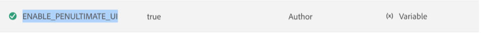

# 配置覆盖 {#id216IFC003XA}

要进行任何配置更新，应使用以下通用方法：

1. 访问Cloud Manager的Git存储库。

1. 在以下位置创建新的JSON文件：

   src/main/content/jcr\_root/apps/fmditaCustom/config/

1. 使用以下格式命名文件：

   $\{PID\}.cfg.json

   其中，PID是配置的进程ID。

1. 使用以下格式在JSON文件中添加属性：

   ```
   {
      "aem.adminuname": "updatedUserjson",
      "valid.characters": "[-a-zA-Z0-9_@$]",
      "dita.serialization": true
   }
   ```

1. 提交更改并运行Cloud Manager管道以部署更新的配置。

## 配置Experience Manager Guides UI

2025.02.0版的Adobe Experience Manager Guides提供了经过修订的UI和增强的功能，帮助您比以往更快更高效地工作。 这包括全新的主页、更简洁且更有条理的编辑器工具栏、专用映射控制台以及增强的功能。

为了确保顺利过渡并将中断降至最低，Experience Manager Guides提供了一个配置选项，允许您根据需要切换回旧的UI（反之亦然）。

>[!IMPORTANT]
>
> 在2025.4.0版本发布之前，用于在新旧用户界面之间切换的此配置选项将可用。 之后，新UI将成为默认UI，并且不再支持切换回上一个UI的选项。

执行以下步骤来配置Experience Manager Guides UI：

1. 打开Adobe Experience Manager，然后选择包含要配置的环境的程序。
2. 切换到&#x200B;**环境**&#x200B;选项卡。
3. 选择要配置的环境名称。 这应该会将您导航到&#x200B;**环境信息**&#x200B;页面。
4. 切换到&#x200B;**配置**&#x200B;选项卡。
5. 选择&#x200B;**添加/更新**。
6. 添加UI配置详细信息。 确保您使用以下屏幕快照中给出的相同名称和配置。

   {width="800" align="left"}

   将该值设置为&#x200B;**true**&#x200B;将保留旧的UI，而&#x200B;**false**&#x200B;将激活新的UI。


**父主题：**&#x200B;[&#x200B;下载并安装](download-install.md)
