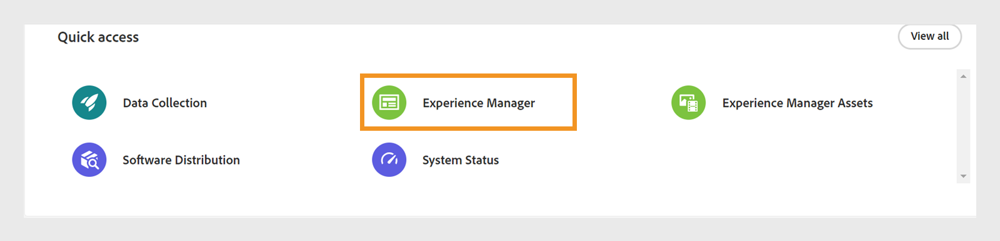
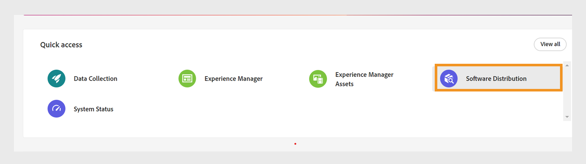
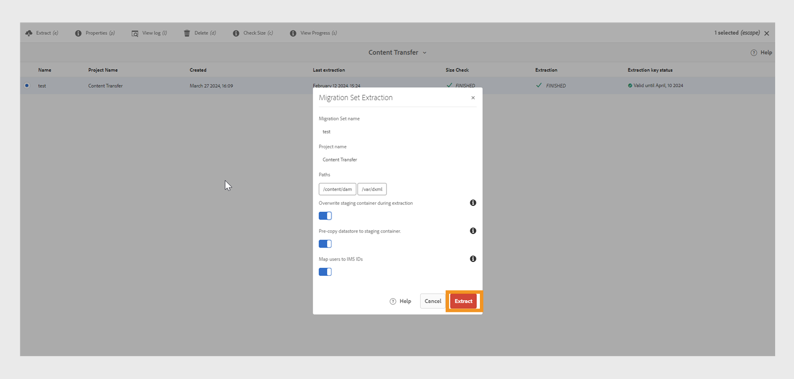
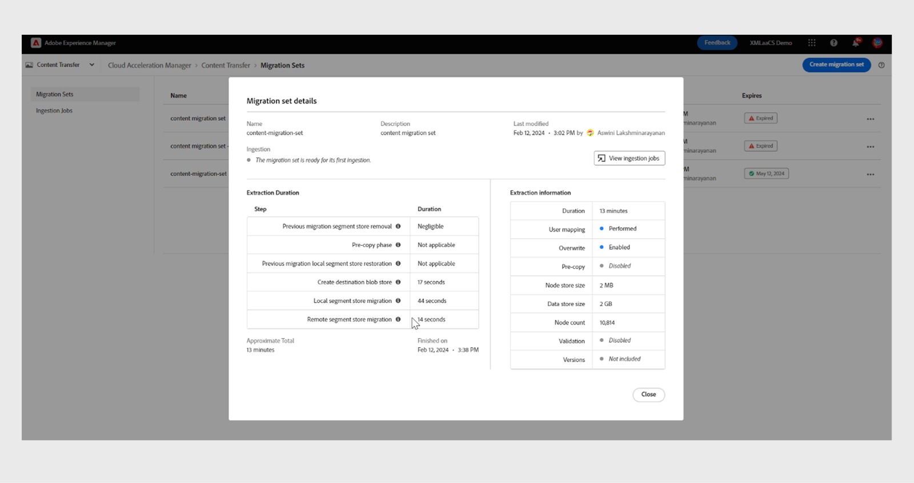

# 将内容从内部部署迁移到Cloud Service

Experience Manageras a Cloud Service为Experience Manager Guides、Assets、Forms和Screens提供了可扩展、安全且敏捷的技术基础。 这使营销人员和IT专业人员能够专注于大规模提供有影响力的体验。
借助Experience Manageras a Cloud Service，您的团队可以专注于创新而不是规划产品升级。 新产品功能经过全面测试并在不中断的情况下交付给您的团队，以便他们始终能够访问最新版本的Adobe Experience Manager。

本文提供了一个详细的分步流程，用于将您的内部部署或Managed Services Experience Manager Guides内容迁移到Cloud Service，确保顺利过渡到基于云的平台。

## 先决条件

* Adobe Experience Manager 6.4或更高版本
* Experience Manager Guides应采用UUID版本。 如果您使用的是非UUID版本的Adobe Experience Manager Guides，请先使用[迁移非DITA内容](../install-guide/migrate-uuid-non-uuid.md)中的步骤迁移到UUID。
* 访问要迁移内容的云实例的&#x200B;**Cloud Acceleration Manager**
* 支持高达20TB的存储库大小
* Lucene索引总大小为25 GB
* 节点名称的长度必须小于150字节

## 迁移过程

**内容传输工具**是由Adobe开发的工具，可用于启动将现有内容从源Adobe Experience Manager内部部署或Managed Services实例迁移到目标Experience Manager Cloud Service实例的操作。
此工具还会自动传输主体（用户或组）。

您可以从&#x200B;**软件分发**&#x200B;门户以ZIP文件形式下载&#x200B;**内容传输工具**：

1. 在&#x200B;**软件分发**&#x200B;门户上选择&#x200B;**AEM as a Cloud Service**&#x200B;选项卡。
1. 搜索&#x200B;**内容传输工具**。
1. 从列表中选择&#x200B;**内容传输工具**&#x200B;并下载它。

然后，通过**包管理器**在源Adobe Experience Manager实例上安装该包。 确保下载最新版本。
有关最新版本的更多详细信息，请查看[发行说明](https://experienceleague.adobe.com/docs/experience-manager-cloud-service/content/release-notes/release-notes/release-notes-current.html?lang=en)。

>[!NOTE]
> 
> 仅支持版本2.0.0及更高版本，建议使用最新版本。

执行以下步骤，将Experience Manager Guides内容迁移到Experience Manageras a Cloud Service。

1. 登录到[experience.adobe.com](https://experience.adobe.com/)并选择&#x200B;**Experience Manager**。

   

1. 在&#x200B;**Cloud Acceleration Manager**&#x200B;磁贴上单击&#x200B;**启动**。
   

1. 创建您的第一个项目。
   

1. 添加名称和描述，然后单击&#x200B;**创建**。 您的项目已创建。
1. 选择已创建的项目并打开项目屏幕。
1. 在&#x200B;**内容传输**&#x200B;磁贴上单击&#x200B;**审阅**。

   

1. 单击&#x200B;**创建迁移集**。

1. 提供迁移集的名称和描述。

   

1. 创建后，选择三个圆点，然后选择&#x200B;**复制提取密钥**。

1. 单击&#x200B;**复制到剪贴板**。 创建您的第一个项目。
   

1. 选择顶部的&#x200B;**Adobe Experience Manager**，然后选择&#x200B;**软件分发**拼贴。
   

1. 在&#x200B;**软件分发**&#x200B;门户上，选择&#x200B;**Adobe Experience Manager作为Cloud Service**&#x200B;选项卡，搜索“内容传输工具”，然后下载内容传输工具包。

   >[!NOTE]
   >
   >  确保下载最新版本。

1. 在内部部署实例的&#x200B;**包管理器**&#x200B;中上载并安装包`content-transfer.all-3.0.10.zip`。
   

1. 在本地实例上，选择&#x200B;**工具** > **操作** > **内容迁移** > **内容传输**。

1. 选择&#x200B;**内容传输**，创建迁移集，并粘贴从Cloud Acceleration Manager复制的提取密钥。 这会在源和目标之间建立连接。 然后验证键，并在输入值后显示有效性。

1. 启用&#x200B;**包含版本**选项以包含文件版本。
   

1. 提供要迁移的路径，然后单击&#x200B;**保存**。
例如，`/content/sites`
或
   `/content/dam/tech-docs`
   

   >[!NOTE]
   >
   > 您需要为&#x200B;**Experience Manager Guides**&#x200B;内容强制迁移以下路径。

   * `/content/dam`
   * `/var/dxml`

   创建迁移集时，以下路径受到限制：
   * `/apps`
   * `/libs`
   * `/home`
   * `/etc`允许您在CTT中选择一些`/etc`路径。

1. 单击&#x200B;**保存**
1. 选择&#x200B;**迁移集**，然后选择顶部的&#x200B;**提取**。
   

1. 在&#x200B;**迁移集提取**&#x200B;弹出窗口中验证所选路径和配置的详细信息，然后单击&#x200B;**提取**。 提取将花费几分钟的时间，并且您会看到状态已更新。
   

1. 提取完成并以状态`finished`指示后，转到Cloud Acceleration Manager并选择您在步骤18中创建的项目。
有关详细信息，请选择三个圆点，然后选择**查看详细信息**。

1. 在迁移集详细信息弹出窗口中，验证迁移集配置并关闭弹出窗口。 您可以查看路径和其他设置，如以下屏幕快照中所示：
   

1. 单击&#x200B;**引入作业** > **新建引入**。
1. 确认所需的复选标记值，然后单击&#x200B;**创建**。
   

1. 选择迁移集，选择环境所需的服务器，然后单击&#x200B;**摄取**。

   

## 在Publish实例上运行内容传输工具

在源Publish实例上安装内容传输工具，以将内容移动到目标Publish实例。
将内容摄取到Publish环境时，内容传输工具不区分已发布和未发布的内容。 迁移集中指定的内容将被摄取到所选的目标实例中。 用户可以将迁移集摄取到创作实例和/或Publish实例中。

### 推荐的方法

请考虑以下建议：

* 使用与创作实例上使用的&#x200B;**内容传输工具**&#x200B;相同的版本。
* 在摄取到Publish期间，Publish层不会按比例缩小（与作者不同）。
* 仅迁移单个Publish节点。 在开始提取之前，将其从负载平衡器中移除。

>[!NOTE]
>
> 作为预防措施，请确保在Publish实例上不会发生写入操作，包括用户启动的操作，例如：
> * 在该环境中从AEM as a Cloud Service Author到Publish的内容分发
> * Publish实例之间的用户同步

## 疑难解答

如果提取由于以下错误而失败，则可以通过导入相关的CA证书来解决此问题：

`javax.net.ssl.SSLHandshakeException: sun.security.validator.ValidatorException: PKIX path building failed: sun.security.provider.certpath.SunCertPathBuilderException: unable to find valid certification path to requested target`

**原因**： Adobe Experience Manager服务器具有防火墙限制，因此请将以下端点添加到允许列表中。

`casstorageprod.blob.core.windows.net`

*启用SSL日志记录。*

