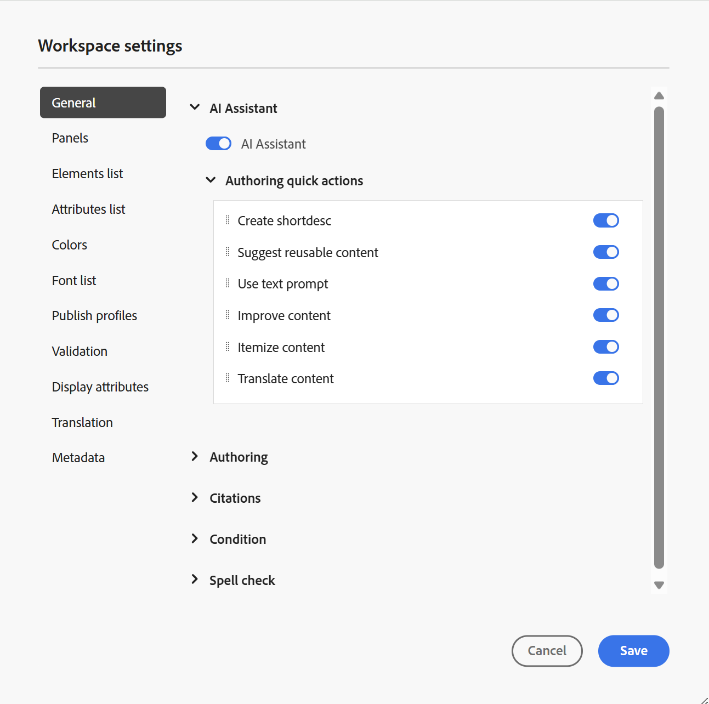

# Workspace设置

编辑器&#x200B;**选项卡栏**&#x200B;中存在的[Workspace设置](../user-guide/web-editor-tab-bar.md)选项仅供管理员和文件夹配置文件管理员使用，并允许配置以下设置：

- [常规](#general)
- [面板](#panels)
- [元素列表](#elements-list)
- [属性列表](#attributes-list)
- [颜色](#colors)
- [发布配置文件](#publish-profiles)
- [验证](#validation)
- [显示属性](#display-attributes)
- [翻译](#translation)
- [元数据](#metadata)

>[!NOTE]
>
> - 如果在内部部署设置中使用Adobe Experience Manager Guides，则Workspace设置选项在“更多操作”菜单下继续显示为&#x200B;**设置**。
> - 如果要更新任何默认设置，则应重新打开文档以使更改生效。

## 常规

常规设置允许您配置设置以使用编辑器。 此选项卡包含五个部分：**AI助手**、**创作**、**引用**、**条件**&#x200B;和&#x200B;**拼写检查**。

{width="350" align="left"}

- **AI助手**
选择此项可在Experience Manager Guides中启用[AI助手](../user-guide/ai-assistant.md)功能。 取消选择可禁用该功能。

  启用&#x200B;**AI助手**&#x200B;切换后，您可以使用&#x200B;**创作快速操作**&#x200B;菜单为作者配置在&#x200B;**创作选项卡**&#x200B;下显示的选项，如下所示。\
  这些更改适用于您正在处理的特定文件夹配置文件。 如果您创建新的文件夹配置文件，则默认情况下它将继承&#x200B;**全局**&#x200B;文件夹配置文件中定义的Workspace设置。 您可以使用&#x200B;**Workspace设置**&#x200B;根据需要修改这些设置并保存更新的配置。\
  有关使用AI助手创作可用选项的详细概述，请使用AI助手智能地查看[创作文档](../user-guide/ai-assistant-right-panel.md)。

  通过&#x200B;**创作快速操作**&#x200B;菜单，您可以：

   - 使用这些切换可启用或禁用作者在使用AI Assistant时可以访问的特定选项。

   - 更改选项的显示顺序，根据需要拖放它们。

  {width="350" align="left"}

- **创作**

   - **启用全部替换**：选择此项以查看&#x200B;**查找和替换**&#x200B;面板中的&#x200B;**全部替换**&#x200B;图标。

- **引用**

  更改引文样式。 从要在项目中使用的下拉列表中选择引用样式。 有关更多详细信息，请查看[更改引文样式](../user-guide/web-editor-apply-citations.md#change-citation-style)。

- **条件**

   - **在作者视图中高亮显示条件文本**：选择此项以在作者视图中高亮显示条件文本。 使用为条件定义的颜色突出显示条件内容。

   - **使用条件属性进行验证**：选择此项以允许验证为属性定义的值。 这样可防止您添加任何不正确的值。

   - **在“主题方案”面板中显示带有标题的键**：选择此项可显示主题方案中的键和标题。 如果不选择此选项，则只显示标题。 例如，此处“os”、“audience”和“other”键也会与标题一起显示。

     {width="550" align="left"}

   - **在条件面板中显示主题方案**：选择此项可在条件面板中查看主题方案。 如果取消选择此选项，则定义的条件将显示在条件面板中。

- **拼写检查**
有两个选项 — **AEM拼写检查**&#x200B;和&#x200B;**浏览器拼写检查**。 默认情况下，编辑器使用浏览器拼写检查功能，其中拼写检查使用浏览器的内置词典执行。 您可以切换到AEM拼写检查以使用Adobe Experience Manager的词典，也可以自定义该词典以添加自定义单词列表。 有关自定义AEM词典的详细信息，请在“安装和配置AEM as a Cloud Service”中查看[自定义Adobe Experience Manager Guides的默认词典](../cs-install-guide/customize-aem-custom-dictionary.md)部分。

## 面板

此设置控制编辑器和“地图”控制台的左右面板中显示的面板。 您可以切换按钮以显示或隐藏所需的面板。

{width="650" align="left"}

还可定义面板中特征的显示顺序。 要更改面板中可用功能的默认顺序，请选择虚线将功能选项卡拖放到所需位置。 功能也可以根据需要从&#x200B;**更多**&#x200B;部分移动到面板的主部分，反之亦然。 重新排序后，这些功能将以相同的顺序显示在相应的右侧面板和左侧面板中。

{width="650" align="left"}

一次最多可以显示8个面板。 对面板设置所做的任何更改都将立即应用。

>[!NOTE]
>
> 如果自定义面板已配置，则它也会出现在面板列表中。 您可以切换开关以显示或隐藏自定义面板。

## 元素列表

作为管理员，您可以控制作者可以插入到文件中的元素列表，还可以定义元素的显示名称。 利用元素列表设置，可根据DITA规范指定元素名称以及要使用的标签而不是DITA定义的元素名称：

{width="650" align="left"}

在上述屏幕快照中，`p`元素被赋予了Paragraph标签，`codeblock`被赋予了Code Block标签以及其他一些元素。 如果选择&#x200B;**仅使用以上元素**&#x200B;选项，则&#x200B;**插入元素**&#x200B;对话框中只会显示此列表中的有效元素\（在当前插入点\）。

在以下屏幕快照中，当前上下文中只显示前一个屏幕快照中4个已配置元素中的3个：

{width="300" align="left"}

## 属性列表

与元素列表类似，您可以控制要在元素的属性列表中显示的属性及其显示名称。 在以下屏幕截图中，只有3个属性已配置为在元素的属性列表中显示：

{width="650" align="left"}

使用此设置，当尝试将属性添加到元素时，您只能查看列表中配置的属性列表。

{width="300" align="left"}

## 颜色

显示&#x200B;**条件**&#x200B;的预配置背景颜色列表。 将条件应用到主题时，用户可以选择背景颜色。 作为管理员，您还可以创建自定义背景颜色并将其添加到列表中。 若要添加新颜色，请在&#x200B;**颜色名称**&#x200B;字段中输入所需的名称，选择自定义颜色，然后选择&#x200B;**+**&#x200B;图标。 自定颜色将显示在颜色列表的末尾。

## 发布配置文件

这包含可用于发布&#x200B;**知识库**&#x200B;输出的配置文件。 您可以为目标知识库创建新的用户档案。 例如，Salesforce或ServiceNow。

**创建Salesforce配置文件**

**先决条件**

- 为Salesforce创建连接的应用程序。 有关更多详细信息，请参阅[为API集成启用OAuth设置](https://help.salesforce.com/s/articleView?id=sf.connected_app_create_api_integration.htm&type=5)。

- 配置连接的应用程序时，请确保满足以下条件：

   - 指定回调。

     `URL: http://<server name>:<port>/bin/dxml/thirdparty/callback/salesforce`

   - 选择以下OAuth范围：
      - 完全访问（完全）
      - 选择通过API (api)管理用户数据

     配置应用程序后，Salesforce会提供&#x200B;**使用者密钥**&#x200B;和&#x200B;**使用者密钥**。 这些资源可用于创建Salesforce配置文件。

   - 要创建Salesforce配置文件，请从&#x200B;**服务器类型**&#x200B;下拉列表中选择&#x200B;**Salesforce**&#x200B;知识库。 输入配置文件名称。 在&#x200B;**站点URL**&#x200B;中，输入用于发布输出的使用者站点，然后添加由Salesforce使用者站点提供的&#x200B;**使用者密钥**&#x200B;和&#x200B;**使用者密钥**。 然后，**验证**&#x200B;和&#x200B;**保存**&#x200B;新创建的配置文件。

     {width="550" align="left"}

     >[!NOTE]
     >
     >要在Experience Manager Guides中配置Salesforce的代理，请使用AEM中的Apache HTTP组件代理配置。 了解如何[配置AEM Link Checker](https://helpx.adobe.com/experience-manager/kb/How-to-configure-proxy-for-the-AEM-Link-Checker-AEM.html)的代理。

**创建ServiceNow配置文件**

**先决条件**

配置ServiceNow服务器以上传资产。

- 连接到&#x200B;**ServiceNow**&#x200B;服务器。
- 导航到&#x200B;**系统属性** > **安全性**。
- 取消选中以下选项：

  **必须设置此属性以激活用于上传的MIME类型检查（所有版本均为Eureka及更高版本）。 启用(true)或禁用(false)文件附件的mime类型验证。 上载期间将检查通过glide.attachment.extensions配置的文件扩展名是否为MIME类型。**

- 选择&#x200B;**保存**。

  配置应用后，创建&#x200B;**ServiceNow**&#x200B;配置文件。

- 要创建配置文件，请从&#x200B;**服务器类型**&#x200B;下拉列表中选择ServiceNow知识库。 输入配置文件&#x200B;**名称**。 在&#x200B;**ServiceNow URL**&#x200B;中，输入用于发布输出的使用者网站，然后添加由ServiceNow使用者网站提供的&#x200B;**用户名**&#x200B;和&#x200B;**密码**。 然后，**验证**&#x200B;和&#x200B;**保存**&#x200B;新创建的配置文件。

  {width="550" align="left"}

  验证后，您可以在DITA Map的输出预设中选择发布配置文件，并使用它生成到您选择的&#x200B;**Salesforce**&#x200B;或&#x200B;**ServiceNow**&#x200B;服务器的输出。

  了解有关[知识库](../user-guide/generate-output-knowledge-base.md)输出预设的更多信息。

## 验证

此选项卡包含用于在编辑器中配置模式验证的选项。 您可以启用以下功能：

- **在保存文件之前运行验证检查**：选择此项可在任何保存操作之前使用选定的架构文件运行架构验证。 您可以通过选择+图标来添加Schematron文件。 将列出选定的架构文件。

  >[!NOTE]
  >
  > 选定的架构文件将在选定的文件夹配置文件中保留。

  {width="550" align="left"}

  这会阻止用户保存任何违反选定架构文件中定义的规则的文件。 如果未选择此选项，则在保存更改之前不会验证文件。

- **允许所有用户在验证面板中添加架构文件**：选择此项可允许用户在编辑器的验证面板中添加任何架构文件。 这允许用户添加Schematron文件，然后针对Schematron文件验证主题。 如果未选择此选项，则编辑器&#x200B;**验证面板**&#x200B;中的用户无法使用添加模式文件&#x200B;**添加模式文件**&#x200B;按钮的选项。

## 显示属性

与“属性”列表一样，您可以控制要在元素的属性列表中显示的属性列表。 默认情况下，四个&#x200B;**显示属性** — audience、platform、product和prop已配置为显示在元素的属性列表中。 您还可以使用顶部的&#x200B;**添加**&#x200B;图标添加显示属性。 您还可以使用&#x200B;**删除**&#x200B;图标删除任何显示属性。

为元素定义的属性将显示在“布局”和“大纲”视图中。

{width="550" align="left"}

## 翻译

此选项卡包含创建语言组、将源标签传播到目标版本以及清理翻译项目的选项。

{width="550" align="left"}

- **语言组**：作为管理员，您可以创建一组语言，并将它们作为一组用于翻译内容。

  执行以下步骤以创建新语言组：

   1. 选择&#x200B;**添加**。
   1. 输入语言组名称。 每种语言都应该有一个唯一的名称。 如果名称字段为空或名称不唯一，则可以查看错误。
   1. 从下拉列表中选择语言。 您可以选择多种语言。

      键入语言的前几个字符或语言代码以筛选所需的语言。 例如，键入“en”可筛选名称或代码开头包含“en”的所有语言。

   1. 选择完成图标以将所选语言添加到组。 将显示语言。 添加三种或更多语言时，将显示&#x200B;**显示更多**&#x200B;选项。 您可以选择&#x200B;**显示更多**&#x200B;以查看该组中存在的所有语言。

      >[!TIP]
      >
      > 将&#x200B;**显示更多**&#x200B;切换为&#x200B;**显示更少**&#x200B;并只查看几种语言。

   1. 将鼠标悬停在组中的语言上以编辑或删除语言组。
   1. 保存&#x200B;**设置**。

      >[!NOTE]
      >
      >作为用户，您可以查看为文件夹配置文件配置的语言组。

- **将源版本标签传播到目标版本**：选择此选项可将源文件版本的标签传递到已翻译的文件。 默认情况下，该选项处于禁用状态。
- **完成后的翻译项目清理**：选择此选项可将翻译项目配置为在翻译后自动禁用或删除。 默认情况下，选择&#x200B;**无**，这样项目在翻译后就会存在。

  如果要稍后使用翻译项目，可以禁用这些项目。 删除项目将永久删除该项目中存在的所有文件和文件夹。

## 元数据

您可以控制主题的版本元数据及其值显示在&#x200B;**版本历史记录**&#x200B;对话框中。  在元数据路径中，指定要从中选取元数据的节点的位置。 您还可以将元数据的自定义名称定义为标签。 默认属性为“标题”、“文档状态”和“标记”。

可以从资产的`/jcr:content`节点下的任何属性中选取元数据，因此您可以将属性的路径添加为元数据路径。

如果元数据路径为空，则会显示错误。 如果将标签留空，则会选取最后一个元素作为标签。

工作区设置中的{width="550" align="left"}

*为&#x200B;**版本历史记录**&#x200B;对话框配置元数据。*

您还可以定义这些元数据标记的显示顺序。 要更改这些标记的默认顺序，请选择虚线将标记拖放到所需位置。
元数据标签在编辑器的&#x200B;**版本历史记录**&#x200B;对话框中以相同的顺序显示。

