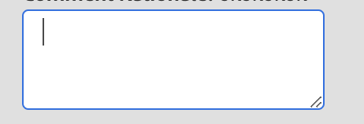

# 文本字段和文本区域

要将文本作为输入，我们使用组件、文本字段和文本区域。
JUI中的文本区域组件表示html `<textarea/>`。

```js title="textArea.js"
const textAreaJSON =  {
    "component": "textarea", //tells the component name
    "id": "input_name", // can be used to give a unique identifier to a component
    "data": "@name", // the variable storing the inputted text
    "on-keyup": {
        "name": "submitName",
        "eventArgs": {
            "keys": [
            "ENTER"
            ]
        }
    },
},
```

此处，`on-keyup`是调用控制器中命令的语法。
这将生成一个textArea，按ENTER将调用事件`submitName`

呈现的文本区域将如下所示：


