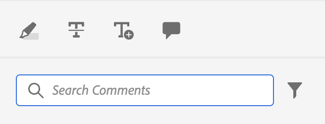

# 简单自定义示例

现在，让我们了解如何在AEM Guides应用程序中集成这些自定义项。

例如，我们希望在应用程序的现有视图中添加此按钮。
为此，我们需要3个基本要素：

1. 我们要向其添加组件的视图JSON的`id`。
2. `target`，即我们要向其中添加新组件的JSON中的位置。 使用`key`和`value`定义`target`。 键值对可以是用于定义组件的任何属性，这些属性有助于唯一标识组件。
我们还可以使用索引来引用目标。
我们有3个视图状态： `APPEND`、`PREPEND`、`REPLACE`。
3. 新创建组件的JSON和相应方法。

假设我们要向审阅中使用的注释工具箱添加一个按钮，用于在AEM中打开文件。

```typescript
export default {
  id: 'annotation_toolbox', 
  view: {
    items: [
      {
        component: 'button',
        icon: 'linkOut',
        title: 'Open topic in Assets view',
        'on-click': 'openTopicInAEM',
        target: {
          key: 'value',
          value: 'addcomment',
          viewState: VIEW_STATE.APPEND

        },
      },
    ],
  },
  controller: {
    openTopicInAEM: function (args) {
        const topicIndex = tcx.model.getValue(tcx.model.KEYS.REVIEW_CURR_TOPIC)
        const {allTopics = {}} = tcx.model.getValue(tcx.model.KEYS.REVIEW_DATA) || {}
        tcx.appGet('util').openInAEM(allTopics[topicIndex])
    },
  },
}
```

在上例中，我们提供了：

1. 我们要插入组件的JSON的`id`，即`annotation_toolbox`
2. 目标为`addcomment`按钮。 我们使用viewState `append`在`addcomment`按钮之后添加按钮。
3. 我们定义控制器中按钮的单击事件。

“annotation_toolbox”的JSON `.src/jsons/review_app/annotation_toolbox.json`

在自定义之前，注释工具箱如下所示：



自定义后，注释工具箱如下所示：


## 添加CSS

为了保持一致性，我们提供了已设置样式的组件。 插入的JSON将应用其固有样式
管理css的主要方法是通过扩展中的extraClass键。

```js
{    
    "view":{
        items:[
            {
                compoenent:"button",
                extraClass:"underline bg-red",
            }
        ]
    }
}
```

通过将css文件添加到clientlibs，您可以使用CSS类放置自定义样式。 在生成期间，我们还为顺风中的实用工具类创建[顺风](https://tailwindcss.com/docs/utility-first)输出。 在扩展的`tailwind.config.js`的`./tailwind.config.js`处可找到相同内容的配置
