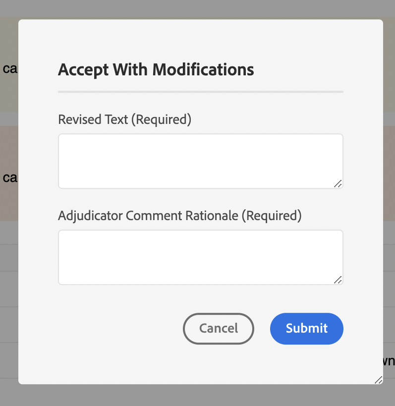

# 示例

在此程序包中，我们还提供了一些自定义示例（位于`guides_extension/src`） 。 下面是每个报表的简要说明。

1. [上下文菜单](./examples/file_options.ts)
在此示例中，我们已自定义`file_options`上下文菜单，以删除`Delete`和`Edit`选项，并将`Duplicate`选项替换为`Download`选项。

2. [左侧面板](./examples/left_panel_container.ts)
在此示例中，我们已自定义`left tab panel`以使其他`tab`具有标题为“TEST EXTENSION”，以及具有标签`Test Tab Panel`的相应`tab panel`

3. [右侧面板](./examples/right_panel_container.ts)
在此示例中，我们已自定义`right tab panel`，以使其具有名为“TEST EXTENSION”的其他`tab`，以及具有标签`New Tab Panel`的相应`tab panel`

4. [存储库面板](./examples/repository_panel.ts)

5. [工具栏](./examples/toolbar.ts)
在此示例中，我们已将`Insert Element`、`Insert Paragraph`、`Insert Numbered List`、`Insert Bulleted List`按钮替换为包含所有这些按钮的单个`More Insert Options`按钮。

[查看应用示例]

1. [注释工具箱](./examples/review_app_examples/annotation_extension.ts)
在此示例中，我们在注释工具箱中添加了另一个按钮，用于在AEM中打开当前审阅主题。

2. [审阅评论](./examples/review_app_examples/review_comment.ts)
在此示例中，我们添加了将用户名替换为用户信息（包含评论者的全名和标题）、添加了唯一评论ID和mailTo图标，并添加了用于提及评论严重性和理由的输入字段。
我们还在用于打开对话框的XMLEditor端的评论中添加了`accept with modification`按钮。

3. [评论回复](./examples/review_app_examples/comment_reply.ts)
在此示例中，我们添加了将用户名替换为用户信息（包含评论者的全名和标题），并在评论标头中添加了mailTo图标。

4. [内联审核面板](./examples/review_app_examples/inline_review_panel.ts)
在此文件中，我们会计算并分配唯一评论ID，如`Review Comment`和`Comment Reply`示例中所述。
   - `setCommentId`方法根据评论计数为每个评论设置唯一的评论ID。

   - `setUserInfo`设置userInfo的值，对每个评论使用全名和标题。

   - `onNewCommentEvent`确保为每个新评论或回复调用`setUserInfo`方法。

   - `updatedProcessComments`函数针对每个新评论事件运行，并确保在获得新评论事件时调用`setCommentId`。

5. [主题审阅面板](./examples/review_app_examples/topic_reviews.ts)：此文件扩展了[内联审阅面板](./examples/review_app_examples/inline_review_panel.ts)，以便添加的自定义项也可在审阅应用程序端工作。

6. [接受修改对话框](./examples/review_app_examples/accept_with_modification_dialog.ts)
这是向应用程序添加新构件的示例。 在此处，我们创建了一个新对话框，该对话框有两个输入文本字段：`Revised Text`和`Adjudicator Comment Rationale`

以下是自定义之前和自定义之后的审核面板：

