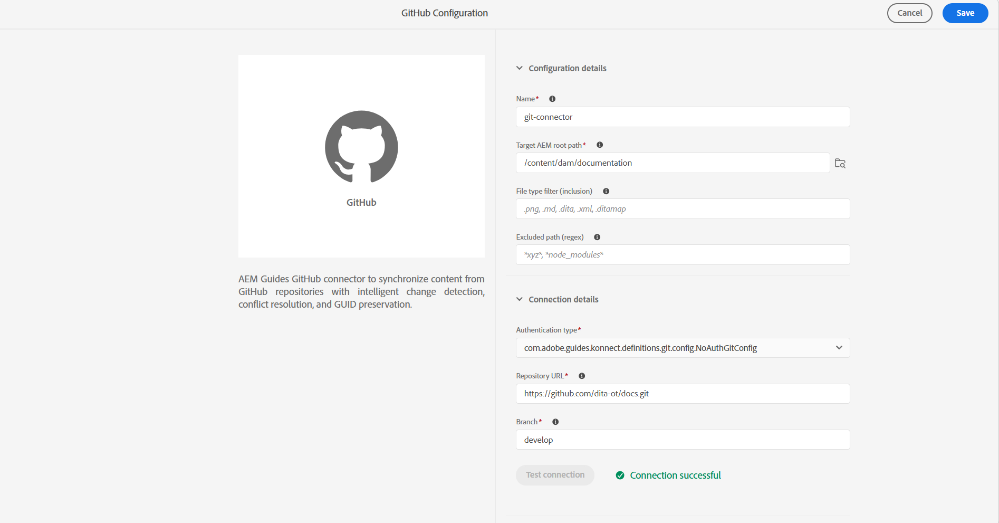

# 从用户界面创建和配置Git连接器

使用Experience Manager Guides中的“数据源”工具从用户界面创建和配置Git连接器。 成功配置连接器后，您可以使用它将Git存储库中的内容导入Experience Manager Guides。

1. 选择顶部的&#x200B;**Adobe Experience Manager**&#x200B;链接，然后选择&#x200B;**工具**。
1. 从工具列表中选择&#x200B;**指南**。
1. 选择&#x200B;**数据源**&#x200B;磁贴。 显示&#x200B;**数据源**&#x200B;页。
1. 选择&#x200B;**创建**。
1. 从数据源连接器列表中，选择&#x200B;**GitHub**。

   {width="600"}

1. 选择&#x200B;**下一步**。
1. 输入配置和连接详细信息。

   {width="600"}

   >[!TIP]
   >
   >* 将鼠标悬停在 在字段附近查看有关它的更多详细信息。
   >* 带*的字段为必填字段。 例如，您可以为Elasticsearch连接器输入以下详细信息。

   * **名称**：输入数据源的名称。
   * **Target AEM根路径**：输入从Git导入的内容应存储在AEM存储库中的路径。
   * **文件类型筛选器（包含）**：指定导入期间要包含的文件类型。
   * **排除的路径（正则表达式）**：指定要从导入中排除的路径模式。
   * **身份验证类型**：从下拉列表中选择身份验证类型。 当前，**个人访问令牌(PAT)**&#x200B;是唯一受支持的身份验证方法。 在连接器设置期间输入PAT以验证和访问Git存储库。
   * **存储库URL**：输入应从中导入内容的Git存储库URL。
   * **分支**：输入用于内容导入的分支。

1. 测试连接。 只有在输入所需的详细信息后，才会启用&#x200B;**测试连接**&#x200B;按钮。 如果连接详细信息正确，则会显示一条成功消息。 否则，将显示一条错误消息。

   {width="600"}

1. 选择顶部的&#x200B;**保存**&#x200B;以保存连接器。

   只有在输入所有必需详细信息并且连接成功后，才会启用“保存”按钮。 如果连接器保存成功，您可以在&#x200B;**数据源**&#x200B;页面上查看配置的Github连接器。

   {width="600"}

