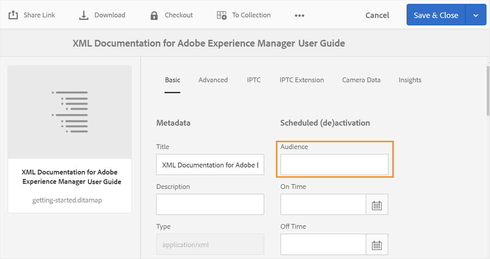

# 配置输出生成设置 {#id181AI0B0E30}

AEM Guides提供了许多配置选项，供您自定义输出生成过程。 本主题介绍有助于您设置输出生成过程的所有配置和自定义设置。

## 在DITA映射操控板上配置基线选项卡 {#id223MD0D0YRM}

以下选项卡提供了有关如何根据您的Experience Manager Guides设置在DITA映射仪表板上隐藏“基线”选项卡的说明： Cloud Service或内部部署。

>[!BEGINTABS]

>[!TAB Cloud Service]

1. 使用[配置覆盖](download-install-config-override.md#)中提供的说明创建配置文件。
1. 在配置文件中，提供以下\(property\)详细信息以在映射功能板上配置基线选项卡。

| PID | 属性键 | 属性值 |
|---|------------|--------------|
| `com.adobe.fmdita.config.ConfigManager` | `hide.tabs.baseline` | 布尔值\(`true/false`\)。**默认值**： `true` |

>[!NOTE]
>
> 默认情况下，此配置处于启用状态，并且基线选项卡在映射功能板上不可用。

>[!TAB 内部部署]

1. 打开Adobe Experience Manager Web控制台配置页面。

   用于访问配置页面的默认URL为：

   ```http
   http://<server name>:<port>/system/console/configMgr
   ```

1. 搜索并单击&#x200B;**com.adobe.fmdita.config.ConfigManager**&#x200B;包。

1. 选择&#x200B;**隐藏基线选项卡**&#x200B;选项。

1. 单击&#x200B;**保存**。

>[!NOTE]
>
> 此配置默认处于禁用状态，并且基线选项卡在映射仪表板上可用。

>[!ENDTABS]


## 在现有AEM站点中配置混合发布 {#id1691I0V0MGR}

如果您有一个包含DITA内容的AEM站点，则可以配置AEM站点输出以将DITA内容发布到站点内的预定义位置。 例如，在以下AEM站点页面屏幕截图中，`ditacontent`节点为存储DITA内容而保留：


页面中的其余节点直接从AEM站点编辑器创作。 将发布设置配置为将DITA内容发布到预定义的位置，可确保AEM Guides发布过程不会修改任何现有的非DITA内容。

您需要在现有站点上执行以下配置，以允许将DITA内容发布到预定义节点：

- 配置网站的模板属性

- 在站点中添加节点以发布DITA内容


以下选项卡提供了有关如何根据Experience Manager Guides设置配置现有站点的模板属性的说明：Cloud Service或内部部署。

>[!BEGINTABS]

>[!TAB Cloud Service]

1. 使用包管理器下载/libs/fmdita/config/templates/default文件。

   >[!NOTE]
   >
   > 请勿在`libs`节点中使用默认配置文件中的任何自定义设置。 您必须在`libs`节点中创建`apps`节点的叠加，并仅更新`apps`节点中的所需文件。

1. 添加以下属性：

   | 属性名称 | 类型 | 价值 |
   |-------------|----|-----|
   | `topicContentNode` | 字符串 | 指定要发布DITA内容的节点名称。 例如，AEM Guides发布DITA内容的默认节点为： <br> `jcr:content/contentnode` |
   | `topicHeadNode` | 字符串 | 指定要存储DITA内容的元数据信息的节点名称。 例如，AEM Guides存储元数据信息的默认节点为： <br> `jcr:content/headnode` |


下次使用网站的模板配置发布任何DITA内容时，该内容将发布到`topicContentNode`和`topicHeadNode`属性中指定的节点。

>[!TAB 内部部署]

1. 登录AEM并打开CRXDE Lite模式。

1. 导航到站点的模板配置节点。 例如，AEM Guides将默认模板配置存储在以下节点中：

   `/libs/fmdita/config/templates/default`

   >[!NOTE]
   >
   > 请勿在`libs`节点中使用默认配置文件中的任何自定义设置。 您必须在`libs`节点中创建`apps`节点的叠加，并仅更新`apps`节点中的所需文件。

1. 添加以下属性：

   | 属性名称 | 类型 | 价值 |
   |-------------|----|-----|
   | `topicContentNode` | 字符串 | 指定要发布DITA内容的节点名称。 例如，AEM Guides发布DITA内容的默认节点为： <br>`jcr:content/contentnode` |
   | `topicHeadNode` | 字符串 | 指定要存储DITA内容的元数据信息的节点名称。 例如，AEM Guides存储元数据信息的默认节点为： <br>`jcr:content/headnode` |


以下屏幕截图显示了在AEM Guides的默认模板节点中添加的属性：

{width="800" align="left"}

下次使用网站的模板配置发布任何DITA内容时，该内容将发布到`topicContentNode`和`topicHeadNode`属性中指定的节点。

但是，对于现有站点，您必须手动添加`topicContentNode`和`topicHeadNode`节点。

执行以下步骤，将所需的节点添加到现有站点：

1. 登录AEM并打开CRXDE Lite模式。

1. 在站点节点中找到`jcr:content`。

1. 添加与在网站的模板配置中指定的名称相同的`topicContentNode`和`topicHeadNode`节点。

>[!ENDTABS]

## 配置基本输出位置以进行发布

以下选项卡提供了根据Experience Manager Guides设置配置基本输出位置的说明：Cloud Service或内部部署。

>[!BEGINTABS]

>[!TAB Cloud Service]

1. 使用[配置覆盖](download-install-config-override.md)中提供的说明创建配置文件。

1. 在配置文件中，提供以下（属性）详细信息以配置基本输出位置：

   | PID | 属性键 | 属性值 |
   |---|---|---|
   | `com.adobe.fmdita.config.ConfigManager` | `base.output.path` | **默认值：** &quot;/content/dam/fmdita-outputs&quot; |

>[!TAB 内部部署]

1. 打开Adobe Experience Manager Web控制台配置页面。

   用于访问配置页面的默认URL为：

   ```http
   http://<server name>:<port>/system/console/configMgr
   ```

1. 搜索并选择&#x200B;*com.adobe.fmdita.config.ConfigManager*&#x200B;包。

1. 更新属性&#x200B;**基本输出位置**&#x200B;以指定AEM存储库中发布后保存PDF的默认路径。 此外，如果输入的路径无效，它将自动还原到默认路径： `/content/dam/fmdita-outputs`。

1. 单击&#x200B;**保存**。

>[!ENDTABS]

## 通过DITA-OT发布输出时使用元数据 {#id191LF0U0TY4}

AEM Guides提供了一种在使用DITA-OT发布输出时传递自定义元数据的方式。 作为管理员和发布者，您需要执行以下任务以在已发布输出中配置和使用自定义元数据：

- 作为管理员，在系统中添加所需的元数据，以便该元数据在DITA映射的“属性”页面上可用。

- 作为管理员，将自定义元数据添加到元数据列表中，以便该元数据显示在DITA映射控制台中。

- 作为发布者，使用DITA映射配置和添加自定义元数据并生成所需的输出。


要在系统中添加所需的元数据，请执行以下步骤：

1. 以管理员身份登录Adobe Experience Manager。

1. 单击顶部的Adobe Experience Manager链接，然后选择&#x200B;**工具**。

1. 从工具列表中选择&#x200B;**Assets**。

1. 单击&#x200B;**元数据架构**&#x200B;磁贴。

   此时会显示元数据架构Forms页面。

1. 从列表中选择&#x200B;**default**&#x200B;表单。

   >[!NOTE]
   >
   > 在DITA映射的“属性”页面上显示的属性取自此表单。

1. 单击&#x200B;**编辑**。

1. 添加要在发布的输出中使用的自定义元数据。 例如，我们将使用以下步骤添加受众元数据：

   1. 从&#x200B;**构建表单**&#x200B;组件列表中，将&#x200B;**单行文本**&#x200B;组件拖放到表单上。

   2. 选择新字段以打开该字段的&#x200B;**设置**。

   3. 在&#x200B;**字段标签**&#x200B;中，输入元数据名称 — Audience。

   4. 在&#x200B;**映射到属性**&#x200B;设置中，指定。/jcr:content/metadata/&lt;元数据的名称\>。 例如，我们将其设置为。/jcr:content/metadata/audience。

   使用这些步骤，添加所有必需的元数据参数。

1. 单击&#x200B;**保存**。


现在，所有DITA映射的“属性”页面中都会显示新参数。



接下来，您需要使自定义元数据在DITA映射控制台中可用。 以下选项卡提供了有关如何根据您的Experience Manager Guides设置在DITA映射仪表板上提供自定义元数据的说明：Cloud Service或内部部署。

>[!BEGINTABS]

>[!TAB Cloud Service]

1. 使用包管理器访问metadataList文件，该文件可在Cloud Manager Git存储库中的以下位置找到：

   /libs/fmdita/config/metadataList

   >[!NOTE]
   >
   > metadataList文件包含属性列表，这些属性显示在映射仪表板中DITA映射的&#x200B;**属性**&#x200B;下拉列表中。 默认情况下，此文件列出了四个属性 — dostate、dc:language、dc:description和dc:title。

1. 添加您在元数据架构Forms页面中添加的自定义元数据。 例如，将受众参数添加到默认列表的末尾。

>[!TAB 内部部署]

1. 登录AEM并打开CRXDE Lite模式。

1. 访问位于以下位置的metadataList文件：

   /libs/fmdita/config/metadataList

   >[!NOTE]
   >
   > metadataList文件包含属性列表，这些属性显示在映射仪表板中DITA映射的&#x200B;**属性**&#x200B;下拉列表中。 默认情况下，此文件列出了四个属性 — dostate、dc:language、dc:description和dc:title。

1. 添加您在元数据架构Forms页面中添加的自定义元数据。 例如，将受众参数添加到默认列表的末尾。

1. 单击&#x200B;**全部保存**。

>[!ENDTABS]

现在，自定义元数据将显示在DITA映射控制台的&#x200B;**属性**&#x200B;下拉列表中。

最后，作为发布者，您需要在发布的输出中包含自定义元数据。 要在生成输出时处理自定义元数据，请执行以下步骤：

1. 在Assets UI中，导航到要发布的DITA映射。

1. 选择DITA映射文件并打开其属性页。

1. 在属性页面上，指定自定义元数据的值。 在本例中，我们为受众参数指定了External值。

   

1. 单击&#x200B;**保存并关闭**。

1. 单击DITA映射文件以打开DITA映射控制台。

1. 在&#x200B;**输出预设**&#x200B;选项卡中，选择要用于生成输出的输出预设。

1. 单击&#x200B;**编辑**。

1. 从&#x200B;**属性**&#x200B;下拉列表中，选择要传递给发布进程的属性。

   


选定的属性/元数据将传递到发布流程，并在最终输出中可用。

### 验证传递到DITA-OT以供处理的元数据（仅适用于Cloud Service）

为了验证传递到DITA-OT的元数据值，可以使用使用云就绪jar的本地环境。 由于我们无法在云上访问本地文件系统，因此验证元数据文件的唯一方法是通过cloud ready jar。

- 文件名： metadata.xml
- 文件位置：crx-quickstart/profiles/ditamaps/&lt;ditamap-1234\>

  要访问metadata.xml，请执行以下操作：

   - 登录到运行AEM实例的服务器位置。
   - 迁移到crx-quickstart/profiles/ditamaps/&lt;new-created-directory-name\>/metadata.xml。
- 示例文件格式：

  **metadata.xml**

  ```XML
  <?xml version="1.0" encoding="UTF-8" standalone="no"?>
  <root>
     <Path id="/absolutePath/sampleMap.ditamap">
        <metadata>
           <meta isArray="false" key="dc:description">This is a file</meta>
           <meta isArray="false" key="dc:title">Myfile</meta>
           <meta isArray="true" key="multivalueText">One;Two;Three</meta>
        </metadata>
     </Path>
     <Path id="/absolutePath/sampleTopic.dita">
        <metadata>
           <meta isArray="false" key="dc:description">description for the accountability</meta>
           <meta isArray="false" key="dc:title">accountability title</meta>
           <meta isArray="true" key="multivalueText">value1</meta>
        </metadata>
     </Path>
  </root>
  ```


- isArray：一个布尔属性，定义元数据是否为多值\(Array\)。 值以分号分隔。
- 路径ID：存储在临时目录下的文件的绝对路径。

>[!NOTE]
>
> 如果文件不存在特定的元数据，则带键的&lt;meta\>标记将不会作为该文件的属性显示在metadata.xml文件中。

## 配置DITA-OT命令行参数字段以接受根映射元数据（仅适用于Cloud Service）

要使用DITA-OT命令行参数字段传递根映射元数据，请执行以下步骤：

1. 使用[配置覆盖](download-install-config-override.md#)中提供的说明创建配置文件。
1. 在配置文件中，提供以下\(property\)详细信息以配置预设中的DITA-OT命令行参数字段：

| PID | 属性键 | 属性值 |
|---|------------|--------------|
| `com.adobe.fmdita.config.ConfigManager` | `pass.metadata.args.cmd.line` | 布尔值\(`true/false`\)。**默认值**： `true` |

- 将属性值设置为&#x200B;**true**&#x200B;可启用DITA-OT命令行功能，从而允许您通过DITA-OT命令行传递元数据。
- 将属性值设置为&#x200B;**false**&#x200B;将禁用DITA-OT命令行功能。 然后，您可以使用预设中的属性字段传递元数据。

## 自定义DITA映射控制台 {#id188HC08M0CZ}

AEM Guides使您可以灵活地扩展DITA映射控制台的功能。 例如，如果您有一组与AEM Guides中可用的报表不同的报表，则可以将这些报表添加到映射控制台。 要自定义映射控制台，您需要创建一个AEM客户端库\（或ClientLib\），该库将包含用于执行所需功能的代码。

>[!NOTE]
>
> 不建议直接修改页面组件，因为新版本的产品将覆盖此设置。

AEM Guides提供了用于自定义映射控制台的`apps.fmdita.dashboard-extn`类别。 每当加载映射控制台时，都会执行并加载在`apps.fmdita.dashboard-extn`类别下创建的功能。

>[!NOTE]
>
> 有关创建AEM客户端库的更多信息，请参阅[使用客户端库](https://experienceleague.adobe.com/docs/experience-manager-cloud-service/implementing/developing/full-stack/clientlibs.html?lang=zh-Hans)。

## 在输出生成期间处理图像演绎版 {#id177BF0G0VY4}

AEM提供了一组默认的工作流和媒体句柄来处理资源。 在AEM中，有预定义的工作流用于处理最常见的MIME类型的资源。 通常，AEM会为您上传的每个图像以二进制格式创建相同的多个演绎版。 这些演绎版可以具有不同的尺寸、不同的分辨率、添加的水印或某些其他改变的特征。 有关AEM如何处理资源的更多信息，请参阅AEM文档中的[使用媒体处理程序和工作流处理Assets](https://experienceleague.adobe.com/docs/experience-manager-cloud-service/assets/asset-microservices-overview.html?lang=zh-Hans)。

AEM Guides允许您配置在为文档生成输出时使用的图像演绎版。 例如，您可以从默认图像演绎版中选择或创建图像演绎版，然后使用相同的图像演绎版发布文档。 用于发布文档的图像演绎版映射存储在`/libs/fmdita/config/ **renditionmap.xml**`文件中。 `renditionmap.xml`文件的片段如下所示：

>[!NOTE]
>
> 建议您在`renditionmap.xml`文件夹为所有自定义项创建`apps`文件的副本。

```XML
<renditionmap>
   <mapelement>
      <mimetype>image/png</mimetype>
      <rendition output="AEMSITE">cq5dam.web.1280.1280.jpeg</rendition>
      <rendition output="PDF">original</rendition>
      <rendition output="HTML5">cq5dam.web.1280.1280.jpeg</rendition>
      <rendition output="HTML5" outputName="ditahtml5">cq5dam.thumbnail.319.319.png</rendition>
      <rendition output="EPUB">cq5dam.web.1280.1280.jpeg</rendition>
      <rendition output="CUSTOM">cq5dam.web.1280.1280.jpeg</rendition>
   </mapelement>
...
</renditionmap>
```

`mimetype`元素指定文件格式的MIME类型。 `rendition output`元素指定输出格式的类型和应用于发布指定输出的格式副本\（例如，`cq5dam.web.1280.1280.jpeg`\）的名称。 您可以指定用于所有受支持的输出格式（AEMSITE、PDF、HTML5、EPUB和CUSTOM）的图像演绎版。

如果要为输出预设指定不同的图像演绎版，可以使用`outputName`属性（其值设置为预设的标题）为同一输出类型下的特定输出预设定义自定义演绎版。 当不同的发布方案需要不同的图像大小或格式时，这将很有用。

例如：


```XML
<renditionmap>
   <mapelement>
      <mimetype>image/png</mimetype>
      
      <rendition output="HTML5">cq5dam.web.1280.1280.jpeg</rendition>
      <rendition output="HTML5" outputName="ditahtml5">cq5dam.thumbnail.319.319.png</rendition>
      
   </mapelement>
...
</renditionmap>
```

在上述演绎版中，当`outputName`属性设置为`ditahtml5`（预设标题）时，`ditahtml5`预设使用缩略图图像`cq5dam.thumbnail.319.319.png`。 如果未指定`outputName`属性，则所有HTML5输出都将使用较大的图像`cq5dam.web.1280.1280.jpeg`。

如果指定的呈现版本不存在，则AEM Guides发布过程将首先查找给定图像的Web呈现版本。 如果找不到Web演绎版，则使用图像的原始演绎版。

>[!NOTE]
>
> 这些图像演绎版仅控制输出生成。 当您打开文档进行预览或审阅时，会使用图像的Web演绎版。

## 为输出历史记录配置自动清除时段 {#id19AAI070V8Q}

生成输出时，将创建输出以及输出日志。 对于大型DITA映射，这些日志可能会占用存储库中的大量空间。 默认情况下，日志存储在存储库中的以下位置：

`/var/dxml/metadata/outputHistory`

在一段时间内，所有日志文件的集合大小可能会达到GB。 AEM Guides允许您配置一个时间段，以将这些日志文件保留在存储库中。 在指定的时间段后，日志以及输出生成历史记录将从存储库中删除。

>[!NOTE]
>
> 输出生成历史记录是输出选项卡中生成的输出列表中的日志条目。

配置历史记录清除功能会影响存储库中所有DITA映射的输出生成。 在DITA映射的输出选项卡中，在指定的天数之后以及在设置中指定的时间清除历史记录。

>[!NOTE]
>
> 删除日志文件和输出生成历史记录不会对生成的输出产生任何影响。

以下选项卡提供了有关如何根据Experience Manager Guides设置清除输出历史记录和日志的日期和时间的说明：Cloud Service或内部部署。

>[!BEGINTABS]

>[!TAB Cloud Service]

使用[配置覆盖](download-install-config-override.md#)中提供的说明创建配置文件。 在配置文件中，提供以下\(property\)详细信息以设置清除输出历史记录和日志的日期和时间：

| PID | 属性键 | 属性值 |
|---|------------|--------------|
| `com.adobe.fmdita.config.ConfigManager\|output.history.purgeperiod` | 指定清除输出历史记录以及输出日志的天数。 如果要禁用此功能，则将此属性设置为0。每天在指定的时间，对此属性中指定的天数之前生成的输出执行清除过程。 | **默认值**： 5 |
| `output.history.purgetime` | 指定清除流程的启动时间。 | **默认值**： 0:00 \（或12:00午夜\） |

>[!TAB 内部部署]

1. 打开Adobe Experience Manager Web控制台配置页面。

   用于访问配置页面的默认URL为：

   ```http
   http://<server name>:<port>/system/console/configMgr
   ```

1. 搜索并单击&#x200B;**com.adobe.fmdita.config.ConfigManager**&#x200B;包。

1. 在&#x200B;**输出历史记录清除周期**&#x200B;属性中，指定清除输出历史记录以及输出日志的天数。 默认情况下，该时间设置为5天。 如果要禁用此功能，则将此属性设置为0。

1. 在&#x200B;**输出历史记录清除时间**&#x200B;属性中，指定启动清除过程的时间。 默认情况下，它被设置为0:00 \（或12:00午夜\）。 每天在此时间，清除进程都在&#x200B;**输出历史记录清除周期**&#x200B;属性中指定的天数之前生成的输出上执行。

   >[!NOTE]
   >
   > 默认情况下，清除功能会在每个午夜对超过5天的输出执行。

1. 单击&#x200B;**保存**。

>[!ENDTABS]

## 更改最近生成的输出列表限制 {#id1679JH0H0O2}

您可以更改DITA映射的输出选项卡中显示的已生成输出的最大数量。

>[!BEGINTABS]

>[!TAB Cloud Service]

使用[配置覆盖](download-install-config-override.md#)中提供的说明创建配置文件。 在配置文件中，提供以下\（属性\）详细信息以更改要在列表中显示的输出数量：

| PID | 属性键 | 属性值 |
|---|------------|--------------|
| `com.adobe.fmdita.config.ConfigManager` | `output.historylimit` | 整数值。<br> **默认值**： 25 |

>[!TAB 内部部署]

默认情况下，将显示最近25个生成的输出的列表。 若要更改要在列表中显示的输出数量，请更新&#x200B;**捆绑包中的**&#x200B;输出列表限制`com.adobe.fmdita.config.ConfigManager`设置。

>[!ENDTABS]

>[!TIP]
>
> 有关使用输出历史记录的最佳实践，请参阅&#x200B;*最佳实践指南*&#x200B;中的[输出历史记录](https://helpx.adobe.com/content/dam/help/en/xml-documentation-solution/cs-mar-22/Adobe-Experience-Manager-Guides_Best-Practices_EN.pdf)部分。

## 输出生成性能优化（仅适用于内部部署） {#id176LB050VUI}

AEM Guides允许您配置输出生成进程池大小，以控制同时运行的输出生成进程数。 默认情况下，进程池大小将设置为系统中可用的处理内核数加一。 如果要连续发布，则可能需要将此值更改为1。 在这种情况下，将执行第一个发布任务，并将下一个发布任务存储在发布队列中。

要更改输出生成处理池大小，请更新&#x200B;**包中的**&#x200B;生成池大小`com.adobe.fmdita.publish.manager.PublishThreadManagerImpl`设置。

## 配置FrameMaker Publishing Server（仅适用于内部部署） {#id1678G0Z0TN6}

您可以使用FrameMaker Publishing Server \(FMPS\)生成DITA内容的输出。 配置FMPS将允许您以FMPS支持的多种格式生成输出。

>[!NOTE]
>
> 要使用FMPS生成输出，您需要设置FMPS服务器。 有关安装和配置的详细信息，请参阅《FrameMaker Publishing Server用户指南》 。

要将AEM Guides配置为使用FMPS，请在Web控制台中更新`com.adobe.fmdita.config.ConfigManager`捆绑包的以下属性。

>[!NOTE]
>
> 访问http://&lt;服务器名称\>：&lt;端口\>/system/console/configMgr URL以打开Web控制台。

| 属性 | 描述 |
|--------|-----------|
| FrameMaker Publishing Server登录域 | 指定托管FrameMaker Publishing Server的域名或工作组名称。 基于FMPS版本，将域名作为:-提供   **FMPS 2020**： IP地址为192.168.1.101 <br>- **FMPS 2019及更早版本**： IP地址或域名 |
| FRAMEMAKER PUBLISHING SERVER URL | 指定FrameMaker Publishing Server的URL 基于FMPS版本，提供FMPS URL为：<br>- **FMPS 2020**： `http://<fmps_ip>:<port>` \(http://192.168.1.101:7000\) <br> - **FMPS 2019及更早版本**： `http://<fmps_ip>:<port>/fmserver/v1/` |
| FMPS版本 | 指定FrameMaker Publishing Server的版本号。 基于FMPS版本，提供版本信息： <br>- **FMPS 2020**： 2020 <br> - **FMPS 2019及更早版本**： 2019或2017 |
| FrameMaker Publishing Server用户名和密码 | 指定用于访问FrameMaker Publishing Server的用户名和密码。 |
| FMPS超时 | \（*可选*\）指定AEM Guides等待FrameMaker Publishing Server响应的时间\（以秒为单位）。 如果在指定时间内未收到响应，则AEM Guides将终止发布任务，并且该任务被标记为失败。 <br>默认值： 300秒\（5分钟\） |
| 外部AEM URL | *\（可选\）* FrameMaker Publishing Server将放置生成的输出文件的AEM URL。 例如 `http://<server-name>:<port>/`。 |
| AEM管理员用户名和密码 | *\（可选\）* AEM设置管理员的用户名和密码。 FrameMaker Publishing Server将使用此功能与AEM通信。 |
| FMPS任务执行等待超时 | 此设置仅适用于FMPS 2020。 指定时间\（以秒为单位），在此时间之后，FMPS将停止等待此进程执行。 |


