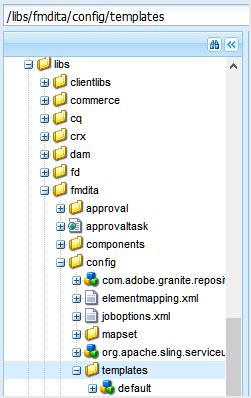

# 自定义现有AEM站点输出 {#id166TG0B30WR}

AEM Guides支持以下列格式创建输出：

- AEM站点
- PDF
- HTML5
- ePub
- 通过DITA-OT自定义输出

对于AEM Site输出，您可以为不同的输出任务分配不同的设计模板。 这些设计模板可以不同布局呈现DITA内容。 例如，您可以为内部和外部受众指定不同的设计模板。

您还可以将自定义DITA Open Toolkit \(DITA-OT\)插件与AEM Guides结合使用。 您可以上传这些自定义DITA-OT插件，以通过特定方式生成PDF输出。

>[!TIP]
>
> 有关创建AEM站点输出的最佳实践，请参阅[最佳实践指南](https://helpx.adobe.com/content/dam/help/en/xml-documentation-solution/cs-mar-22/Adobe-Experience-Manager-Guides_Best-Practices_EN.pdf)中的&#x200B;*AEM站点发布*&#x200B;部分。


## 自定义用于生成输出的设计模板 {#customize_xml-add-on}

AEM Guides使用一组预定义的设计模板来生成AEM站点输出。 您可以自定义AEM Guides设计模板，以生成符合您公司品牌策略的输出。 设计模板是各种样式\(CSS\)、脚本\（服务器和客户端\）、资源\（图像、徽标和其他资源\）以及将所有这些资源绑定在一起的JCR节点的集合。 设计模板可以非常简单，只需具有几个JCR节点的单个服务器端脚本，也可以是样式、资源和JCR节点的复杂组合。 设计模板由AEM Guides发布子系统在生成AEM站点输出时使用，它们控制所生成输出的结构、外观和风格。

设计模板资源在服务器上的放置位置没有限制，但通常会根据其功能进行逻辑组织。 例如，默认模板的所有其JavaScript和CSS文件都存储在`/etc/designs/fmdita/clientlibs/siteoutput/default`文件夹下。 无论这些文件位于何处，它们都会通过一组JCR节点链接在一起。 这些JCR节点和文件共同构成了整个设计模板。

AEM Guides附带的默认设计模板允许您自定义登录、主题和搜索页面组件。 您可以复制缺省设计和相应的参照模板，并指定不同的元件来生成所需的输出。

以下选项卡提供了有关如何指定自己的设计模板的说明，以用于根据您的AEM设置生成Experience Manager Guides站点输出：Cloud Service或内部部署。

>[!BEGINTABS]

>[!TAB Cloud Service]

1. 使用包管理器从以下位置下载默认设计模板：

   /libs/fmdita/config/templates

1. 在Cloud Manager Git存储库中的以下位置创建已下载文件的副本：

   /apps/fmdita/config/templates

1. 还必须下载并复制从默认模板节点引用的模板。 引用的模板将放置在：

   /libs/fmdita/templates/default/cqtemplates

>[!TAB 内部部署]

1. 登录AEM并打开CRXDE Lite模式。

1. 导航到默认设计模板节点。 默认设计模板节点的位置为：

   `/libs/fmdita/config/templates/`

   {width="300" align="left"}

   >[!NOTE]
   >
   > 将默认设计模板从`libs`文件夹复制到`apps`文件夹，并在`apps`文件夹中进行更改。 您还必须在从默认模板节点引用的模板中进行更改。 引用的模板被放置在`/libs/fmdita/templates/default/cqtemplates`节点下。 在进行任何更改之前，请先在`apps`文件夹中复制引用的模板。

1. 单击&#x200B;*模板*&#x200B;节点中的&#x200B;*默认*&#x200B;组件以访问其属性。

>[!ENDTABS]

下表描述了AEM Guides设计模板的属性。

| 属性 | 描述 |
|--------|-----------|
| `landingPageTemplate`，`searchPageTemplate`，`topicPageTemplate`，`shadowPageTemplate` | 为这些对应页面指定`cq:Template`节点\（登陆、搜索和主题\）。 默认情况下，这些页面的`cq:Template`节点可以在`/libs/fmdita/templates/default/cqtemplates`节点中找到。 此节点定义登录、搜索和主题页面的结构和属性。<br> `shadowPageTemplate`用于优化分块内容。 您需要将此属性的值设置为： `fmdita/templates/default/cqtemplates/shadowpage` <br> **注意：**&#x200B;您必须为`topicPageTemplate`指定一个值。 `landingPageTemplate`和`searchPageTemplate`是可选属性。 如果您不希望生成搜索和登陆页面，请不要指定这些属性。 |
| `title` | 设计模板的描述性名称。 |
| `topicContentNode` | 将在主题页面中包含DITA内容的节点的位置。 路径相对于主题页面。 |
| `topicHeadNode` | 包含派生自DITA内容的头值\（或metadata\）的节点位置。 路径相对于主题页面。 |
| `tocNode` | 将包含目录的节点的位置。 路径相对于登陆页面或目标路径。 |
| `basePathProp` | 用于存储已发布站点的根目录的路径的属性名称。 |
| `indexPathProp` | 用于存储已发布站点的登陆/索引页面路径的属性名称。 |
| `pdfPathProp` | 用于存储主题PDF路径的属性名称（如果启用了主题PDF生成）。 |
| `pdfTypeProp` | 用于存储PDF生成类型的属性名称。 目前，此属性始终包含“主题”。 |
| `searchPathProp` | 用于存储搜索页面路径的属性名称（如果模板包含搜索页面）。 |
| `siteTitleProp` | 用于存储正在发布的站点标题的属性名称。 此标题通常与正在发布的地图的标题相同。 |
| `sourcePathProp` | 用于存储当前页面的源DITA主题的路径的属性名称。 |
| `tocPathProp` | 用于存储已发布站点的目录根目录的路径的属性名称。 |


>[!NOTE]
>
> 创建自定义设计模板节点后，必须更新AEM站点输出预设中的设计选项才能使用自定义设计模板节点。

有关详细信息，请参阅[创建您的第一个Adobe Experience Manager网站](https://experienceleague.adobe.com/docs/experience-manager-learn/getting-started-wknd-tutorial-develop/overview.html?lang=en)和[在AEM上开发您自己的网站的基础知识](https://experienceleague.adobe.com/docs/experience-manager-cloud-service/implementing/developing/full-stack/develop-wknd-tutorial.html?lang=en)。

## 使用文档标题生成AEM站点输出

在生成AEM Site输出时，生成URL的方式对内容的可发现性起着重要作用。 如果您使用的是基于UUID的文件名，则根据文件的UUID生成URL不利于搜索。 作为管理员或发布者，您可以控制如何为AEM站点输出生成URL。 AEM Guides为您提供了一个配置，通过该配置，您可以选择使用文件的标题而不是基于UUID的文件名来生成AEM站点输出的URL。 默认情况下，对于基于UUID的文件系统，此选项处于打开状态。 这意味着在为基于UUID的文件系统生成AEM Site输出时，使用文件的标题来生成URL，而不是文件的UUID。

对于通过不基于UUID的文件系统进行的内部部署设置，AEM Site输出是使用文件名而不是文件标题生成的。 默认情况下，此选项处于关闭状态。 这表示在生成AEM Site输出时，将使用文件名来生成URL，而不是文件的标题。 通过启用此选项，您可以选择根据文件标题生成URL。

以下选项卡提供了有关如何根据Experience Manager Guides设置在AEM站点输出中配置URL生成的说明：Cloud Service或内部部署。

>[!NOTE]
>
> 您可以进一步配置规则，以仅允许在AEM站点输出的URL中设置一组字符。 有关更多详细信息，请参阅[配置用于创建主题和发布AEM站点输出的文件名清理规则](#id2164D0KD0XA)。

>[!BEGINTABS]

>[!TAB Cloud Service]

使用[配置覆盖](download-install-config-override.md#)中提供的说明创建配置文件。 在配置文件中，提供以下\(property\)详细信息以在AEM站点输出中配置URL生成：

| PID | 属性键 | 属性值 |
|---|------------|--------------|
| `com.adobe.fmdita.config.ConfigManager` | `aemsite.pagetitle` | 布尔值\(true/false\)。 如果要使用页面标题生成输出，则将此属性设置为true。 默认情况下，它设置为使用文件名。<br> **默认值**： false |


>[!TAB 内部部署]

1. 打开Adobe Experience Manager Web控制台配置页面。

   用于访问配置页面的默认URL为：

   ```http
   http://<server name>:<port>/system/console/configMgr
   ```

1. 搜索并单击&#x200B;**com.adobe.fmdita.config.ConfigManager**&#x200B;包。

1. 选择&#x200B;**使用AEM站点页面名称的标题**&#x200B;选项。

   >[!NOTE]
   >
   > 如果要使用文件名生成输出，请取消选择此选项。

1. 单击&#x200B;**保存**。

>[!ENDTABS]

## 配置AEM站点输出的URL以使用文档标题（仅适用于Cloud Service）

您可以在AEM站点输出的URL中使用文档标题。 如果文件名不存在或包含所有特殊字符，则可以配置系统以在AEM Site输出的URL中使用分隔符替换特殊字符。 您还可以将其配置为使用第一个子主题名称替换它们。


要配置页面名称，请执行以下步骤：

1. 使用[配置覆盖](download-install-config-override.md#)中提供的说明创建配置文件。
1. 在配置文件中，提供以下（属性）详细信息以配置主题的页面名称。

| PID | 属性键 | 属性值 |
|---|------------|--------------|
| `com.adobe.fmdita.common.SanitizeNodeName` | `nodename.systemDefinedPageName` | 布尔值(`true/false`)。 **默认值**： `false` |

例如，如果`<topichead>`中的&#x200B;*@navtitle*&#x200B;包含所有特殊字符，并且您将`aemsite.pagetitle`属性设置为true，则默认情况下，它使用分隔符。 如果将`nodename.systemDefinedPageName`属性设置为true，它将显示第一个子主题的名称。


## 配置用于创建主题和以AEM Sites和其他格式发布输出的文件名清理规则 {#id2164D0KD0XA}

作为管理员，您可以定义文件名中允许的有效特殊字符列表，这些字符最终形成AEM Site输出的URL。 在早期版本中，允许用户定义包含`@`、`$`、`>`等特殊字符的文件名。 这些特殊字符会在生成AEM网站页面时生成经过编码的URL。

从3.8版本开始，添加了配置以定义允许文件名中使用的特殊字符列表。 默认情况下，有效的文件名配置包含“`a-z A-Z 0-9 - _`”。 这意味着，在创建文件时，文件的标题中可以包含任何特殊字符，但在内部，该文件名中将替换为连字符\(`-`\)。 例如，文件的标题可以是Introduction 1或Introduction@1 ，针对这两种情况生成的相应文件名是Introduction-1。

定义有效字符列表时，请记住，这些字符“`*/:[\]|#%{}?&<>"/+`”和`a space`将始终替换为连字符\(`-`\)。

>[!NOTE]
>
> 如果未配置有效的特殊字符列表，文件创建过程可能会给您一些意外的结果。

以下选项卡提供了有关如何根据您的AEM设置，在文件名和Experience Manager Guides站点输出中配置有效的特殊字符的说明： Cloud Service或内部部署。

>[!BEGINTABS]

>[!TAB Cloud Service]

使用[配置覆盖](download-install-config-override.md#)中提供的说明创建配置文件。 在配置文件中，提供以下\(property\)详细信息以在文件名和AEM站点输出中配置有效的特殊字符：

| PID | 属性键 | 属性值 |
|---|------------|--------------|
| `com.adobe.fmdita.common.SanitizeNodeNameImpl` | `aemsite.DisallowedFileNameChars` | 确保将该属性设置为``'<>`@$``。 您可以向此列表添加更多特殊字符。 |

>[!NOTE]
> 
> 上述配置适用于所有输出格式。 这意味着在生成PDF、HTML或自定义输出时，最终输出将遵循配置的文件名清理规则。

您还可以配置其他属性，如文件名中的使用小写、用于处理无效字符的分隔符以及文件名中允许的最大字符数。 要配置这些属性，请在配置文件中添加以下键值对：

| 属性键 | 属性值 |
|------------|--------------|
| `nodename.uselower` | 布尔值\(true/false\)。<br> **默认值**： true |
| `nodename.separator` | 任意字符。<br> **默认值**： \_ *\（下划线\）* |
| `nodename.maxlength` | 整数值。<br> **默认值**： 50 |

>[!TAB 内部部署]

1. 打开Adobe Experience Manager Web控制台配置页面。

   用于访问配置页面的默认URL为：

   ```http
   http://<server name>:<port>/system/console/configMgr
   ```

1. 搜索并单击&#x200B;*com.adobe.fmdita.common.SanizeNodeNameImpl*&#x200B;包。

1. 在&#x200B;**不允许发布到AEM Sites**&#x200B;属性的字符集中，确保将该属性设置为```'<>`@$```。 您可以向此列表添加更多特殊字符，但是，它必须具有这些必需的特殊字符。

   >[!NOTE]
   >
   > 您还可以配置其他属性，如文件名中的&#x200B;**使用小写**、用于处理无效字符的&#x200B;**分隔符**&#x200B;以及文件名中允许的&#x200B;**最大字符数**。

1. 单击&#x200B;**保存**。

1. 搜索并单击&#x200B;**com.adobe.fmdita.config.ConfigManager**&#x200B;包。

1. 在&#x200B;**Regex for Valid Characters**&#x200B;属性中，确保将该属性设置为`[-a-zA-Z0-9_]`。 您可以向此列表添加更多字符，但是，它必须包含这些基本字符，并且列表必须以连字符\(`-`\)开头。

   >[!NOTE]
   >
   > 此属性定义用于创建新文件的有效字符列表。

1. 单击&#x200B;**保存**。

>[!ENDTABS]

## 配置AEM站点节点结构的扁平化

在生成AEM Site输出时，将在内部创建主题中每个元素的节点。 对于包含数千个主题的DITA映射，此节点结构可能会变得太深。 对于较大的站点，这种类型的深度嵌套节点结构可能存在性能问题。 以下快照显示AEM站点输出的深度嵌套节点结构：


在上述快照中，请注意为每个`p`元素及其后续子元素创建一个节点，并为主题中使用的其他每个元素创建一个类似结构。

AEM Guides允许您配置如何在内部创建AEM站点输出的节点结构。 可以在指定的元素处拼合节点结构，这意味着您可以定义一个元素，该元素将被视为主元素，其中的所有子元素将与主元素合并。 例如，如果您决定拼合`p`元素，则出现在`p`元素中的任何元素都将与主`p`元素合并。 将不会为`p`元素中的任何子元素创建单独的注释。 以下快照显示扁平化在`p`元素处的节点结构：


以下选项卡提供了有关如何根据AEM设置拼合Experience Manager Guides站点节点结构的说明：Cloud Service或内部部署。

>[!BEGINTABS]

>[!TAB Cloud Service]

1. 确定要扁平化节点结构的元素：

1. 覆盖`apps`节点中的`libs`节点，并打开elementmapping.xml文件。

1. 在要扁平化节点结构的元素的定义中添加`<flatten>true</flatten>`属性。 例如，如果要拼合`p`元素的节点结构，则在`p`元素的定义中添加flatten属性，如下所示：

   ```XML
   <ditaelement>
         <name>p</name>
         <class>- topic/p</class>
         <componentpath>fmdita/components/dita/wrapper</componentpath>
         <type>COMPOSITE</type>
         <target>para</target>
         <flatten>true</flatten>
         <wrapelement>div</wrapelement>
      </ditaelement>
   ```

   >[!NOTE]
   >
   > 默认情况下，已在`p`元素上配置了flatten节点属性。

1. 使用[配置覆盖](download-install-config-override.md#)中提供的说明创建配置文件。
1. 在配置文件中，提供以下\(property\)详细信息：

   | PID | 属性键 | 属性值 |
   |---|------------|--------------|
   | `com.adobe.dxml.flattening.FlatteningConfigurationService` | `flattening.enabled` | 布尔值\(true/false\)。<br> **默认值**： `false` |


现在，当您生成AEM站点输出时，`p`元素中的节点将被扁平化并存储在`p`元素本身中。 您可以在CRXDE中找到`p`元素的新拼合属性。


>[!TAB 内部部署]

1. 指定要展平节点结构的元素。

   1. 覆盖`apps`节点中的`libs`节点，并打开elementmapping.xml文件。

   1. 在要扁平化节点结构的元素的定义中添加`<flatten>true</flatten>`属性。 例如，如果要拼合`p`元素的节点结构，则在`p`元素的定义中添加flatten属性，如下所示：

      ```XML
      <ditaelement>
          <name>p</name>
          <class>- topic/p</class>
          <componentpath>fmdita/components/dita/wrapper</componentpath>
          <type>COMPOSITE</type>
          <target>para</target>
          <flatten>true</flatten>
          <wrapelement>div</wrapelement>
      </ditaelement>
      ```

      >[!NOTE]
      >
      > 默认情况下，已在`p`元素上配置了flatten节点属性。

1. 在configMgr中启用站点节点拼合配置。

   1. 打开Adobe Experience Manager Web控制台配置页面。

      用于访问配置页面的默认URL为：

      ```http
      http://<server name>:<port>/system/console/configMgr
      ```

   1. 搜索并单击&#x200B;*com.adobe.dxml.flattening.FlatteningConfigurationService*&#x200B;包。

   1. 选择&#x200B;**属性flattening.enabled**&#x200B;选项。

   1. 单击&#x200B;**保存**。


>[!IMPORTANT]
>
> 如果您在elementmapping.xml文件中进行了任何更改，请确保打开configMgr并保存任何包以使更改生效。

现在，当您生成AEM站点输出时，`p`元素中的节点将被扁平化并存储在`p`元素本身中。 您可以在CRXDE中找到`p`元素的新拼合属性。

{width="650" align="left"}

>[!ENDTABS]

**在AEM站点输出内容中搜索字符串（仅适用于Cloud Service）**

默认情况下，您只能在AEM站点输出的标题中搜索字符串。 您可以将系统配置为在AEM站点输出的标题以及内容或正文中搜索字符串。

>[!NOTE]
>
> 有时，您的搜索可能适用于内容中的某些元素，但您可以将其配置为适用于整个内容。


要启用搜索，您应该配置AEM站点节点结构的拼合。

注意:

您最多可以搜索1MB的拼合内容。 例如，在上一个屏幕截图中，您可以搜索&lt;p\>标记下的内容是否小于= 1Mb。

>[!NOTE]
>
> 仅当`<flatten>`属性设置为true时，搜索才对元素起作用。 默认情况下，AEM Guides将&lt;p\> &lt;ul\> &lt;lI\>等常用文本元素的`<flatten>`属性设置为true。 但是，如果您已经创建了一些自定义元素，则应在elementmapping.xml文件中将`<flatten>`属性设置为true。

**阻止拼合AEM站点节点结构**

与在AEM站点输出中指定要拼合的节点类似，您还可以指定要从此配置中排除的元素。 例如，如果要拼合`body`元素上的节点，但不希望`body`中的任何`table`元素拼合，则可以在`table`元素的定义中添加exclude属性。

要从拼合中排除`table`元素，请将以下属性添加到`table`元素的定义中：

`<preventancestorflattening>true|false</preventancestorflattening>`

## 在AEM站点输出中为已删除的页面配置版本控制

生成针对“现有输出页面”设置选择了&#x200B;**删除和**&#x200B;创建&#x200B;**&#x200B;**&#x200B;选项的AEM站点输出时，将为要删除的页面创建一个版本。 您可以将系统配置为在删除之前停止创建版本。

以下选项卡提供了有关如何根据您的Experience Manager Guides设置停止为正在删除的页面创建版本的说明：Cloud Service或内部部署。

>[!BEGINTABS]

>[!TAB Cloud Service]

1. 使用[配置覆盖](download-install-config-override.md#)中提供的说明创建配置文件。
1. 在配置文件中，提供以下\(property\)详细信息以配置&#x200B;**不要为已删除的页面创建版本**&#x200B;选项：

   | PID | 属性键 | 属性值 |
   |---|------------|--------------|
   | `com.adobe.fmdita.confi g.ConfigManager` | `no.version.creation.on.deletion` | 布尔值\(true/false\)。<br> **默认值**： `true` |

   >[!NOTE]
   >
   > 选中此选项后，用户可直接删除任何页面，而无需为其创建任何版本。 如果未选中该选项，则在删除页面之前将创建一个版本。

>[!TAB 内部部署]

1. 打开Adobe Experience Manager Web控制台配置页面。

   用于访问配置页面的默认URL为：

   ```http
   http://<server name>:<port>/system/console/configMgr
   ```

1. 搜索并单击&#x200B;*com.adobe.fmdita.config.ConfigManager*&#x200B;包。

1. 选择&#x200B;**不要为已删除的页面创建版本**&#x200B;选项。

   >[!NOTE]
   >
   > 选中此选项后，用户可直接删除任何页面，而无需为其创建任何版本。 如果未选中该选项，则在删除页面之前将创建一个版本。

1. 单击&#x200B;**保存**。

>[!ENDTABS]

## 使用Experience Manager Guides设置自定义重写器（仅适用于Cloud Service） {#custom-rewriter}

Experience Manager Guides有一个自定义sling [**重写器**](https://sling.apache.org/documentation/bundles/output-rewriting-pipelines-org-apache-sling-rewriter.html)模块，用于处理在交叉映射情况下生成的链接（两个不同映射的主题之间的链接）。 此重写器配置安装在以下路径中： <br> `/apps/fmdita/config/rewriter/fmdita-crossmap-link-patcher`。

如果您的代码库中有另一个自定义sling重写器，请使用大于50的`'order'`值，因为Experience Manager Guides sling重写器使用`'order'` 50。  要覆盖此值，您需要一个值>50 。 有关详细信息，请查看[输出重写管道](https://sling.apache.org/documentation/bundles/output-rewriting-pipelines-org-apache-sling-rewriter.html)。
