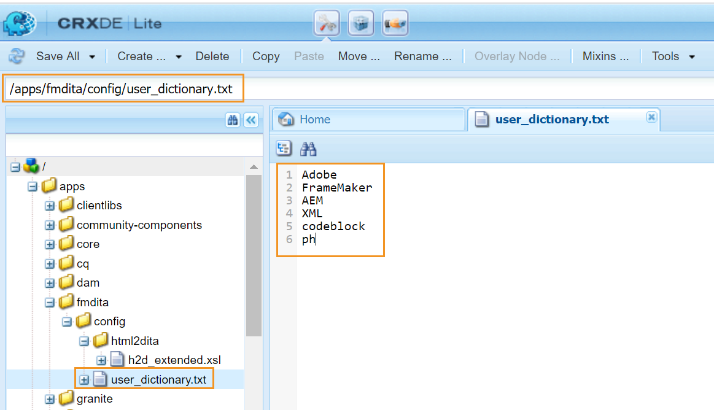

# 自定义AEM的默认词典 {#id209SD8000WU}

可以将Web编辑器配置为使用AEM的拼写检查器或浏览器的拼写检查器。 如果您选择使用AEM的拼写检查器，则可以灵活地定义自定义单词列表。 这些自定义单词随后将添加到AEM的词典中，并且不会在Web编辑器中标记这些单词\（不正确\）。

执行以下步骤可创建添加到AEM词典中的自定义单词列表：

1. 登录AEM并打开CRXDE Lite模式。

1. 导航到以下节点：

   /apps/fmdita/config

1. 创建一个名为user\_dictionary.txt的新文件。

1. 打开文件，并添加要在自定义词典中定义的单词列表。

   以下屏幕截图显示了添加到user\_dictionary.txt文件中的自定义单词列表：

   {width="650"}

1. 保存并关闭该文件。

作者需要重新启动Web编辑器会话才能在AEM词典中更新自定义词列表。

**父主题：**&#x200B;[&#x200B;自定义Web编辑器](conf-web-editor.md)
