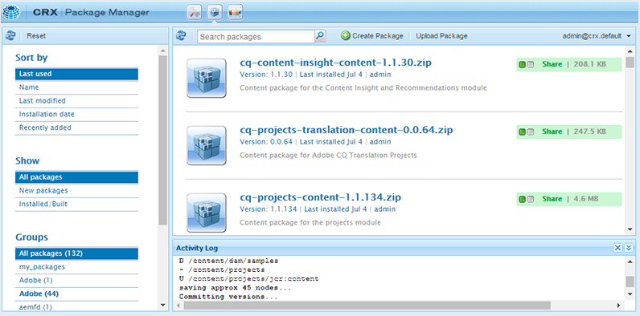

# 首次下载并安装AEM Guides {#id213BCL00KEV}

执行以下步骤，首次在计算机上下载和安装AEM Guides：

>[!IMPORTANT]
>
> 如果要将Livefyre与AEM Guides结合使用，请确保先安装3.0之前的Livefyre版本，然后再安装AEM Guides。 如果您使用的是Livefyre版本3.0或更高版本，则没有此类限制。

1. 从[Adobe软件分发门户](https://experience.adobe.com/#/downloads/content/software-distribution/en/aem.html)下载AEM Guides。

   >[!NOTE]
   >
   >在安装Experience Manager Guides之前，请确保您的系统符合[技术要求](../install-guide/download-install-technical-requirements.md)。

1. 登录AEM实例并导航到CRX包管理器。 访问包管理器的默认URL为：

   ```http
   http://<server name>:<port>/crx/packmgr/index.jsp
   ```

   包管理器可管理本地AEM安装中的包。 有关使用包管理器的更多信息，请参阅AEM文档中的[如何使用包](https://helpx.adobe.com/experience-manager/6-5/sites/administering/using/package-manager.html)。

   {width="650" align="left"}

1. 要上传AEM Guides包，请单击&#x200B;**上传包**。

1. 在上传包对话框中，导航到您在步骤1中下载的AEM Guides文件，然后单击&#x200B;**确定**。

   资源包将上传到您的AEM实例。

1. 若要安装包，请单击&#x200B;**安装**。

   {width="650" align="left"}

1. 在“安装包”对话框中，单击&#x200B;**安装**。

1. 要开始使用AEM Guides，请单击CRX包管理器左上角的“主页”按钮。


>[!NOTE]
>
> 在安装程序中所有AEM服务器实例上执行安装过程。

**父主题：**[&#x200B;下载并安装](download-install.md)
