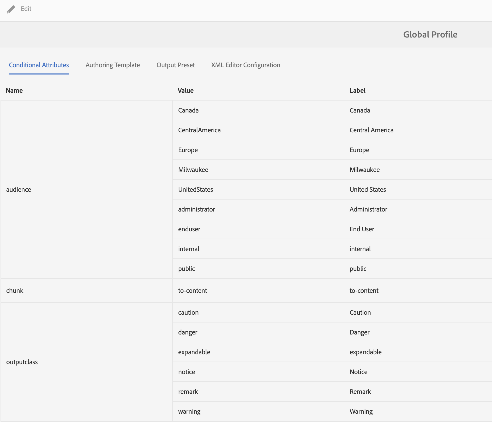

# 使用条件内容

**用例**

* 作者可以对某段内容设置条件，以便控制该内容是否显示在输出中。

* 作者可以在发布时选择显示/隐藏不同的条件。

* 例如，作者可以在内容中添加版本为1.0和版本为2.0的属性，并使用条件包括版本1.0的版本1.0和排除版本2.0。

**步骤1**

在[!UICONTROL 文件夹配置文件]中定义与文档相关的条件：
请参阅《安装和配置指南》第69页[中的&#x200B;**为全局或文件夹级配置文件配置条件属性**&#x200B;部分](https://helpx.adobe.com/content/dam/help/en/xml-documentation-solution/4-2/Adobe-Experience-Manager-Guides_Installation-Configuration-Guide_EN.pdf)

**步骤2**

在XML编辑器的&#x200B;**用户首选项**&#x200B;中选择步骤1中定义的&#x200B;**[!UICONTROL 文件夹配置文件]**：
请参阅用户指南](https://helpx.adobe.com/content/dam/help/en/xml-documentation-solution/4-2/Adobe-Experience-Manager-Guides_User-Guide_EN.pdf)第41页[中的&#x200B;**用户首选项**&#x200B;部分

**步骤3**

使用条件条件条件化内容的各个部分：
请参阅用户指南](https://helpx.adobe.com/content/dam/help/en/xml-documentation-solution/4-2/Adobe-Experience-Manager-Guides_User-Guide_EN.pdf)第90页[中的&#x200B;**条件**&#x200B;部分

**步骤4**

定义映射级别的条件预设，以选择要在输出中启用的条件：
请参阅用户指南](https://helpx.adobe.com/content/dam/help/en/xml-documentation-solution/4-2/Adobe-Experience-Manager-Guides_User-Guide_EN.pdf)第249页[中的&#x200B;**使用条件预设**&#x200B;部分
