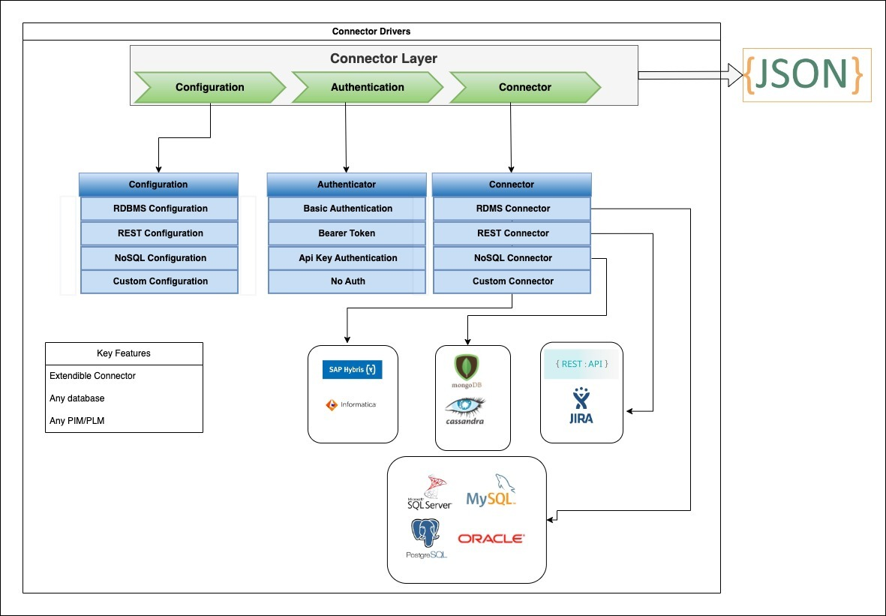

# 外部数据源集成

来自外部系统的数据可以轻松集成到您的Experience Manager Guides实例中。 连接到外部数据源可以显着增强内容管理系统的功能和可用性。


使用数据集成，您可以高效地连接外部源并从外部源获取数据。 使用此功能，您不必依赖IT团队获取数据，然后手动复制并粘贴数据，或不断更新外部系统中的更改。

此功能可确保与原始源同步，并允许对文档进行协调更新，而无需依赖手动复制粘贴操作。 它还有助于维护Experience Manager Guides与外部数据源之间的数据一致性。

此外，从外部数据源获取内容后，您可以采用DITA格式创作该内容，还可以重用集成的内容。


## 数据源集成框架

数据源的集成框架主要包括两个主要组件：外部数据源及其与Experience Manager Guides实例的集成。

### 外部数据源

您可以从Experience Manager Guides连接的一些数据源如下所示：

- 关系数据库(RDBMS)
   - PostgreSQL、MySQL、Microsoft SQL Server、MariaDB和SQLite
- 非关系数据库
   - MongoDB、Apache Cassandra、Apache CouchDB和Redis
- 产品信息管理(PIM) /产品生命周期管理(PLM)
   - Pimcore、Salsify、Akeneo和Informatica
- 产品管理系统
   - JIRA和Microsoft Azure DevOps讨论区(ADO)
- 联机分析处理(OLAP)和分析系统

### Experience Manager Guides中的集成


通过使用经验证的连接器，从外部系统传输数据并在Experience Manager Guides内生成数据。


### Experience Manager Guides中的集成

执行以下步骤以将内容集成到Experience Manager Guides：

1. **设置数据源连接器**
   - 数据源连接器用作与外部数据源建立连接的接口。 必须配置连接器以建立连接并包括身份验证方法，如`Basic Auth`或`API key Auth`。 所有配置详细信息（包括加密信息）都安全地存储在Adobe Experience Manager中。
   - 连接器层旨在实现可扩展性，允许您创建用于连接到Experience Manager Guides未提供现成可用的各种系统的实施。
     
   >[!NOTE]
   >
   > 访问Konnect定义模块并实施Connector接口以创建自定义连接器。 详细了解如何[配置自定义数据源连接器](./conf-custom-data-source-connector.md)。

1. **自定义Velocity模板**

   - Experience Manager Guides支持Velocity (https://velocity.apache.org/)，这是一个非常可靠的模板引擎，用于将数据从JSON文件转换为DITA内容。 Velocity提供了灵活性，可以浏览具有任何嵌套级别的JSON结构。
   - 以下示例展示了如何集成Velocity模板和源自Jira的数据，以便轻松生成表或排序列表。
      - Jira响应

        ```
        {
            "expand": "schema,names",
            "total": 5,
            "hostname": "https://jira.corp.adobe.com",
            "maxResults": "200",
            "issues": [
                {
                    "key": "DXML-12756",
                    "fields": {
                        "description": "Implement the snippet generator in External Data Source integration",
                        "summary": "Implement the snippet generator in External Data Source integration"
                    }
                },
                {
                    "key": "DXML-12755",
                    "fields": {
                        "description": "Implement the topic generator in External Data Source integration",
                        "summary": "Implement the topic generator in External Data Source integration"
                    }
                },
                {
                    "key": "DXML-12745",
                    "fields": {
                        "description": "Implement the ability to register a new connector",
                        "summary": "Implement the ability to register a new connector"
                    }
                }
            ],
            "startAt": 0
        }
        ```

      - 模板
        {width="800" align="left"}
      - 从相同数据源但不同模板生成的数据
        {width="800" align="left"}

1. **使用模板生成内容**
   - 您可以从已创建的模板生成内容。
   - 您可以生成各种类型的内容：
      - 代码片段：这是一次性可用内容。 您可以在定义的模板中从连接器生成数据，然后将其嵌入到所需的标记中。
      - DITA主题：生成各种主题以在内容中按原样使用，或可作为&#x200B;*可重用组件*&#x200B;重复使用。
      - DITA主题+映射：您还可以生成包含该主题的完整映射，然后使用该数据直接发布，或将其用作其他数据中的&#x200B;*可重用组件*。


1. **Publish集成的内容**
   - 发布是Experience Manager Guides的OOTB功能，您可以直接发布从外部系统生成的所有数据作为PDF或AEM站点输出。

>[!MORELIKETHIS]
>
> 以下文档提供了有关配置连接器以及在实例中使用连接器的更多详细信息。
> - [配置数据源连接器](../../../install-guide/conf-data-source-connector-tools.md)
> - [使用代码片段或主题生成内容](../../../user-guide/web-editor-content-snippet.md)