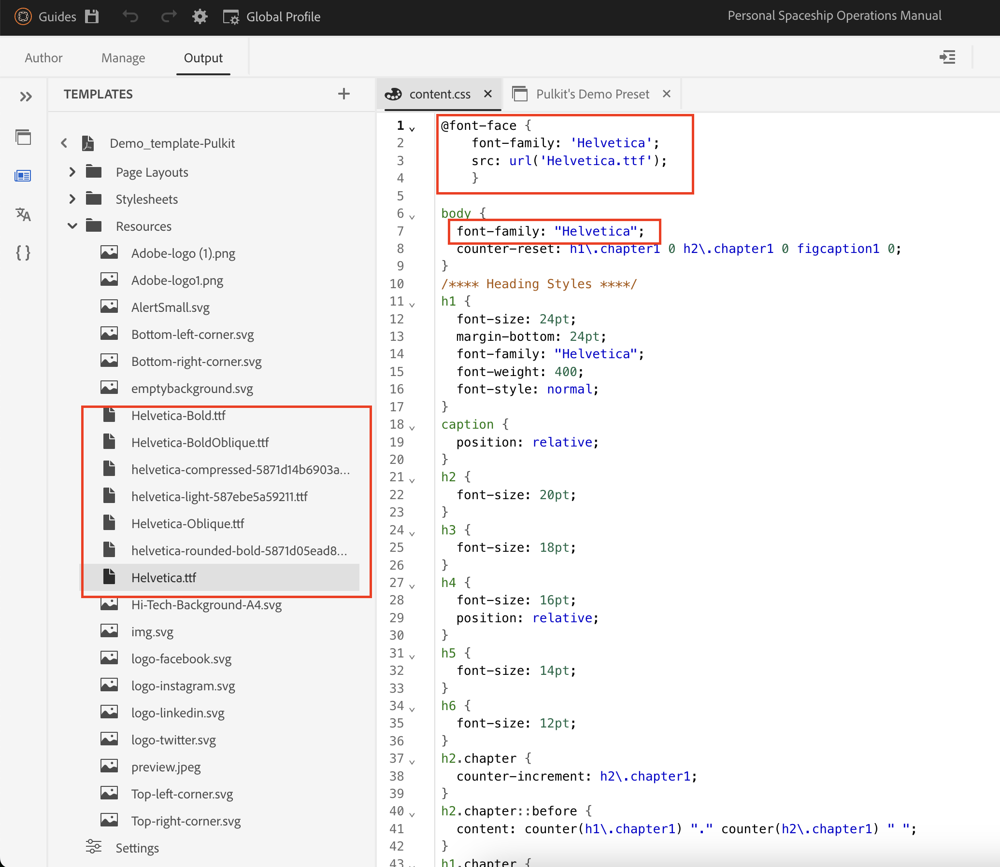

# 将自定义字体添加到DITA Native PDF

## 本文涵盖：

添加自定义字体以加强所有内容的品牌标识和视觉一致性。

此过程包括3个步骤：

- [上传自定义字体](#step-1--upload-the-custom-font-to-the-resource-folder-of-your-template)
- [在PDF模板的样式表中进行必要的更改](#step-2--make-necessary-changes-in-pdf-templatess-stylesheet)

- [嵌入使用的字体（可选）](#step-3-optional--embed-used-font-in-pdf)

## 步骤1 ：将自定义字体上传到模板的资源文件夹

## 第2步：在PDF模板的样式表中进行必要的更改

中的字体

## 步骤3（可选） ：在PDF中嵌入使用的字体

## 常见问题解答

### 我可以使用Adobe Fonts吗？

> 是，转到fonts.adobe.com并单击“添加到Web项目”。
> 
> 复制导入代码，如`" @import url("https://use.typekit.net/xxxx.css")`；
>
> 将粘贴到内容CSS中，然后在CSS文件中进行所需的更改。

### PDF中不显示我的字体

> 双重检查字体名称拼写（最常见的错误）
>
> 如果在打开PDF的系统上无法使用字体，请确保嵌入字体

## 有关任何其他查询，请联系您各自的CSM

## 其他资源：

- [如何在PDF中包含DITA Bookmap的目录](./how-to-include-bookmap-toc-in-pdf-publishing.md)
- [如何在PDF发布中包含目录](./how-to-include-bookmap-toc-in-pdf-publishing.md)
- [关于原生PDF的专家讲座视频](../../expert-sessions/native-pdf-publishing-eamples-part1-june2023.md)
