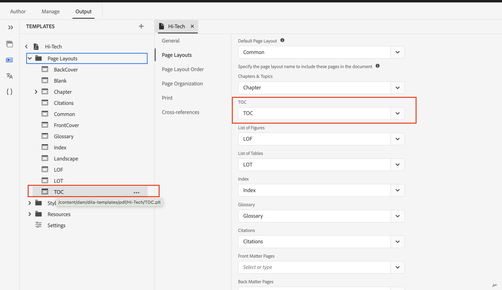
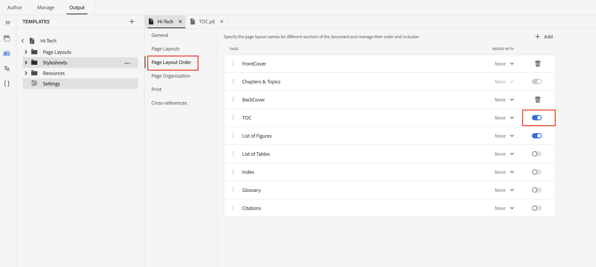

# 在PDF发布中生成书签映射的目录

## 设置书图

包括`<toc>`元素：
在书签映射的`<frontmatter>`元素中，找到`<booklists>`元素。  在`<toc>`中嵌套`<booklists>`元素，如下所示：

```
<frontmatter>
  <booklists>
    <toc/>  <figurelist/>
    <tablelist/>
  </booklists>
</frontmatter>
```

DITA规范还允许将TOC和书签放在`<backmatter>`部分中。


```
<backmatter>
    <booklists>
      <toc/>
      <figurelist/>
      <indexlist/>
    </booklists>
  </backmatter>
```

书签的目录结构、前件图表和表表结构、后件索引表结构。

```
<bookmap>
  <title>My Bookmap Title </title>
  <frontmatter>
    <booklists>
      <toc/>
      <figurelist/>
      <tablelist/>
    </booklists>
  </frontmatter>

  <chapter href="chapter1.ditamap">
  <chapter href="chapter2.ditamap">
  </chapter>

  <backmatter>
    <booklists>
      <indexlist/>
    </booklists>
  </backmatter>
</bookmap>
```

目录和书签列表会根据书签映射中定义的结构自动生成。

设置书图后，使用本机PDF生成PDF输出。 它处理书签图结构和引用，包括目录和书签。

## PDF中的TOC设计和其顺序

原生PDF功能提供了一种便捷的方法，可用于定制目录的布局和设计。

您可以通过目录的分页布局和通过layout.css的样式来控制设计。

PDF中的目录和其他书签列表顺序仅基于书签映射的结构。




## 常见问题解答

### 如何在PDF中包含Ditamap的目录

Ditamap本身并不像书签那样直接具有目录(TOC)。 但是，在定义内容结构时，Ditamap起着关键作用，并间接有助于目录生成过程。

如果您要发布Ditamap，则本机PDF提供自动生成目录和书列表的功能，您可以在本机PDF设置中启用/禁用在ditamap上生成目录。



## 其他资源：

- [原生PDF设计页面布局文档](https://experienceleague.adobe.com/en/docs/experience-manager-guides/using/install-guide/on-prem-ig/output-gen-config/config-native-pdf-publish/design-page-layout)
- [Native PDF Essentials预先录制的Expert会话](https://experienceleague.adobe.com/en/docs/experience-manager-guides/using/knowledge-base/expert-session/native-pdf-publishing-essentials-feb23)

<br>
<br>

在AEM Guides社区[论坛](https://experienceleaguecommunities.adobe.com/t5/experience-manager-guides/ct-p/aem-xml-documentation)上发布任何查询。


