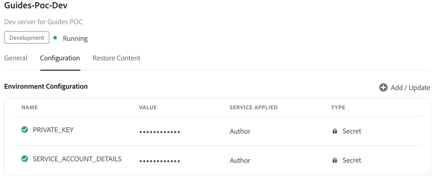

# 使用JWT身份验证配置基于微服务的发布

[!BADGE Cloud Service]{type=Informative}

>[!NOTE]
>
> 服务帐户(JWT)凭据已弃用，推荐使用OAuth服务器到服务器凭据。 使用服务帐户(JWT)凭据的应用程序将在2025年1月1日之后停止工作。 您必须在2025年1月1日之前迁移到新凭据，以确保您的应用程序继续运行。 了解有关[从服务帐户(JWT)凭据迁移到OAuth服务器到服务器凭据的详细信息](https://developer.adobe.com/developer-console/docs/guides/authentication/ServerToServerAuthentication/migration/)。


在Adobe Experience Manager Guidesas a Cloud Service版中基于微服务的发布支持PDF（本机或基于DITA-OT）、HTML5、JSON和CUSTOM类型的输出预设。

由于服务帐户(JWT)凭据已被弃用，因此建议使用基于Adobe IMS OAuth的身份验证。 了解如何[使用OAuth身份验证](configure-microservices-imt-config.md)配置基于微服务的发布。

对于由基于Adobe IMS JWT的身份验证保护的云发布服务，客户应遵循以下给定步骤，将其环境与Adobe的安全基于令牌的身份验证工作流集成，并开始使用新的基于云的可伸缩发布解决方案。


## 在Adobe Developer Console中创建IMS配置

创建配置需要&#x200B;**角色**：系统管理员

执行以下步骤可在Adobe Developer Console中创建IMS配置：

1. 打开Developer Console： `https://developer.adobe.com/console`。

1. 从顶部切换到&#x200B;**项目**&#x200B;选项卡。

   

1. 要创建新的空项目，请从&#x200B;**创建新项目**&#x200B;下拉列表中选择&#x200B;**空项目**。

   

1. 从&#x200B;**添加到项目**&#x200B;下拉列表中选择&#x200B;**API**&#x200B;以将IO管理API添加到您的项目中。

   

   

1. 在添加API时创建新的私钥/公钥对。 这将自动下载系统上的私钥。

   

1. 保存配置的API。

   

1. 返回至&#x200B;**项目**&#x200B;选项卡，然后单击左侧的&#x200B;**项目概述**。

   

1. 单击顶部的&#x200B;**下载**&#x200B;按钮以下载服务JSON。

   

您现在已配置JWT身份验证详细信息，并且已下载私钥和服务详细信息JSON。 保留这两个文件以便使用，因为下一节需要这些文件。

### 将IMS配置添加到环境

执行以下步骤以将IMS配置添加到环境：

1. 打开Experience Manager，然后选择包含要配置的环境的程序。
1. 切换到&#x200B;**环境**&#x200B;选项卡。
1. 单击要配置的环境名称。 这应该会将您导航到“环境信息”页面。
1. 切换到&#x200B;**配置**&#x200B;选项卡。
1. 上传私钥和项目JSON，如下面的屏幕快照所示。 请确保您使用的名称和配置与下面高亮显示的名称和配置相同。

   

>[!NOTE]
>
> 您需要打开、复制私钥和服务详细信息JSON文件的内容，并将其粘贴到配置面板的值列，如上面的屏幕快照所示。

将IMS配置添加到环境后，执行以下步骤以使用OSGi将这些资产与Experience Manager Guides链接：

1. 在您的Cloud Manager Git项目代码中，添加以下给定两个文件（有关文件内容，请参阅[附录](#appendix)）。

   * `com.adobe.aem.guides.eventing.ImsConfiguratorService.cfg.json`
   * `com.adobe.fmdita.publishworkflow.PublishWorkflowConfigurationService.xml`
1. 确保`filter.xml`涵盖新添加的文件。
1. 提交并推送您的Git更改。
1. 运行管道以在环境中应用更改。

完成此操作后，您应该能够使用新的基于微服务的云发布。

## 常见问题解答

1. 单个密钥能否用于多个云环境？
   * 可以，您可以生成一个私钥并将其用于所有环境，但您必须为所有环境配置环境变量并使用同一密钥。
1. 如果启用了使用微服务的OSGi配置，则发布过程能否在本地AEM服务器上使用相同的代码库？
   * 否，如果标志`dxml.use.publish.microservice`设置为`true`，则它始终查找微服务配置。 将`dxml.use.publish.microservice`设置为`false`以便在本地进行发布。
1. 使用基于微服务的发布时，为DITA进程分配了多少内存？ 这是通过DITA配置文件ant参数驱动的吗？
   * 对于基于微服务的发布，内存分配不通过DITA配置文件ant参数驱动。 服务容器上可用的总内存为8 GB，其中6 GB分配给DITA-OT进程。


## 附录 {#appendix}

**文件**：
`com.adobe.aem.guides.eventing.ImsConfiguratorService.cfg.json`

**内容**：

```
{
  "service.account.details": "$[secret:SERVICE_ACCOUNT_DETAILS]",
  "private.key": "$[secret:PRIVATE_KEY]"
}
```

**文件**： `com.adobe.fmdita.publishworkflow.PublishWorkflowConfigurationService.xml`

**内容**：
* `dxml.use.publish.microservice`：切换为使用DITA-OT启用基于微服务的发布
* `dxml.use.publish.microservice.native.pdf`：切换到启用基于微服务的本机PDF发布

```
<?xml version="1.0" encoding="UTF-8"?>
<jcr:root xmlns:jcr="http://www.jcp.org/jcr/1.0" xmlns:sling="http://sling.apache.org/jcr/sling/1.0"
          jcr:primaryType="sling:OsgiConfig"
          dxml.publish.microservice.url="https://adobeioruntime.net/api/v1/web/543112-guidespublisher/default/publishercaller.json"
          dxml.use.publish.microservice="{Boolean}true"
          dxml.use.publish.microservice.native.pdf="{Boolean}true"
/>
```
