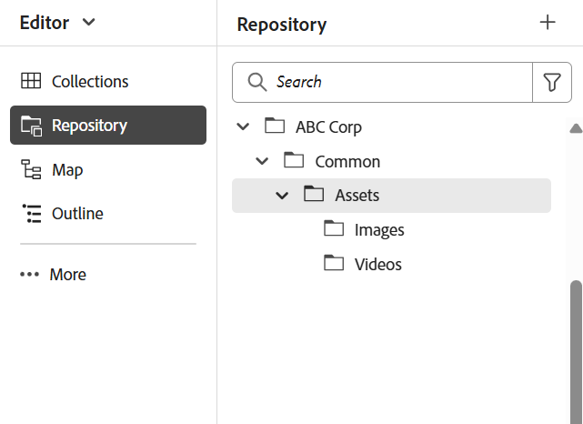

# 设置文件夹结构的最佳实践

本文为管理员提供了在Adobe Experience Manager Guides中设置文件夹结构的基本步骤和最佳实践。 组织良好的文件夹层次结构可确保用于学习和培训内容的流畅的创作、发布和翻译工作流。

## 设置文件夹结构

要允许访问Experience Manager Guides的各种创作、发布和翻译功能，请确保在正确的层次结构中设置文件夹，如下所述。

**创建根级文件夹**

首先，为您的组织创建根文件夹。 这是所有部门级文件夹和常用共享资产的基础。

示例：`/content/dam/ABC-Corp/`

在此根文件夹中，创建一个专用文件夹来管理将在多个部门中使用的资产。 例如，创建一个&#x200B;**常用**&#x200B;文件夹以包含共享资源，如图像、视频等。

**创建部门级文件夹**

为每个部门（如HR、Finance、Legal）创建单独的文件夹，以便他们能够管理自己的内容。

*Caption：在根文件夹*&#x200B;中为HR部门创建了单独的文件夹结构

**设置部门级文件夹的最佳实践**

- 在每个部门下为部门级公用资产创建专用&#x200B;**公用** > **资产**&#x200B;文件夹（如果需要）。
- 如果要共享内容以进行翻译，请创建特定于语言的文件夹（例如en、de、fr）。 作者应仅在源语言文件夹（如en）中创建或更新内容，因为翻译工作流中不包含源语言文件夹之外的内容。 其他语言文件夹可以作为占位符保留为空。 了解有关[内容翻译](../user-guide/translation.md)的详细信息。
- 可以利用权限来限制特定部门或用户对新创建的文件夹结构的访问权限。 例如，分配权限以确保只有HR部门用户可以创建或修改指定文件夹中的内容。

对金融、法律等其他部门重复相同的结构。

## 设置输出文件夹结构

`fm-ditaoutputs`文件夹用作从学习和培训内容生成的输出的默认存储位置。 这些输出通常包括&#x200B;**alm**&#x200B;文件夹中的SCORM包（ZIP文件）和&#x200B;**pdf**&#x200B;文件夹中的PDF。如果需要，您可以从&#x200B;**映射控制台**&#x200B;在预设级别更改此默认输出路径。

使用多个部门时，请考虑在`fm-ditaoutputs`文件夹结构中创建部门特定的文件夹，以确保特定部门内的用户有权访问相关的输出文件夹。

## 创建用户并将其分配给适当的组

建立文件夹层次结构后，您可以开始创建用户并将他们添加到组，以便他们有权访问Experience Manager Guides中的相关功能。 Experience Manager Guides提供三个现成的组 — Authors、Reviewer和Publishers。 根据用户关联的组，允许他们执行特定任务。 例如，发布任务只能由发布者执行，而不能由作者执行。

要创建新用户并将他们添加到组，请导航到&#x200B;**工具** > **安全性** > **用户**。

在“用户管理”页面上，选择&#x200B;**创建**&#x200B;以创建新用户。 添加用户详细信息并将其分配给组。

有关详细信息，请查看[用户管理和安全性](../cs-install-guide/user-admin-sec.md)

## 为每个用户组分配权限

将用户添加到相应的组后，请在组级别配置权限，以确保他们有权访问存储库中的正确创作和输出文件夹。

要分配权限，请导航到&#x200B;**工具** > **安全性** > **权限**。

这些权限可帮助确保用户只能在其指定的文件夹中创建或修改内容。

有关详细信息，请在AEM中查看[权限](https://experienceleague.adobe.com/zh-hans/docs/experience-manager-65/content/security/security#permissions-in-aem)。

