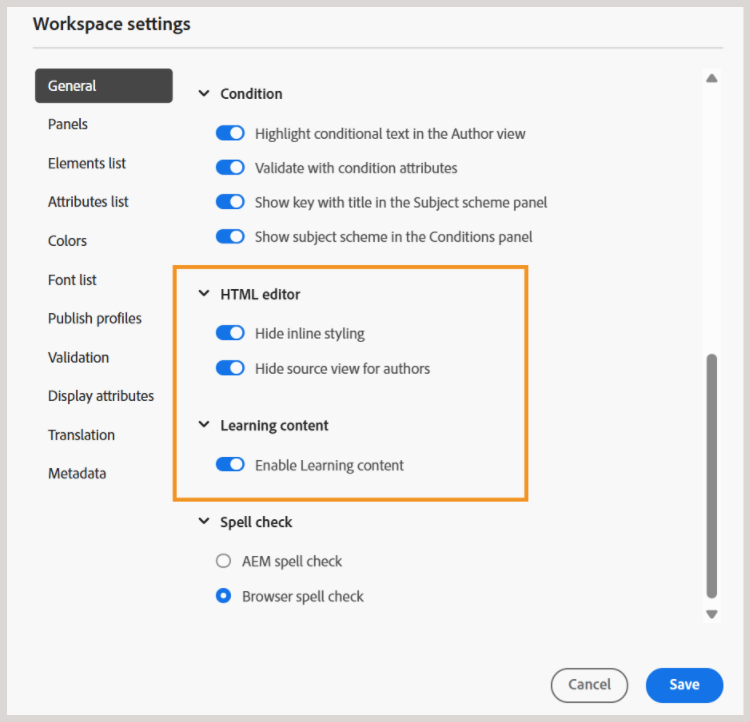
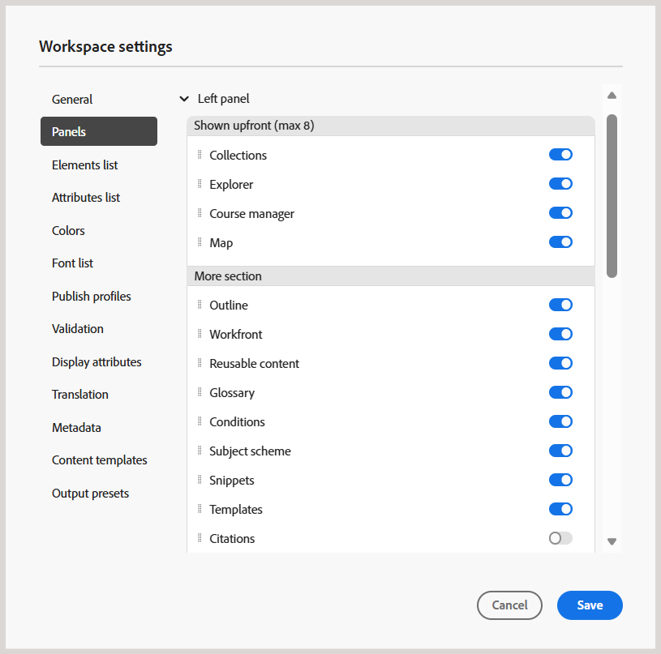
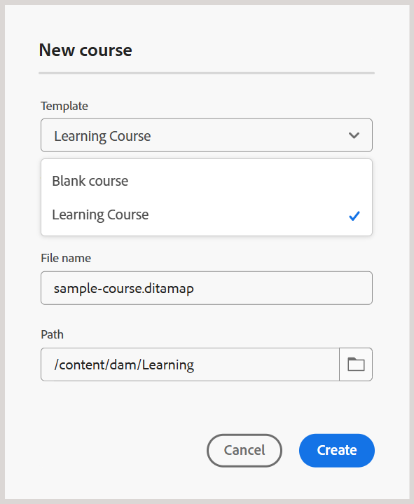
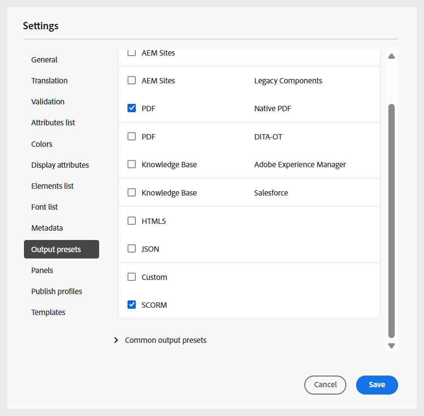

# 配置文件夹配置文件

需要文件夹配置文件来分隔企业中不同部门或产品的配置。 对于学习和培训内容，您可以创建和配置文件夹级别的配置文件，以管理创作模板、输出模板、输出预设和其他文件夹级别的设置。

了解[设置文件夹结构的最佳实践](best-practices-folder-structure.md)。

要开始使用学习和培训内容的文件夹配置文件配置，您需要：

1. **创建其他文件夹以管理创作和输出模板**：您可以为企业中不同部门或产品中工作的作者和发布者创建文件夹。 这些文件夹可以映射到特定的文件夹配置文件，每个文件夹都配置了不同的创作和输出模板，以支持特定于部门的学习课程创建和分散管理。

   您可以从“存储库”面板创建新文件夹。

   {width="350" align="left"}
2. **创建语言文件夹以管理翻译**：如果将内容翻译成不同的语言，则必须创建与每种语言对应的文件夹。 其中每个语言文件夹都将包含与该语言对应的内容。

3. **创建文件夹以管理Assets**：与文件夹类似，您也可以创建其他Assets文件夹以满足不同部门的需求。 通过这种方式，您还可以确保作者和发布者有权访问其模板、图像和其他资产中配置的正确CSS。

   {width="350" align="left"}
4. [创建文件夹配置文件](../cs-install-guide/conf-folder-level.md#create-and-configure-a-folder-level-profile)以映射不同的文件夹。
5. **选择要配置的文件夹配置文件**：创建文件夹配置文件后，您需要在[用户首选项](../user-guide/intro-home-page.md#user-preferences)页面上选择文件夹配置文件，以确保作者和发布者可以访问正确的模板。

   {width="650" align="left"}

6. **配置文件夹配置文件设置**：对于学习和培训内容，可以在文件夹级别配置以下设置：
   - [常规](#general)
   - [面板](#configure-panels)
   - [内容模板](#configure-content-templates)
   - [输出预设](#configure-output-presets)
   - [HTML编辑器](#html-editor-settings)
   - [发布配置文件](#manage-publish-profiles)

要访问这些设置，请切换到编辑器视图，然后从&#x200B;**选项**&#x200B;菜单中选择&#x200B;**Workspace设置**，如下所示：

## 常规

在常规选项卡中，您可以配置以下特定于产品培训和学习内容功能的设置：

{width="350" align="left"}

- **学习内容**：使用&#x200B;**启用学习内容**&#x200B;切换开关在文件夹配置文件级别启用或禁用该功能。
- **HTML编辑器**：此设置允许您为基于HTML的创作配置编辑器。 此设置中存在的关键配置选项如下：

   - **隐藏内联样式**：启用此选项可阻止作者将内联格式应用于课程内容。 启用后，编辑器右侧面板中存在的所有内联样式选项（如“字体”、“边框”、“布局”、“背景”和“列”）对作者保持隐藏状态。 但是，作者仍可以使用&#x200B;**样式**&#x200B;面板中提供的基于类的全局样式选项。 这有助于保持与组织风格指南的一致性。
   - **隐藏作者的Source视图**：启用此选项可限制对HTML源代码的访问。 当您希望简化编辑体验或避免意外更改基础代码时，这将很有用。

## 配置面板

此设置控制在Experience Manager Guides中的&#x200B;**编辑器**&#x200B;和&#x200B;**映射控制台**&#x200B;的左右面板中显示的面板。 您可以切换按钮以显示或隐藏所需的面板。

对于学习和培训内容，请确保仅为“编辑器和映射”控制台启用以下功能。

{width="350" align="left"}

### 编辑器

**左侧面板**

- **收藏集**：允许您组织和保存常用文件，或快速访问共享文件。
- **资源管理器**：允许您查看和访问内容存储库中存储的所有地图、主题、图像和其他资源。
- **课程经理**：为创建和管理课程提供专用工作区。
- **映射**：提供当前打开的映射文件的映射视图。
- **大纲**：显示当前打开的主题或地图的结构层次结构，允许快速导航和元素级访问。
- **Workfront**：除了Experience Manager Guides核心CCMS功能之外，还提供对强大项目管理功能的访问。
- **可重用内容**：允许您管理和插入可重用元素或主题，以确保内容的一致性并减少重复内容。
- **术语表**：允许您创建和管理术语表，并在主题间包含这些术语以保持术语的一致性。
- **片段**：允许您在学习课程的各个主题中创建和重复使用小型内容片段。
- **条件**：允许您在全局和文件夹级别配置条件属性。
- **模板**：允许您创建和管理课程模板。
- **引用次数**：允许您使用支持的引用样式向内容中添加和管理引用次数。
- **语言变量**：允许您为已发布的输出定义语言变量。
- **变量**：允许您创建和管理要在学习内容中使用的变量。
- **输出模板**：允许您创建和管理输出模板，以生成各种格式的输出。
- **查找和替换**：提供用于搜索并替换映射或存储库中文件夹中文件间的文本的选项。 
- **数据源**：允许您连接外部数据源并在内容中重复使用数据。
- **审阅**：允许您在Experience Manager Guides中创建和管理审阅工作流。
- **系统报告**：允许您创建和管理报告。

**右侧面板**

- **内容属性**：包含有关编辑器中当前选定元素的类型和属性的信息。
- **文件属性**：允许您查看和管理选定文件的属性。
- **样式**：显示用于学习内容的基于类的全局样式选项。
- **筛选器**：允许您在主题的预览模式下根据应用的条件筛选内容。

### 映射控制台

**左侧面板**

- **预设**：允许您配置用于发布学习课程的输出预设。
- **翻译**：提供将内容翻译成多种语言的选项。
- **报告**：允许您生成和管理报告，以便让有用的insight了解课程内容的整体运行状况。
- **条件预设**：提供为不同受众、部门等配置基于条件的输出预设的选项。

**右侧面板**

- **筛选器**：允许您在处理报告和翻译时使用筛选器。

## 配置内容模板

>[!NOTE]
>
> 仅当在&#x200B;**Workspace设置** > **常规**&#x200B;中启用学习内容功能时，此设置才可用。

此设置允许您管理编辑器[中](../user-guide/web-editor-left-panel.md)左侧面板中存在的创作和发布模板。 您可以添加、删除或重新排序创作和输出模板，作者和发布者随后可以访问这些模板。

{width="350" align="left"}

创作模板分为四个类别 — 学习课程、学习内容、测验和问题库。 如果在实例中配置了任何预定义模板，则默认情况下将显示这些模板。

{width="350" align="left"}

### 添加模板

执行以下步骤以添加新模板：

1. 导航到要添加模板的模板类别，然后选择&#x200B;**添加**。
2. 在选择路径对话框中，选择所需的模板。
3. 选择&#x200B;**选择**。

   {width="350" align="left"}

模板即添加到设置面板的相应类别中。

同样，您可以添加其他创作和输出模板。 添加后，作者和发布者可在各自的课程对话框中访问这些模板。 例如，管理员添加的学习课程模板可供作者创建新课程时使用。

{width="350" align="left"}

### 使用新的创作和输出模板

要使用与&#x200B;**选择路径**&#x200B;对话框中所显示的模板不同的模板，请创建自定义创作或输出模板。

**创建新的创作模板**

要使用其他映射或主题模板，请从编辑器的“模板”面板中新建一个创作模板。 使用映射模板创建学习课程和主题模板，用于学习内容、测验或学习摘要。

有关详细信息，请查看[从编辑器创建自定义模板](../user-guide/create-maps-customized-templates.md)。

{width="350" align="left"}

**创建新输出模板**

执行以下步骤，为学习与培训内容创建新的输出模板：

1. 从编辑器的左侧面板中，选择&#x200B;**更多** > **输出模板**。

   此时将显示“输出模板”面板。

   {width="350" height="" align="left"}
2. 在“输出模板”面板中，选择(+)以创建新的输出模板。

   {width="350" align="left"}
3. 从下拉菜单中选择一个输出模板。

   {width="650" align="left"}
4. 根据所选的输出模板类型，会显示一个对话框，您可以在其中基于可用模板创建新模板。

   {width="350" align="left"}

5. 选择&#x200B;**创建**。

   将创建新的输出模板。

6. 要访问和添加发布者的输出模板，请导航到&#x200B;**设置** > **模板** > **输出模板**，然后选择&#x200B;**添加**。

   {width="350" align="left"}

   输出模板显示在“选择路径”对话框中。
7. 选择模板并选择&#x200B;**确认**。

   {width="350" align="left"}

   现在，选定的输出模板即添加到“设置”面板中。

   {width="350" align="left"}

### 删除或重新排序模板

添加模板后，您可以从“设置”面板中删除或重新排序模板。

要删除模板，请选择模板旁边的&#x200B;**删除**&#x200B;图标。

{width="350" align="left"}

您还可以定义类别中存在的模板的显示顺序。 要更改模板的显示顺序，请选择虚线并将模板拖到所需位置。

{width="350" align="left"}

## 配置输出预设

>[!NOTE]
>
> 仅当在&#x200B;**Workspace设置** > **常规**&#x200B;中启用学习内容功能时，此设置才可用。

“输出预设”选项卡允许您定义哪些输出格式可用于发布课程。 它包含两个部分：**允许的输出预设类型**&#x200B;和&#x200B;**公共输出预设**。

{width="350" align="left"}

- **允许的输出预设类型**：此部分列出了Experience Manager Guides实例中支持的所有输出预设。 对于课程发布，仅&#x200B;**SCORM**&#x200B;和&#x200B;**PDF**&#x200B;格式适用。 您可以选择其中一个或两个选项。 生成课程输出时，发布者可以使用选定的预设。

  {width="350" align="left"}

- **常见输出预设**：此部分显示发布者通常创建并添加到特定文件夹配置文件的输出预设。 您还可以删除任何不再需要的预设。

  {width="350" align="left"}

## 管理发布配置文件

在此部分中，您可以查看、创建和管理用于将课程发布到SCORM Cloud的发布配置文件。 每个配置文件定义将学习课程发布到特定SCORM云环境所需的连接设置和配置详细信息。

如果需要发布到不同的SCORM Cloud帐户，您可以创建多个配置文件，从而确保发布过程的灵活性和控制力。

提供服务器详细信息以及关联的SCORM云应用程序的客户端ID和客户端密码，以配置SCORM云的发布配置文件。

{width="350" align="left"}
