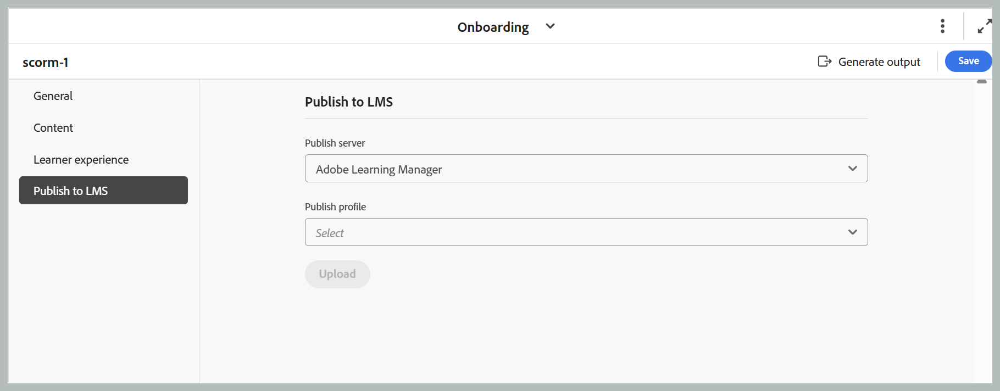

# 配置SCORM输出预设

创建预设后，配置SCORM预设设置。 预设配置选项组织在“常规”、“内容”、“学习者体验”和“发布”选项卡下。

- **常规：**&#x200B;用于为包含所有已配置工作流程的新生成后工作流下拉列表指定基本输出设置，如支持的版本、输出路径、SCORM文件名(zip)、输出模板和生成后工作流。

  {width="650"}

- **内容：**&#x200B;用于指定可用的条件筛选（使用DITAVAL或使用某些条件预设）和变量集。

  {width="650"}

- **学习者体验：** **学习者体验**&#x200B;选项卡允许您配置学习者如何与SCORM输出交互并进行导航。 设置按&#x200B;**常规**、**导航**&#x200B;和&#x200B;**测验**&#x200B;组织，允许您控制内容可访问性、导航流程和测验行为，从而量身定制的学习体验。

  {width="650"}

  - **常规：**&#x200B;配置输出级别选项，例如为学习者启用PDF下载。

    - **允许学习者下载课程PDF**：启用此选项后，会在SCORM输出中添加一个PDF图标。 单击此图标可让学习者直接从发布的输出下载课程内容的PDF版本。

      **先决条件：**&#x200B;在启用此选项之前，请确保以下各项：

      - 必须在所需位置为&#x200B;**输出模板**&#x200B;配置&#x200B;**嵌入PDF**&#x200B;图标，并且在配置SCORM预设时，应在&#x200B;**常规**&#x200B;选项卡的&#x200B;**输出模板**&#x200B;选项下选择相同的模板。

        {width="650"}

      - 关联的&#x200B;**Native PDF预设**&#x200B;必须至少生成一次。 选择未生成的PDF预设将导致提示用户发布预设的错误。

    按照上述设置生成SCORM输出后，生成的输出将包含一个PDF图标，如下所示，学习者可使用该图标下载课程PDF。

    {width="650"}

  - **导航：**&#x200B;定义学习者如何在课程中移动，包括顺序进度、强制完成条件以及用于解锁&#x200B;**下一步**&#x200B;按钮的规则。

    - **学习者必须按顺序完成内容**：确保学习者按固定顺序完成课程，且不能跳过或跳过课程组件。
    - **如果学习者未通过测试，则禁用下一步按钮**：阻止学习者移动到下一分区/页面，直到他们通过测试。
    - **学习者必须尝试每个问题才能继续**：要求学习者在提交测试之前尝试所有问题，以防止提交不完整。
    - **锁定进度直到完成**：禁用课程中的&#x200B;**下一步**&#x200B;按钮，直到满足该课程下所有配置的子条件为止，才阻止导航该课程。
      - **已打开所有交互式元素**：需要学习者打开页面上的每个交互式元素。
      - **所有观看过的媒体**：要求学习者观看页面上的所有视频/音频媒体。
      - **已尝试所有知识检查**：要求学习者尝试此页上的每个知识检查问题。
      - **在页面逗留的最短时间**：在启用“下一步”按钮之前，要求学习者在页面上至少停留指定的持续时间。 启用后，您需要按如下所述输入所需的时间。
        - **所需时间（秒）**：学习者必须在页面上停留的最少秒数（例如`30`）才能满足此条件。

  - **测验：**&#x200B;配置与测验相关的行为，如随机排列问题顺序和答案选择，以降低每次尝试的可预测性。

    - **随机排列每次尝试的问题顺序**：以不同的顺序显示每次尝试的测验问题，这有助于降低可预测性。
    - **随机选择每次尝试的答案**：在每次尝试时随机选择每个问题的答案，减少猜测的机会。

- **发布到LMS：**&#x200B;使用此设置将您的内容直接发布到Adobe Learning Manager (ALM)。 从&#x200B;**发布服务器**&#x200B;下拉列表中，选择&#x200B;**Adobe Learning Manager**，然后选择以前在Workspace设置中配置的所需&#x200B;**发布配置文件**。 选定的配置文件用于建立连接，并将生成的内容上传到ALM。

  >[!NOTE]
  >
  > 在将内容发布到ALM之前，必须配置Adobe Learning Manager发布配置文件。 有关详细信息，请查看[发布配置文件](../lc-config-guide/lc-folder-profile.md)。

  {width="650"}

配置所有更改后，使用SCORM预设页面工具栏右角的&#x200B;**保存**&#x200B;保存对SCORM预设所做的更改。
