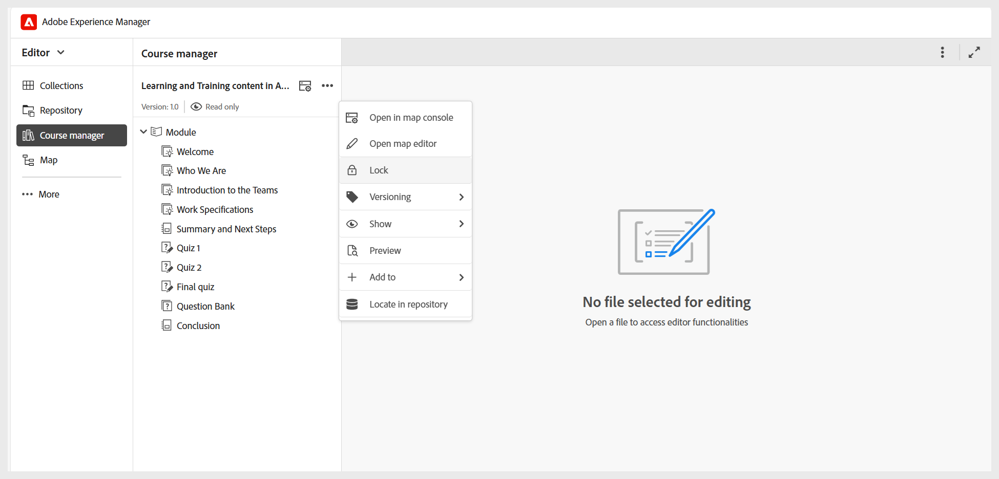

# 了解课程经理的基础知识

**课程经理**&#x200B;是您创建和管理课程的中央工作区。 创建新课程时，会自动在课程经理面板中打开，您可以从此处开始构建课程。

使用课程经理时，请考虑以下事项：

- 课程以只读模式打开，并自动分配版本1.0，以指示课程的初始版本。
- 若要编辑课程，您需要从&#x200B;**选项**&#x200B;菜单获取锁定。 锁定课程后，您可以开始添加主题或编辑课程中存在的现有主题。

  
- 面板中的&#x200B;**映射控制台**&#x200B;图标会将您转到映射控制台，其中显示了管理员配置的输出预设。 您还可以从&#x200B;**选项**&#x200B;菜单访问&#x200B;**映射控制台**。