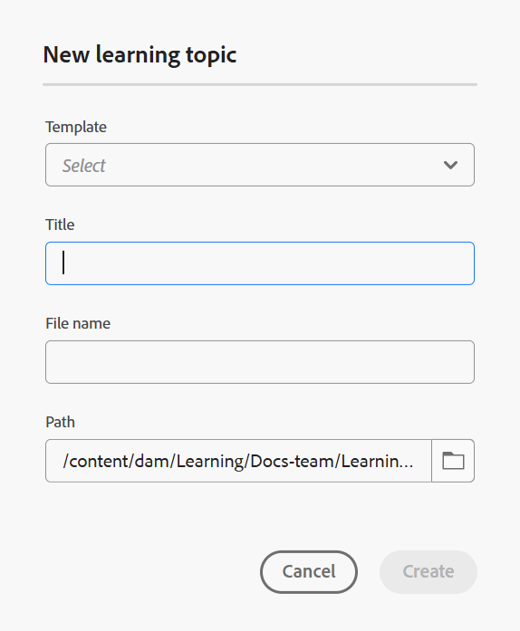

# 创建主题

在我们进入分步流程之前，以下是一段快速视频概述，可帮助您可视化如何创建学习主题。

>[!VIDEO](https://video.tv.adobe.com/v/3475211/learning-content-aem-guides)

**将主题添加到课程的步骤**

执行以下步骤可向课程添加主题：

1. 在&#x200B;**课程经理**&#x200B;中打开课程，然后从&#x200B;**选项**&#x200B;菜单中选择&#x200B;**添加新课程**。

   {width="650" align="left"}

1. 选择&#x200B;**主题**。

   显示&#x200B;**新学习主题**&#x200B;对话框。

   {width="350" align="left"}

1. 从下拉菜单中选择所需的模板。

   {width="350" align="left"}

1. 为主题提供合适的标题。
1. 选择&#x200B;**创建**。

随即会在课程中创建一个新的学习主题，该主题会显示在“课程管理员”面板中。

>[!NOTE]
>
> 创建新学习主题后，系统会自动为其分配版本1.0。
