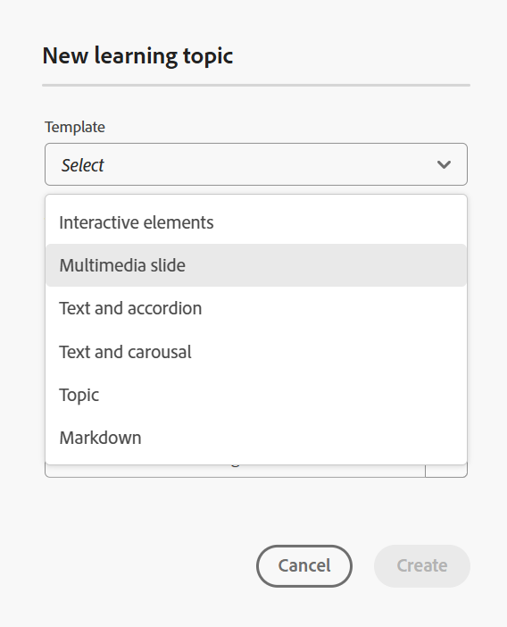

# 创建学习内容

执行以下步骤以将学习内容添加到课程：

1. 在&#x200B;**课程经理**&#x200B;中打开课程，然后从&#x200B;**选项**&#x200B;菜单中选择&#x200B;**添加新课程**。

   {width="650" align="left"}

1. 选择&#x200B;**学习内容**。
此时会显示新建学习内容对话框。

   {width="350" align="left"}

1. 从下拉菜单中选择所需的模板。

   {width="350" align="left"}

1. 为学习内容提供合适的标题。
1. 选择&#x200B;**创建**。

学习内容在课程中创建，并显示在“课程管理器”面板中。

>[!NOTE]
>
> 创建新学习内容后，系统会自动为其分配版本1.0。

