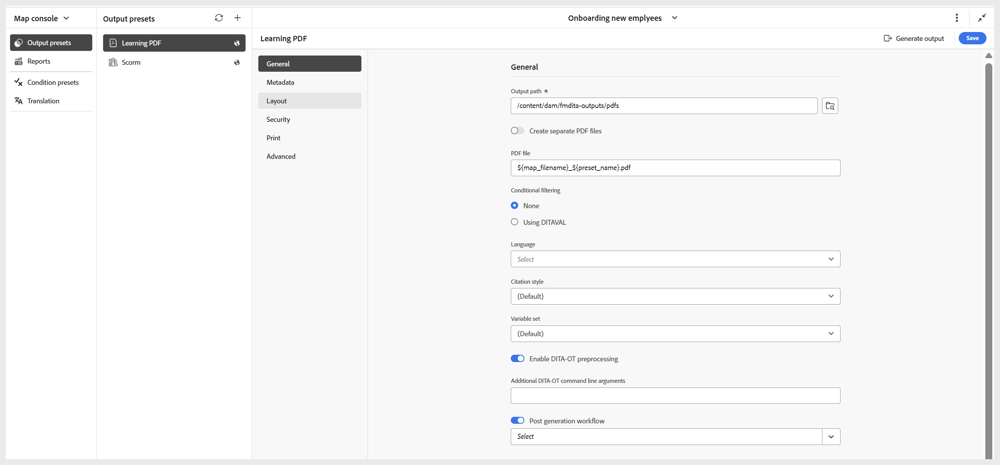

# 创建PDF输出预设

执行以下步骤以创建PDF输出预设：

1. 在&#x200B;**映射控制台**&#x200B;中打开课程。

   {width="350"}

1. 在&#x200B;**输出预设**&#x200B;面板中，选择+图标以创建输出预设。
1. 从“新建输出预设”对话框的&#x200B;**类型**&#x200B;下拉列表中选择&#x200B;**PDF**。
1. 在&#x200B;**名称**&#x200B;字段中，提供此预设的名称。
1. 在&#x200B;**使用**&#x200B;生成PDF字段中，选择&#x200B;**本机PDF**。
1. 选择&#x200B;**添加到当前文件夹配置文件**&#x200B;选项可在当前文件夹配置文件中创建输出预设。
1. 选择&#x200B;**添加**。

将打开PDF预设页面，您可以在其中进行必要的配置。

{width="650"}
