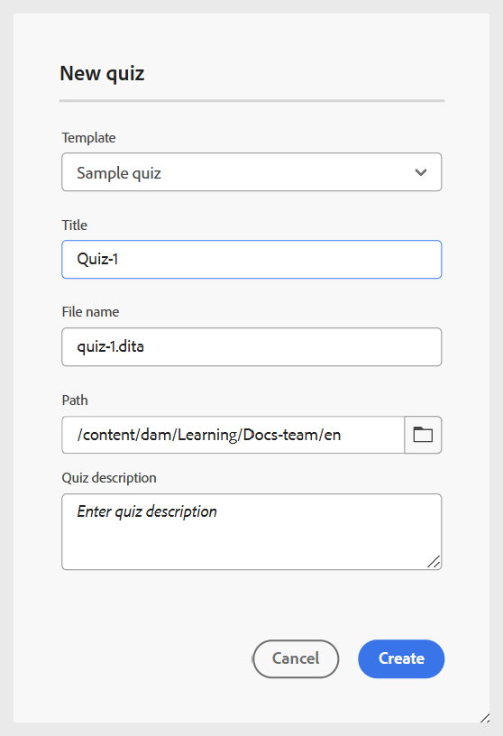

# 创建测验

执行以下步骤以在课程中添加测验：

1. 在&#x200B;**课程经理**&#x200B;中打开课程，然后从&#x200B;**选项**&#x200B;菜单中选择&#x200B;**添加新课程**。

   {width="650" align="left"}

1. 选择&#x200B;**测试**。\
   将打开&#x200B;**新测验**&#x200B;对话框以指定测验的相关详细信息。 您可以从下拉菜单中选择模板并为其指定合适的标题。

   {width="350" align="left"}

1. 选择&#x200B;**创建**。

测验将作为课程的一部分添加，并显示在“课程管理器”面板中。

>[!NOTE]
>
>  创建测验后，会自动为其分配版本1.0。

