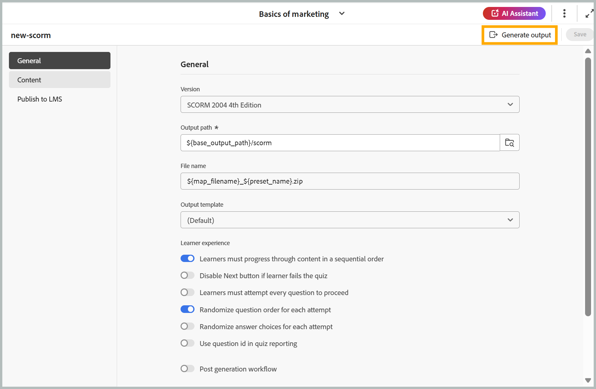
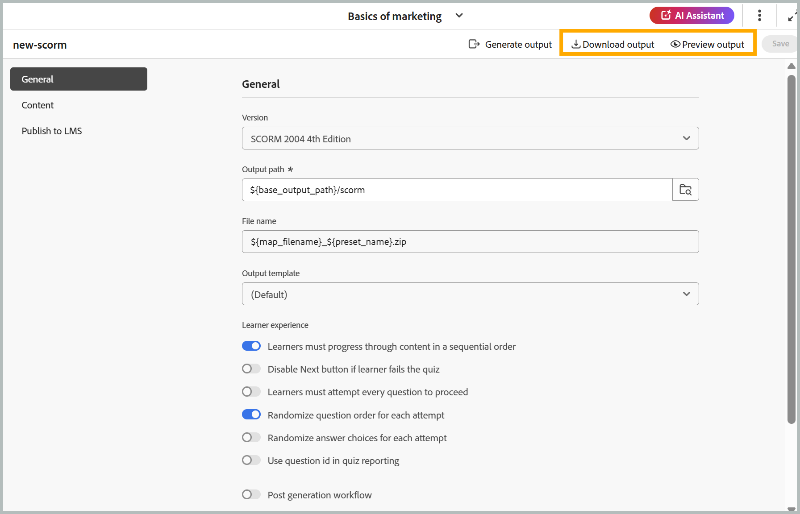

# 生成SCORM输出

执行以下步骤以生成SCORM输出：

1. 根据您的首选项配置SCORM输出所需的所有设置后，导航到SCORM预设页面的工具栏。
1. 选择&#x200B;**生成输出**。

   {width="650"}

1. 生成完成后，将显示一条成功消息，确认已创建&#x200B;**filename.zip**&#x200B;文件。 您可以使用成功消息上的&#x200B;**查看输出**&#x200B;选项预览输出。

   {width="350"}

1. 您可以通过选择&#x200B;**下载输出**&#x200B;或&#x200B;**预览输出**&#x200B;来下载或预览输出。

   {width="650"}

您可以使用SCORM预设的&#x200B;**发布到LMS**&#x200B;选项卡上的&#x200B;**上传**&#x200B;选项将ZIP文件上传到LMS，以使学习者可以使用您的课程。

