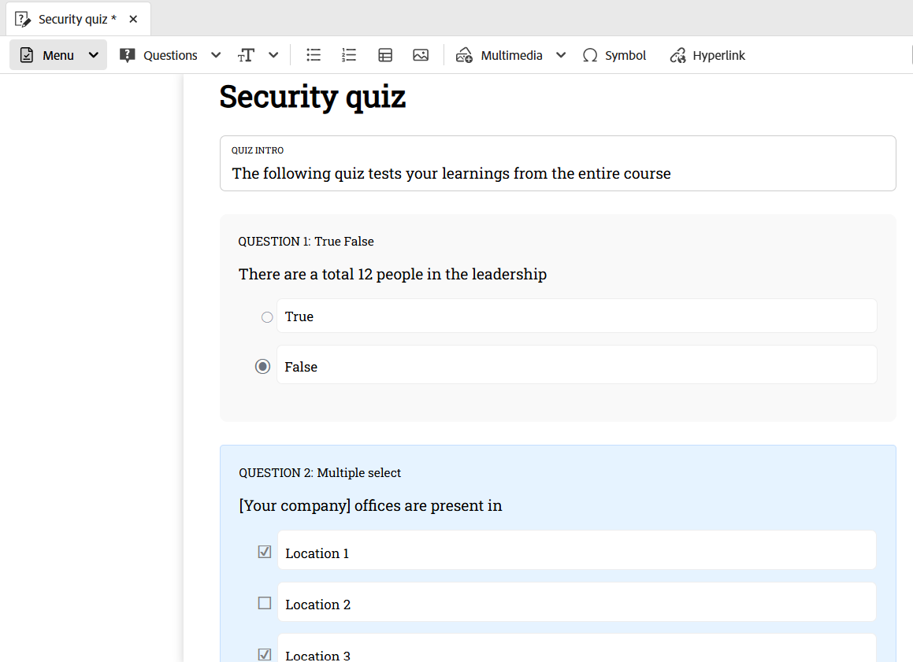

# 插入来自问题库的问题

执行以下步骤，在测验中插入题库中的问题：

1. 从工具栏的&#x200B;**问题**&#x200B;下拉菜单中选择&#x200B;**从问题行插入**&#x200B;选项，如下所示。

   {width="350" align="left"}

   显示&#x200B;**从HTML题库**&#x200B;插入对话框。

1. 指定存储在存储库中的问题库的路径，并选择要插入到测验中的问题，如下所示。 您还可以使用&#x200B;**全选**&#x200B;来选择问题库的所有问题。

   {width="650" align="left"}

1. 选定的问题会以蓝色高亮显示插入到测验中，表示它们不可编辑。 但是，它们将正常显示在发布的输出中。

   {width="650" align="left"}

1. 此外，您可以使用切换开关启用&#x200B;**选择随机问题**&#x200B;选项。 启用后，您可以定义要随机选择的问题数。 然后，该测验将显示一个占位符，指示已插入随机问题，如第二个屏幕快照所示。 在发布期间，系统自动从题库中选择并插入指定数量的随机问题。

   {width="650" align="left"}

   随机问题会添加到测验中，如下所示。

   {width="650" align="left"}

如需快速视频概述，。