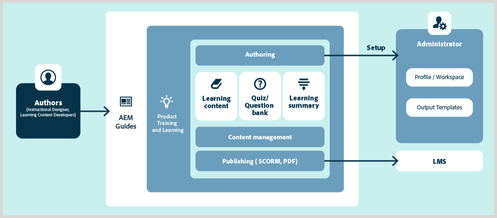

# 产品培训和学习内容概述

通过支持产品培训和学习内容，可以轻松地在企业环境中创建和管理交互式电子学习内容。 您可以使用模板创建课程、添加交互式元素（如可折叠项、轮播项、多媒体等）、使用不同问题类型或通过题库添加测验，以及以支持的输出格式发布课程。

## 核心功能概览

主要功能如下：

- 集中式学习内容管理
- 模板驱动的创作
- 内容重用
- 测验创建和管理
- 业界领先的翻译管理
- 使用现成的SCORM和PDF输出格式的多渠道发布
