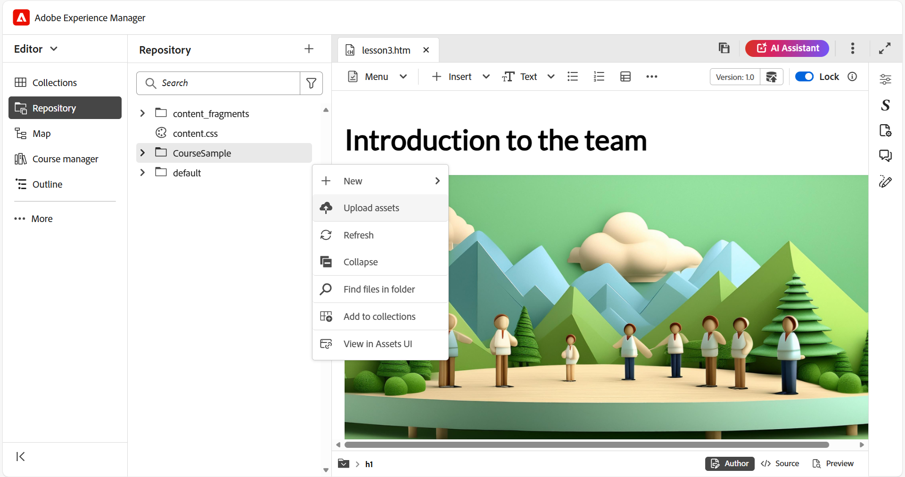
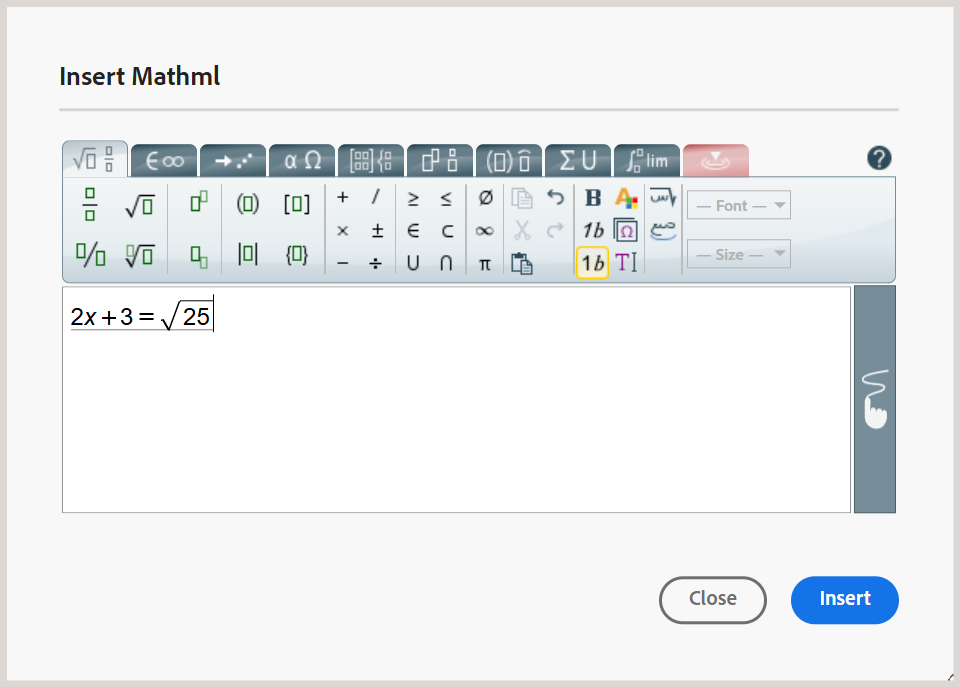

# “插入”菜单中的其他选项

编辑器工具栏的“插入”菜单中的其他可用选项包括：

- **块引号：**&#x200B;将块引号与引号一起添加到您的内容。

  {width="650"}

- **代码块：**&#x200B;向内容添加代码块。

  {width="650"}

- **Iframe：**&#x200B;在内容中插入iframe以嵌入外部网页或交互式资源。 您可以使用&#x200B;**内容属性**&#x200B;面板配置iframe属性，包括源URL、宽度、高度、对齐方式和标题。 通过切换到&#x200B;**预览**&#x200B;模式，您可以查看在iframe中添加的内容，如下所示。

  **作者**&#x200B;视图：

  {width="650"}

  **预览**&#x200B;模式：

  {width="650"}

- **H5P：**&#x200B;向学习内容添加了交互式H5P包。 要添加H5P内容，请将光标置于所需位置，然后从“插入”菜单中选择&#x200B;**H5P**。 在插入H5P对话框中，提供对要添加到学习内容中的H5P文件的引用。

  

  如果您希望从系统中使用H5P内容，请首先使用&#x200B;**上传assets**&#x200B;选项在DAM](../user-guide/authoring-upload-existing-files.md)中[上传文件，然后将其纳入存储库视图/Assets。

  

  完成后，在预览模式下查看H5P内容并发布输出。

  >[!NOTE]
  >
  > Adobe Experience Manager Guides不支持编辑或创建H5P内容。 在上载之前，请在外部准备H5P包。

- **MathML公式：**&#x200B;将MathML公式插入到您的内容中。 您可以创建一个MathML公式，并选择&#x200B;**插入**&#x200B;以将其添加到您的文档中。

  {width="350"}

  该公式使用浅灰色背景插入。 您可以随时更新公式，方法是右键单击现有公式并从上下文菜单中选择&#x200B;**编辑数学公式**。 有关在Experience Manager Guides中验证MathML方程式的详细信息，请在MathML编辑器中查看[方程式的验证](../user-guide/web-editor-other-features.md#validation-of-equations-in-the-mathml-editor)。

- **知识检查：**&#x200B;允许您以可用格式（“单个正确”、“多个正确”、“真/假”、“符合以下内容”或插入问题库）将问题添加到主题以供审阅，并且无需评分即可确认理解。 这些问题反映了标准格式并排除了评分，因此非常适合于自我评估，并且适合作为课程内容的一部分或以后测验或评估之前的主题（如果可用）。

  {width="650"}

  您可以通过&#x200B;**内容属性**&#x200B;面板配置正确答案和其他必填字段。 有关详细信息，请查看[问题类型](./quiz-insert-questions.md)。 您可以使用如下所示的知识检查选项添加各种问题类型。

  {width="650"}

- **输入字段：**&#x200B;向内容添加文本输入字段和按钮。 您可以使用此组合来捕获用户输入并触发特定操作。 播放按钮将添加到内容中，如下所示。

  {width="650"}

- **更多选项：**&#x200B;您有其他选项可增强您的学习内容，包括插入水平线、换行符、文本框、定位文本框和嵌入的HTML。

  {width="650"}
