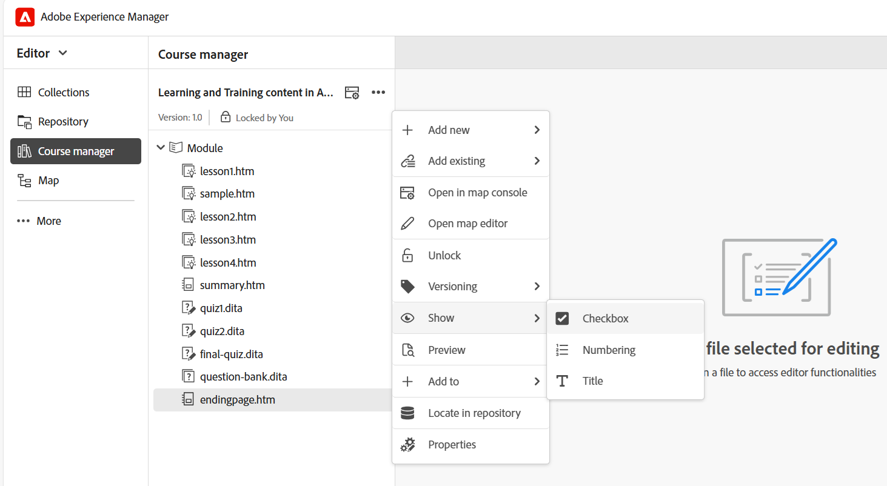

# 管理您的课程

创建课程后，该课程将在“课程管理器”面板中打开。 您可以锁定课程并在课程级别进行所有必需的更改。 以下部分将介绍编辑课程的可用选项。

## 添加新内容

执行以下步骤以在课程中添加新内容：

1. 选择&#x200B;**选项**&#x200B;菜单> **新增**。

   
2. 选择要创建的内容类型。 可用的选项为：
   - **概述**：课程中第一个主题，该主题提供了有关课程内容的快速介绍。
   - **主题**：课程中的主要材料包括一些简短而重点突出的内容，如步骤、示例或解释等，这些内容教导了特定的技能或想法。 有关详细信息，请查看[创建和自定义主题](./create-content.md)。
   - **摘要**：在课程章节结束时进行快速审查，提醒学习者他们刚刚学到的要点。
   - **测验**：一组用于检查某个人了解所学知识的程度的问题。 有关详细信息，请查看[创建和管理测验](./create-quiz.md)。
   - **问题库**：可用于快速且一致地创建测验的共享的可重用问题池。 有关更多详细信息，请查看[题库](./create-qb.md)。
   - **组**：学习组帮助将相关主题（如章节、主题和其他模块）按逻辑顺序组织，从而构建清晰的层次结构，以便于管理和重复使用培训材料。
3. 选择&#x200B;**创建**。

选定内容随即会创建并添加到课程中。 有关视频概述，请查看[向课程添加新内容](https://video.tv.adobe.com/v/3469537/aem-guides-learning-content?quality=12&learn=on) 。

## 添加现有内容

您可以将内容存储库中的现有内容添加到课程中。 执行以下步骤以添加现有内容：

1. 选择&#x200B;**选项**&#x200B;菜单> **添加现有**。
2. 选择要创建的课程内容类型。
3. 在&#x200B;**选择路径**&#x200B;对话框中，导航到内容位置并选择所需的学习内容。

   
4. 选择&#x200B;**选择**。

所选课程内容即从存储库添加到课程。

>[!NOTE]
>
>您还可以使用&#x200B;**Add Existing** > **File (Resource only zip)**&#x200B;选项来包含解压缩并集成到最终SCORM输出的文件夹结构中的zip文件。 这有助于在课程发布期间简化资源打包。

有关视频概述，请查看[将现有内容添加到课程](https://video.tv.adobe.com/v/3469537/aem-guides-learning-content?quality=12&learn=on) 。

## 删除内容

您可以通过选择该特定主题的&#x200B;**选项**&#x200B;菜单，然后选择&#x200B;**删除条目**，从课程中删除任何主题，如下所示。

有关视频概述，请查看[从课程中删除内容](https://video.tv.adobe.com/v/3475210/learning-content-aem-guides) 。

## 创建课程版本

您可以通过选择&#x200B;**选项**&#x200B;菜单> **版本控制**&#x200B;来控制课程的版本控制。

您将获得以下课程版本控制选项：

- **另存为新版本**：使用新版本号保存课程。
- **版本历史记录**：显示当前版本的预览，并允许您将其与课程的其他可用版本进行比较。
- **版本标签**：允许您以自由格式文本格式指定标签或使用一组预定义标签。

## 显示设置：显示

**显示**&#x200B;选项决定如何显示主题。 您可以选择使用多个主题选择的复选框来显示它们，使用编号来指示层次结构，或者显示主题标题或文件名。

>[!NOTE]
>
> 这些视图设置仅在“课程管理器”中适用，对已发布的输出没有影响。

有关视频概述，请查看[显示设置](https://video.tv.adobe.com/v/3475210/learning-content-aem-guides) 。

## 创建审核任务

作为学习课程的作者或管理员，您可以创建课程的审阅任务，并将其分配给审阅人以获取反馈。 首先，在&#x200B;**课程管理员**&#x200B;面板中打开您的课程，然后从&#x200B;**选项**&#x200B;菜单中选择&#x200B;**创建审核任务**，如下所示：

您被定向到&#x200B;**创建审阅任务**&#x200B;页面，在该页面中，您需要添加任务详细信息，例如审阅任务的标题、指定任务所属的DITA项目、定义任务时间线、分配审阅人等。 完成后，查看者将收到此任务的通知。 所选课程主题将在审核UI中打开，审核者可以在其中添加注释并将主题发回以获取更新。

要了解Experience Manager Guides中的审阅工作流程，请查看，[发送审阅主题](../user-guide/review-send-topics-for-review.md)。

