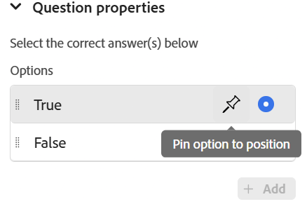
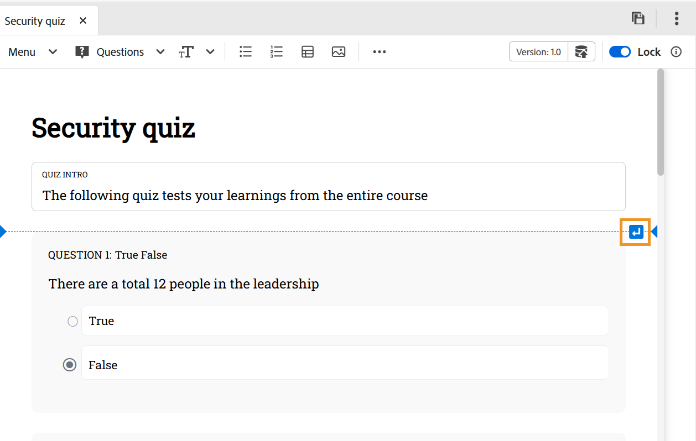
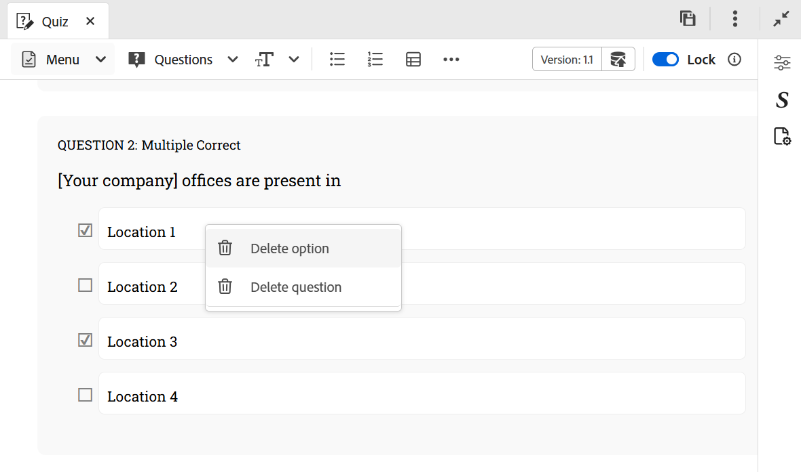
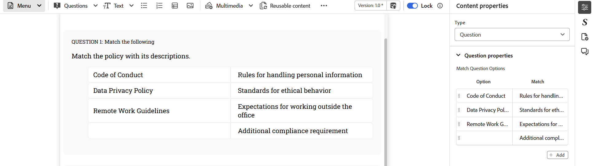
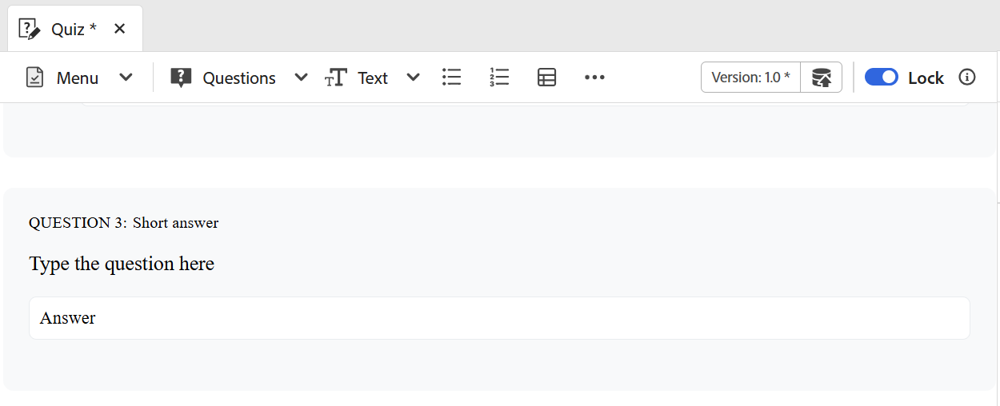

# 在测验中插入问题

执行以下步骤将问题插入测验：

1. 从工具栏的&#x200B;**问题**&#x200B;下拉菜单中选择所需的问题类型。 根据要求，您可以使用四种可用格式中的任意格式添加问题：真或假、单正确、多正确、匹配以下答案和简短答案，如下所示。 有关详细信息，请查看[问题类型](#question-types)。

   {width="650" align="left"}

   插入问题时，如果光标位于问题块上，则新问题默认会紧跟在问题块之后。

   若要在两个现有问题之间插入问题，请先[插入段落](#insert-paragraph-within-the-quiz)，然后插入问题。

1. 问题会以所选格式插入。 然后，您可以根据自己的要求编辑问题。

1. 您可以选择任何问题，并使用&#x200B;**内容属性**&#x200B;面板配置其属性。

   {width="650" align="left"}

1. 保存您在测验中所做的所有更改。

## 问题属性

您可以使用&#x200B;**内容属性**&#x200B;面板中的以下问题属性来配置问题：

{width="350" align="left"}

- **选项**：指定问题的正确答案
- **问题ID**：指定每个问题的问题ID。 如果问题ID不存在，建议始终添加它。
- 正确答案获得&#x200B;**分**：指定正确答案的得分。
- **错误答案的惩罚**：指定错误答案要扣除的点数。
- **问题标签**：启用以添加问题标签。
- **反馈**：启用可提供正确或不正确答案的反馈。
- **将选项固定到位置**：当问题的特定选项被固定时，它仍固定到选项列表中的指定位置，即使在SCORM预设配置中启用了&#x200B;**随机选择每次尝试的答案**&#x200B;也是如此，否则，这会重新整理可用选项。 您可以将鼠标悬停在“内容属性”面板中问题的所需选项上并固定它。

  {width="350" align="left"}

## 在测验中插入段落

将光标放在特定问题或两个问题之间的空格上时，屏幕最右角会显示一条蓝色水平线，蓝色箭头表示该水平线。 选择蓝色箭头，可在测验创作界面中插入段落。

{width="650" align="left"}

- 在问题中使用时，它允许您在问题中添加更多元素，如图像、表格、文本元素等。
- 在问题之间使用时，它允许您插入另一个问题或添加上述其他创作元素。

## 删除问题或选项

执行以下步骤以从测验中删除问题或特定选项：

1. 右键单击要删除的问题或选项。
1. 在上下文菜单中，选择&#x200B;**删除问题**（以删除整个问题）或&#x200B;**删除选项**（仅删除选定的选项）。

{width="650" align="left"}

## 问题类型

测验支持以下问题类型：

- **单个正确**：一个问题，该问题具有多个选项，其中只有一个答案是正确的。

  {width="650" align="left"}

- **True/False**：一个基于语句的问题，学习者可从中选择True还是False。

  {width="650" align="left"}

- **多个正确答案**：有多个选项的问题，其中多个答案可以正确。

  {width="650" align="left"}

- **匹配以下项**：允许学习者匹配两个列表中的项以形成正确的对。 您可以从&#x200B;**内容属性**&#x200B;面板添加新选项集。 为了提高复杂性，您可以从第一个列表中删除一个选项，并在“匹配”列中包含一个额外的匹配。 这就要求学习者仔细思考哪个选项没有直接的搭配，从而造成了一定难度。

  {width="650" align="left"}

  在发布的输出中，每个项目都显示&#x200B;**与以下**&#x200B;匹配的问题，该问题带有下拉菜单，允许您从可用选项中选择正确的匹配项。

  {width="650" align="left"}

- **简短答案**：允许学习者使用简短文本输入进行回复。 它接受字母数字答案，不区分大小写匹配答案，对于非常长的答案，它提供了一个水平滚动条。

  {width="650" align="left"}
