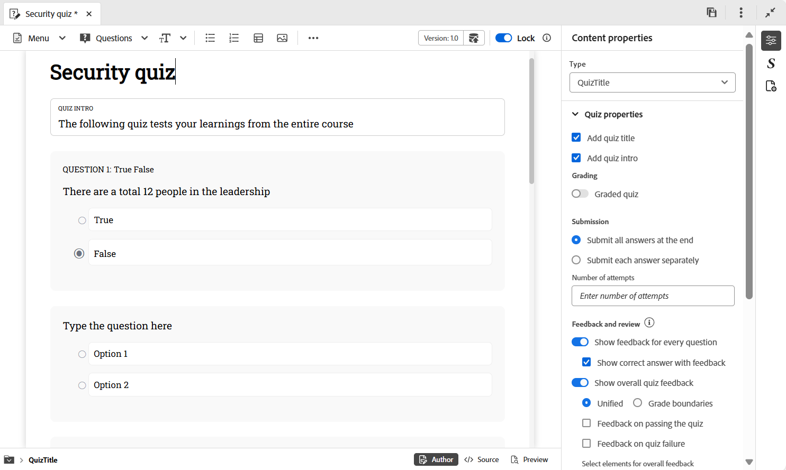
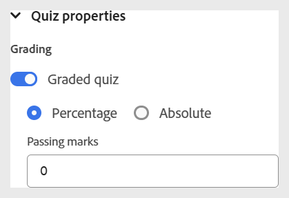

# 测验属性

可以使用以下选项配置测验属性：

- 选择测验的标题，然后选择右侧工具栏上的&#x200B;**内容属性**&#x200B;图标以打开&#x200B;**内容属性**&#x200B;面板。 您可以在此处编辑测验属性。

  {width="650" align="left"}

- 您可以通过打开&#x200B;**评分测试**&#x200B;切换开关来启用测验的评分。 启用后，您可以选择基于百分比或绝对的评分方法，并相应地定义通过标准。

  {width="350" align="left"}

- 您还可以配置其他设置，如答案提交选项、反馈和审核选项、测验时间以及布局偏好设置，如下所示。

  {width="350" height="200" align="left"}